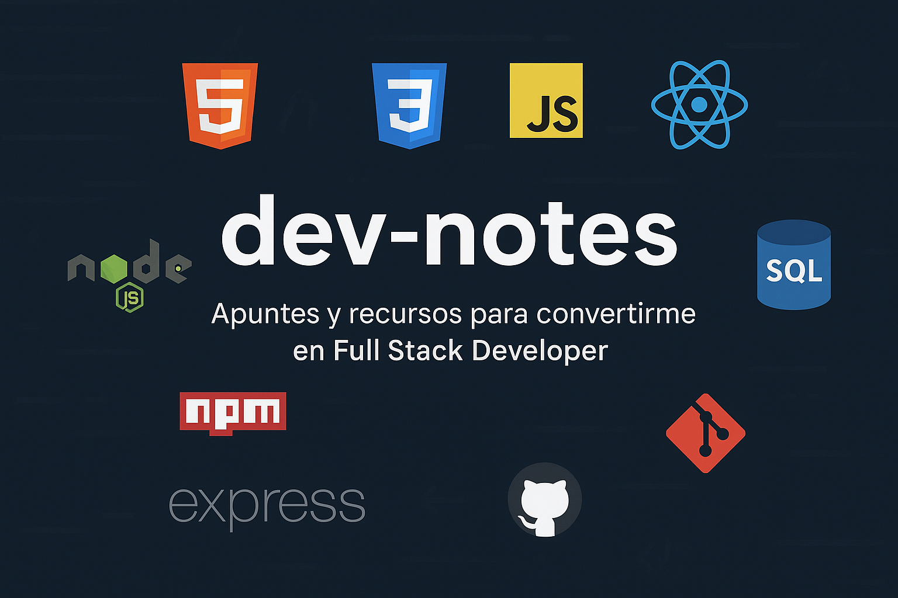

  

# 📚 Apuntes de Programación

Este repositorio es mi **base de conocimiento personal** y centralizada sobre desarrollo de software. Aquí documento todo lo que aprendo sobre lenguajes de programación, tecnologías, herramientas y buenas prácticas. El objetivo es tener un recurso propio, curado y fácil de consultar para reforzar conceptos y resolver dudas rápidamente.

Más que una simple colección de notas, este espacio representa mi viaje como desarrollador. Cada apunte es un bloque de construcción en mi camino para convertirme en un desarrollador Full Stack.

Es importante recordar que el objetivo de este camino no es memorizar cada detalle de cada tecnología. El mundo del desarrollo es vasto y cambia constantemente. La meta real es construir una comprensión sólida de los conceptos fundamentales, saber cómo aplicar las herramientas de manera efectiva y, lo más importante, desarrollar la habilidad de encontrar la información correcta cuando sea necesario.

Este repositorio es un mapa, no una enciclopedia. Úsalo para navegar, no para memorizar cada calle.

## 🚀 Roadmap de Desarrollo Full Stack

Este es un mapa de ruta de las habilidades y tecnologías clave para el desarrollo Full Stack. No es una lista exhaustiva, sino una guía de las áreas más importantes en las que centrarse.

### 1. Fundamentos Esenciales
- [x] **HTML5:** Estructura y semántica web.
- [x] **CSS3:** Estilizado, Flexbox, Grid y diseño responsivo.
- [x] **JavaScript (ES6+):** Manipulación del DOM, asincronía y conceptos fundamentales.
- [x] **Control de Versiones:** Git y GitHub.
- [x] **Terminal/Línea de Comandos:** Comandos básicos de Linux/Bash.

### 2. Desarrollo Front-End
- [ ] **Frameworks CSS:** Tailwind CSS, Bootstrap.
- [ ] **Preprocesadores CSS:** SASS/SCSS.
- [x] **Frameworks JavaScript:** React, Vue o Angular.
- [ ] **State Management:** Redux, Zustand, Vuex.
- [x] **Herramientas de Build:** Vite, Webpack.
- [ ] **Testing:** Jest, React Testing Library.

### 3. Desarrollo Back-End
- [x] **Lenguaje de Programación:** Node.js, Python, Go, o Java.
- [x] **Frameworks de Back-End:** Express (Node.js), Django/FastAPI (Python), Gin (Go).
- [ ] **Bases de Datos Relacionales:** PostgreSQL, MySQL.
- [ ] **Bases de Datos NoSQL:** MongoDB, Redis.
- [ ] **APIs:** REST, GraphQL.
- [ ] **Autenticación y Autorización:** JWT, OAuth.

### 4. DevOps y Despliegue
- [ ] **Contenedores:** Docker.
- [ ] **Orquestación:** Kubernetes (opcional, para proyectos grandes).
- [ ] **CI/CD:** GitHub Actions.
- [x] **Plataformas de Despliegue:** Vercel, Netlify, AWS, Google Cloud.

## 📄 Lista de Apuntes

Aquí están las notas detalladas de los temas que he estudiado hasta ahora.

| Nº | Apunte | Descripción |
|----|--------|-------------|
| 1 | 🧭 [Roadmap Full Stack](apuntes/Roadmap.md) | Plan de estudio personalizado para convertirme en desarrollador Full Stack. |
| 2 | ⚙️ [Guía rápida de instalación](apuntes/Guía%20rápida%20de%20instalación.md) | Descarga y configuración de herramientas esenciales para programar. |
| 3 |  [HTML](apuntes/HTML.md) | Fundamentos del desarrollo web: estructura, etiquetas y semántica. |
| 4 |  [CSS](apuntes/CSS.md) | Diseño visual, maquetación responsive y buenas prácticas con CSS. |
| 5 |  [JavaScript](apuntes/JavaScript.md) | Fundamentos del lenguaje, manipulación del DOM y eventos. |
| 6 |  [JavaScript en Profundidad](apuntes/JavaScript%20en%20Profundidad.md) | Conceptos avanzados: asincronía, scopes, closures y patrones. |
| 7 | 🌐 [Cómo subir un sitio web](apuntes/Como%20subir%20un%20sitio%20web.md) | Métodos para publicar sitios web (GitHub Pages, Netlify, Vercel, etc.). |
| 8 |  [GIT](apuntes/GIT.md) | Control de versiones, ramas y manejo de proyectos en GitHub. |
| 9 |  [Bootstrap](apuntes/Bootstrap.md) | Framework CSS para desarrollo rápido y responsive. |
| 10 |  [Tailwind CSS](apuntes/Tailwind%20CSS.md) | Framework de utilidades para crear interfaces con clases directas. |
| 11 |  [React](apuntes/React.md) | Librería para construir interfaces interactivas y componentes reutilizables. |
| 12 |  [Node.js](apuntes/Node.js.md) | Entorno de ejecución para usar JavaScript del lado del servidor. |
| 13 |  [SQL](apuntes/SQL.md) | Lenguaje para crear, consultar y gestionar bases de datos relacionales. |
| 14 |  [Introducción a Linux](apuntes/Introduccion%20a%20Linux.md) | Comandos básicos, estructura de archivos y uso de la terminal. |

## ⭐ Repositorios de Interés

Una colección de repositorios de GitHub que encuentro útiles, inspiradores o educativos.

- [frontend-developer-resources](https://github.com/mrcodedev/frontend-developer-resources): Recursos detallados y organizados para desarrolladores front-end.
- [developer-roadmap](https://github.com/kamranahmedse/developer-roadmap): Roadmaps para desarrolladores (Front-end, Back-end, DevOps, etc.).
- [free-for-dev](https://github.com/ripienaar/free-for-dev): Una lista de recursos gratuitos para desarrolladores.
- [free-programming-books](https://github.com/EbookFoundation/free-programming-books): Una lista masiva de libros de programación gratuitos.
- [awesome](https://github.com/sindresorhus/awesome): Una colección de listas "awesome" para casi cualquier tema.
- [devdocs](https://github.com/freeCodeCamp/devdocs): Documentación de múltiples tecnologías en un solo lugar.

## 🔗 Recursos

Aquí hay una lista de recursos útiles que he encontrado a lo largo de mi viaje de aprendizaje.

- [freeCodeCamp](https://www.freecodecamp.org/): Cursos de desarrollo web y diferentes tecnologías  
- [The Odin Project](https://www.theodinproject.com/): Ruta completa para aprender desarrollo web desde cero, con proyectos reales  
- [JavaScript.info](https://javascript.info): Fundamentos JS a fondo  
- [CS50 – Harvard](https://cs50.harvard.edu): Curso completo de informática  
- [Front-end Developer – Meta](https://www.coursera.org/professional-certificates/meta-front-end-developer): Curso Frontend de Meta  
- [Back-end Developer – Meta](https://www.coursera.org/professional-certificates/meta-back-end-developer): Curso Backend de Meta  
- [Frontend Practice](https://www.frontendpractice.com): Desafíos reales de diseño  
- [Node.js Docs](https://nodejs.org/docs/latest/api/): Docs oficiales, pero amigables  
- [MongoDB University](https://university.mongodb.com): Cursos gratis de MongoDB  
- [useHooks.com](https://usehooks.com): Hooks de React reutilizables  
- [Can I Use](https://caniuse.com): Compatibilidad de funciones en navegadores  
- [Grid CSS Generator](https://cssgridgenerator.io/): Generador de Grid CSS  
- [DevDocs](https://devdocs.io/): Documentación de múltiples tecnologías en un solo lugar  
- [Awwwards](https://www.awwwards.com/): Ejemplos de portfolios  

## 👤 Autor

Desarrollado con ❤️ por **Juan Bautista Malina**

- 🌐 [Portfolio](https://juanbautistamalina.github.io/portfolio/)  
- 💻 [GitHub](https://github.com/juanbautistamalina)  
- 💼 [LinkedIn](https://www.linkedin.com/in/juan-bautista-malina)
