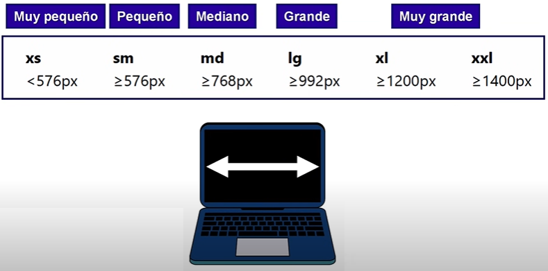
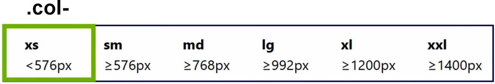
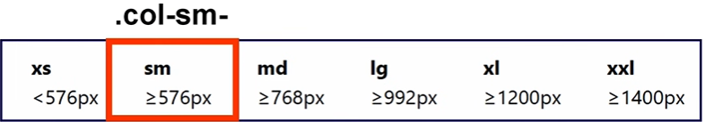
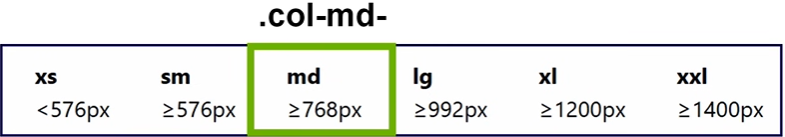
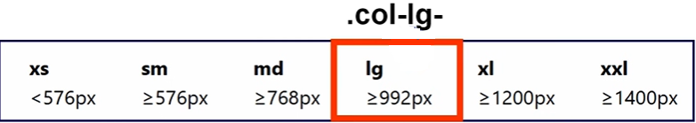
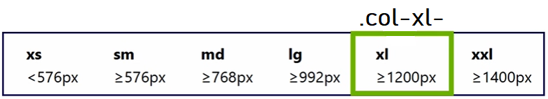
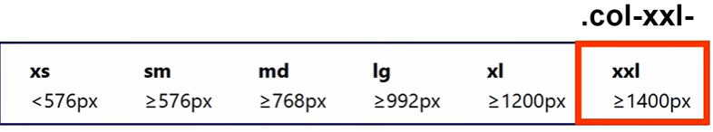

# Bootstrap

## ¿Qué es?

- Bootstrap es un **framework CSS para desarrollar sitios webs responsivos.**

## Instalación

- **Link**: [https://getbootstrap.com/](https://getbootstrap.com/)

### Instalación con CDN

```html
<!-- CSS -->
<link href="https://cdn.jsdelivr.net/npm/bootstrap@5.3.3/dist/css/bootstrap.min.css" rel="stylesheet" integrity="sha384-QWTKZyjpPEjISv5WaRU9OFeRpok6YctnYmDr5pNlyT2bRjXh0JMhjY6hW+ALEwIH" crossorigin="anonymous">

<!-- JS -->
<script src="https://cdn.jsdelivr.net/npm/bootstrap@5.3.3/dist/js/bootstrap.bundle.min.js" integrity="sha384-YvpcrYf0tY3lHB60NNkmXc5s9fDVZLESaAA55NDzOxhy9GkcIdslK1eN7N6jIeHz" crossorigin="anonymous"></script>
```

### **Instalación con npm**

```bash
npm init
npm install bootstrap
```

```html
<!-- CSS -->
<link rel="stylesheet" href="node_modules/bootstrap/dist/css/bootstrap.css">

<!-- JS -->
<script src="node_modules/bootstrap/dist/js/bootstrap.bundle.js"></script>
```

---

# Introducción a Bootstrap

## Grid

- En Bootstrap, hay un concepto muy importante. Las cuadrículas va a permitir trabajar con filas y columnas, pero *cada fila va a estar dividida en 12 columnas*.

### Clases para grid

- **row:** El elemento html al que se le aplique esta clase, se va a convertir en una fila.
- **.col-**
- **.col-sm-**
- **.col-md-**
- **.col-lg-**
- **.col-xl-**
- **.col-xxl-**



### Breakpoint

- Cada una de las dimensiones de la foto anterior representa un **breakpoint**. Un **breakpoint** es la dimensión (ancho) a partir de la cual podemos cambiar el estilo o la estructura de una página web.













## Contenedores

- Un contenedor es un elemento HTML que va a contener toda la estructura de filas y columnas, o elementos HTML. Existen 2 clases en Bootstrap para crear un contenedor:
    - **.container**: Crea un contenedor responsivo con un ancho máximo fijo que depende del tamaño del dispositivo.
    - **.container-fluid**: Crea un contenedor responsivo que cubre el 100% del ancho de la ventana
    - **.container-breakpoint ( breakpoint = xs, sm, md, lg, xl, xxl)**: Crea un contenedor que se comporta como **fluid** mientras el breakpoint no se cumpla. Una vez que el breakpoint se cumpla, el contenedor se comporta como **container**.

## Componentes

- Elemento HTML reutilizable que ya viene con estilos predeterminado y que puede utilizarse en una página web.
- Simplemente ir a la web de Bootstrap, copiar el componente deseado y pegarlo en el proyecto.

## Flexbox

- Bootstrap incluye clases para trabajar con flexbox más fácilmente.
- `class: d-flex`
- `flex-direction: row`
- `flex-direction: row-reverse`
- `flex-direction: column`
- `flex-direction: column-reverse`

### justify-content en Bootstrap

- `.justify-content-start`
- `.justify-content-end`
- `.justify-content-center`
- `.justify-content-between`
- `.justify-content-around`
- `.justify-content-evenly`

### align-items en Bootstrap

- `.align-items-start`
- `.align-items-end`
- `.align-items-center`
- `.align-items-baseline`
- `.align-items-stretch`

### flex-wrap en Bootstrap

- `.flex-nowrap`
- `.flex-wrap`
- `.flex-wrap-reverse`

---

# Bootstrap Icons

### Instalación

- **Link**: [https://getbootstrap.com/](https://getbootstrap.com/)

### Instalación con CDN

```html
<!-- Opción 1: HTML CDN -->
<link rel="stylesheet" href="https://cdn.jsdelivr.net/npm/bootstrap-icons@1.11.3/font/bootstrap-icons.min.css">

<!-- Opción 2: CSS CDN -->
@import url("https://cdn.jsdelivr.net/npm/bootstrap-icons@1.11.3/font/bootstrap-icons.min.css");
```

### **Instalación con npm**

```bash
npm init
npm i bootstrap-icons
```

```html
<!-- CSS -->
<link rel="stylesheet" href="node_modules/bootstrap/dist/css/bootstrap.css">

<!-- JS -->
<script src="node_modules/bootstrap/dist/js/bootstrap.js"></script>
```