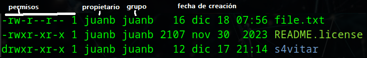
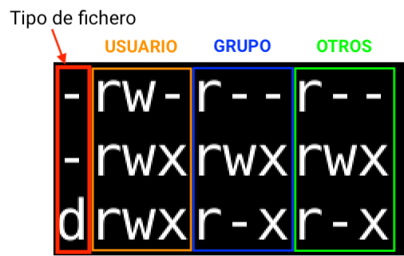
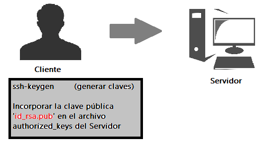

# Introducción a Linux

---

# **Sistemas operativos para pentesting**

- Un sistema operativo es un programa o un conjunto de programas de un sistema informático que administra los recursos físicos (hardware), los protocolos de ejecución del contenido (software), así como la interfaz de usuario.

## **Creando una nueva máquina virtual**

### Seleccionar SO

- **Link Parrot**: [https://parrotsec.org/](https://parrotsec.org/)
- **Link Kali Linux**: [https://www.kali.org/get-kali/#kali-platforms](https://www.kali.org/get-kali/#kali-platforms)

### Máquina Virtual: VMware

**Link**: [https://blogs.vmware.com/workstation/2024/05/vmware-workstation-pro-now-available-free-for-personal-use.html](https://blogs.vmware.com/workstation/2024/05/vmware-workstation-pro-now-available-free-for-personal-use.html)

### Configuraciones Iniciales

- **Tamaño máximo de disco**: 60 GB
- **Memoria RAM**: 4 GB
- **Procesadores**: 2
- **Adaptador de red**: Bridged

---

# **Comandos básicos de Linux**

```bash
# ---------------------------
# 1. Información del usuario
# ---------------------------
whoami            # Muestra el nombre del usuario actual
id                # Muestra el UID (User ID) y los grupos del usuario actual
sudo su           # Cambia a usuario root
exit              # Sale de la sesión actual

# ---------------------------
# 2. Manipulación de archivos
# ---------------------------
cat archivo                   # Muestra el contenido de un archivo
cat archivo | grep "texto"    # Filtra el contenido de un archivo por texto específico
cat /etc/passwd               # Información de los usuarios del sistema
cat /etc/shells               # Listar las shells disponibles en el sistema

# ---------------------------
# 3. Rutas de comandos
# ---------------------------
which comando       # Muestra la ruta absoluta de un comando ejecutable
command -v comando  # Alternativa a 'which'

# ---------------------------
# 4. Variables de entorno
# ---------------------------
echo $PATH   # Rutas de búsqueda de comandos
echo $HOME   # Directorio personal del usuario
echo $SHELL  # Shell predeterminado del usuario

# ---------------------------
# 5. Navegación por directorios
# ---------------------------
pwd         # Muestra la ruta absoluta del directorio actual
ls          # Lista el contenido del directorio actual
ls -l       # Lista con detalles (permisos, propietario, tamaño, fecha)
ls -a       # Lista todos los archivos (incluidos los ocultos)
ls -la      # Lista detallada con archivos ocultos
cd          # Vuelve al directorio personal del usuario
cd ruta/    # Cambia al directorio especificado
cd ..       # Sube un nivel en la estructura de directorios

# ---------------------------
# 6. Atajos útiles
# ---------------------------

# Ctrl + L : Limpia la consola
# Ctrl + U : Borrar la línea que estas escribiendo
```

## Ruta Absoluta vs Ruta Relativa

### **Ruta Absoluta**

- Una **ruta absoluta** especifica la ubicación completa de un archivo o directorio **desde la raíz del sistema**. Siempre **comienza con una barra inclinada `/`**, que representa el directorio raíz (`/`).
- **Ejemplo**: `/home/usuario/documento.txt`
    
    Aquí, `/` es la raíz, `home` es un subdirectorio de la raíz, y `usuario` es un subdirectorio dentro de `home`, que contiene el archivo `documento.txt`.
    

### **Ruta Relativa**

- Una **ruta relativa** especifica la ubicación de un archivo o directorio **desde tu ubicación actual** en el sistema de archivos. No comienza con `/`.
- **Ejemplos**:
    - `./documento.txt   # Archivo en el directorio actual`
    - `../documento.txt  # Archivo en el directorio superior`
    
    `./` representa el directorio actual.
    
    `../` representa el directorio padre (uno superior en la jerarquía).
    

---

# **Control del flujo stderr-stdout, operadores y procesos en segundo plano**

```bash
# ---------------------------
# 1. Ejecutar múltiples comandos
# ---------------------------

whoami; ls           
# Ejecuta ambos comandos en una sola línea, sin importar el resultado de cada uno.

# ---------------------------
# 2. Ejecución condicional
# ---------------------------

whoami && ls       # Ejecuta `ls` solo si `whoami` se ejecuta correctamente (AND lógico).
whoam || ls        # Ejecuta `ls` solo si `whoam` falla (OR lógico).

# ---------------------------
# 3. Código de estado del comando anterior
# ---------------------------

!$ # Acceder al último argumento del comando anterior
echo $? 
# Muestra el código de estado del comando anterior             
# (0 = éxito, cualquier otro valor = error).

# ---------------------------
# 4. Redirección de errores estándar (stderr)
# ---------------------------

whoam 2>/dev/null    
# Redirige los errores de `whoam` al archivo especial `/dev/null`,
# ocultándolos de la salida.

# ---------------------------
# 5. Redirección de salida y ejecución en segundo plano
# ---------------------------
cat /etc/hosts &>/dev/null & disown  

# &>/dev/null: Redirige todo el output (stdout y stderr) al null, 
# por lo que no se muestra nada por pantalla
# salida estándar (stdout) 
# salida de error (stderr)
# & (del final): coloca en segundo plano el proceso
# disown: sirve para disociar un proceso de la sesión actual de la terminal
```

---

# **Descriptores de archivo**

```bash
# ---------------------------
# 1. Crear un archivo con capacidad de lectura y escritura
# ---------------------------
exec 3<> file         
# Asigna el descriptor de archivo `3` al archivo llamado `file`.
# El descriptor 3 tendrá permisos de lectura y escritura.  
# 3 es un número que puedes elegir (excepto 2, reservado para errores).  
# `<` habilita lectura, `>` habilita escritura.  

# ---------------------------
# 2. Almacenar el output de un comando en un archivo
# ---------------------------
whoami >&3           
# Envía la salida estándar (stdout) del comando 'whoami' al descriptor de archivo 3.  
# El contenido del descriptor '3' se escribe en el archivo asociado.  

# ---------------------------
# 3. Cerrar el descriptor de archivos
# ---------------------------
exec 3>&-            
# Cierra el descriptor de archivo '3'.  
# Una vez cerrado, ya no puede ser utilizado hasta que se vuelva a abrir.  

# ---------------------------
# 4. Duplicar un descriptor de archivo
# ---------------------------
exec 8>&3            
# Copia el contenido del descriptor de archivo '3' en el descriptor de archivo '8'.  
# Ambos apuntarán al mismo archivo y compartirán permisos de acceso.  

# ---------------------------
# 5. Duplicar y cerrar el descriptor original
# ---------------------------
exec 8>&3-           
# Copia el contenido del descriptor de archivo '3' en el descriptor '8'.  
# Luego, cierra automáticamente el descriptor '3' después de copiarlo.  
# Ahora solo el descriptor '8' estará asociado al archivo.  
```

---

# Lectura e interpretación de permisos

```bash
# ---------------------------
# 1. Crear un archivo
# ---------------------------
touch file.txt         
# Crea un archivo vacío llamado 'file.txt'.  
# Si el archivo ya existe, no se modifica.  

# ---------------------------
# 2. Borrar un archivo
# ---------------------------
rm file.txt            
# Elimina el archivo llamado 'file.txt' de forma permanente.  

# ---------------------------
# 3. Añadir contenido al archivo (sobreescribir)
# ---------------------------
echo "Contenido" > file.txt  
# Escribe el texto "Contenido" en 'file.txt'.  
# Sobrescribe todo el contenido existente en el archivo.  

# ---------------------------
# 4. Añadir contenido sin sobreescribir (append)
# ---------------------------
echo "Contenido" >> file.txt  
# Añade el texto "Contenido" al final del archivo 'file.txt'.  
# Conserva el contenido existente.  

# ---------------------------
# 5. Crear y editar un archivo
# ---------------------------
nano file.txt          
# Abre el archivo 'file.txt' en el editor de texto nano.  
# Permite crear y modificar el contenido del archivo.  

# ---------------------------
# 6. Permisos de archivos y directorios
# ---------------------------
# .rw-r--r--  

# r: Read (lectura) - Permite leer el contenido del archivo.  
# w: Write (escritura) - Permite modificar o borrar el contenido del archivo.  
# x: Execute (ejecutar o ingresar)  
#   - Si es un archivo: Permite ejecutarlo como programa.  
#   - Si es un directorio: Permite ingresar al directorio.  
```





- El primer par corresponde al permiso del **propietario (u)**
- El segundo par corresponde al permiso de los **grupos (g)**
- El tercer par corresponde al permiso de **otros (o)**

---

# Asignación de Permisos

```bash
# ---------------------------
# 1. Cambiar los permisos (privilegios) de archivos o directorios
# ---------------------------

# Añadir permisos: chmod par+(r, w, x) --> par = u (user), g (group), o (others)

chmod o+r prueba   # Otros usuarios obtienen permiso de lectura en el directorio "prueba".
chmod o+w prueba   # Otros usuarios obtienen permiso de escritura en el directorio "prueba".
chmod o+x prueba   # Otros usuarios obtienen permiso de ingreso en el directorio "prueba".

chmod g+r prueba   # El grupo obtiene permiso de lectura en el directorio "prueba".
chmod g+w prueba   # El grupo obtiene permiso de escritura en el directorio "prueba".
chmod g+x prueba   # El grupo obtiene permiso de ingreso en el directorio "prueba".

# Quitar permisos: chmod par-(r, w, x) --> par = u (user), g (group), o (others)

chmod o-r prueba   # Otros usuarios pierden permiso de lectura en el directorio "prueba".
chmod o-w prueba   # Otros usuarios pierden permiso de escritura en el directorio "prueba".
chmod o-x prueba   # Otros usuarios pierden permiso de ingreso en el directorio "prueba".

chmod g-r prueba   # El grupo pierde permiso de lectura en el directorio "prueba".
chmod g-w prueba   # El grupo pierde permiso de escritura en el directorio "prueba".
chmod g-x prueba   # El grupo pierde permiso de ingreso en el directorio "prueba".

# ---------------------------
# 2. Cambiar el propietario y el grupo de un directorio
# ---------------------------
chown username directorio # Cambia el propietario del directorio al usuario especificado.
chown juanb prueba                

chgrp nombre_grupo directorio  # Cambia el grupo del directorio al grupo especificado.
chgrp root prueba                 

chown propietario:grupo directorio  # Cambiar el propietario y el grupo de un directorio
chown juanb:root prueba 

# ---------------------------
# 3. Gestión de usuarios
# ---------------------------
sudo useradd -m -s /bin/bash -d /home/username username  # Crear un nuevo usuario
# -m: Crea automáticamente el directorio personal (/home/username).
# -s /bin/bash: Shell bash como consola predeterminada
# -d /home/username: le asigna un directorio con su mismo nombre

passwd username # Asigna una contraseña al usuario especificado.                    

# ---------------------------
# 4. Gestión de grupos
# ---------------------------
groupadd NombreGrupo # Crea un nuevo grupo con el nombre especificado.
grupodel NombreGrupo # Borrar un grupo existente       

usermod -a -G NombreGrupo username # Añadir un usuario a un grupo existente
# usermod: Modifica las propiedades de un usuario existente
# -a (append): Añade al usuario a los grupos especificados sin eliminarlo de los actuales
# -G NombreGrupo: Especifica el nombre del grupo al que se va a añadir al usuario
```

---

# **Notación octal de permisos**

## Conversión en  Binario

1. **Identificar los permisos**: Coloca un **1** en cada posición donde haya un permiso (`r`, `w`, `x`) y un **0** donde no haya (`-`)
2. **Agrupar de a tres**: Divide los valores en grupos de tres (correspondientes a `rwx`).
3. **Convertir a decimal**: Para cada grupo, asigna las posiciones de derecha a izquierda como potencias de 2 (2⁰, 2¹, 2²). Suma los valores correspondientes a los **1** en ese grupo.

El resultado será un número decimal que representa los permisos.

Ejemplo `rwxr-xr-x`

1. **Identificar los permisos**:
    
    Sustituimos cada grupo de tres caracteres:
    
    - `rwx` → **111**
    - `r-x` → **101**
    - `r-x` → **101**
    
    Representación binaria completa: **111 101 101**.
    
2. **Asignar potencias de 2 solo a los 1**:
    - **111:**
        
        $$
        2^2 + 2^1 + 2^0 = 4 + 2 + 1 = 7
        $$
        
    - **101**:
        
        $$
        2^2 + 2^0 = 4 + 1 = 5
        $$
        
    - **101**:

$$
2^2 + 2^0 = 4 + 1 = 5
$$

1. **Resultado en decimal**:
    
    Los permisos son **7 5 5**.
    
- **Número final en formato octal**:
    
    **755**, que significa:
    
    - **7**: Dueño tiene permisos de lectura, escritura y ejecución.
    - **5**: Grupo tiene permisos de lectura y ejecución.
    - **5**: Otros tienen permisos de lectura y ejecución.


## Truco para la Conversión

- Tomar como base la secuencia 421 421 421 = rwx rwx rwx. Estos son los valores ya convertidos.
Entonces, en caso de tener que realizar otra conversión, se suman los pares que sean 1 (convertidos a binario). 
En el ejemplo se suma 2 + (4 + 1) + 1


---

# **Permisos especiales – Sticky Bit**

- El **Sticky Bit** es un permiso especial que se utiliza en directorios para restringir la eliminación o modificación de archivos. Solo el propietario del archivo o el administrador puede realizar estos cambios, incluso si otros usuarios tienen permisos de escritura en el directorio. 
**Se utiliza principalmente en directorios del sistema de ficheros en los que interesa que todos puedan escribir pero que no todos puedan borrar los datos**

```bash
# ---------------------------
# Sticky Bit
# ---------------------------

chmod +t directorio 
chmod 1xxx directorio # Habilitar el Sticky Bit utilizando notación octal.              

# Habilita el Sticky Bit en un directorio.
# Esto asegura que solo el propietario de un archivo dentro del directorio 
# (o el root) pueda eliminarlo, incluso si otros tienen permisos de escritura 
# en el directorio.

# Ejemplo

# Creamos un directorio de pruebas y le damos permisos 777 (todos pueden escribir):
mkdir pruebas
chmod 777 pruebas
ls -ld pruebas
# Resultado: drwxrwxrwx  (todos tienen permisos de escritura)

# Creamos un archivo dentro del directorio con otro usuario:
touch pruebas/archivo.txt
ls -l pruebas
# Resultado: -rw-r--r--  usuario usuario  archivo.txt

# Habilitamos el Sticky Bit:
chmod +t pruebas
ls -ld pruebas
# Resultado: drwxrwxrwt  (la "t" indica que el Sticky Bit está activo)

# Ahora, aunque todos puedan escribir en "pruebas", solo el dueño de "archivo.txt" 
# o el root pueden eliminarlo.        
```

---

# **Control de atributos de ficheros – chattr y lsattr**

- En Linux, el manejo de atributos de archivos y directorios proporciona un nivel adicional de control y seguridad sobre el sistema de archivos. Herramientas como `chattr` y `lsattr` permiten configurar y visualizar atributos avanzados, como la inmutabilidad o la protección contra modificaciones.
***Estos comandos son especialmente útiles para garantizar que ciertos archivos no puedan ser borrados, incluso por el usuario root***, brindando una capa adicional de protección en sistemas críticos.

```bash
# ---------------------------
# Gestión de atributos de archivos y directorios - chattr y lsattr
# ---------------------------

# Evitar confirmación al eliminar un directorio
rm -rf directorio             
# -r: Elimina recursivamente los archivos y subdirectorios.  
# -f: Fuerza la eliminación sin pedir confirmación.

lsattr # Listar atributos de archivos y directorios                    
# Muestra los atributos asignados a archivos y directorios

# Cambiar atributos de archivos y directorios
chattr +i -V archivo # +i: Hace que el archivo o directorio sea inmutable.              
chattr -i archivo # Hace que el archivo deje de ser inmutable

# -i: El archivo o directorio no se puede modificar, renombrar, mover ni eliminar 
# hasta que se elimine el atributo.
# -V: Habilita el modo verbose, mostrando una breve descripción de la acción realizada
```

---

# **Permisos especiales – SUID y SGID**

En sistemas Linux, los permisos especiales **SUID** (Set User ID) y **SGID** (Set Group ID) son mecanismos avanzados que otorgan privilegios adicionales a los archivos y directorios.

- **SUID**: Cuando se asigna a un archivo ejecutable, permite que dicho archivo se ejecute con los privilegios del propietario del archivo, no del usuario que lo ejecute. Esto es útil para ejecutar programas que requieren permisos elevados.
- **SGID**: Asignado a un directorio, hace que los archivos creados dentro de ese directorio pertenezcan al grupo del directorio, no al grupo del usuario que crea el archivo. Es útil en entornos colaborativos donde se necesita asegurar que los archivos compartidos sean accesibles por un grupo específico.

Estos permisos son cruciales para la administración avanzada de seguridad y control en sistemas multiusuario.

```bash
# ---------------------------
# Permisos especiales: SUID y SGID
# ---------------------------

# Concatenar un comando de forma paralela
which python3 -- | xargs ls -l
# xargs: Redirige la salida del comando anterior (which python3) a 'xargs'
# que ejecuta 'ls -l' sobre los resultados.

# Asignar privilegio SUID (Set User ID)
chmod u+s directorio             
# u+s: Asigna el privilegio SUID, permitiendo que el archivo se ejecute 
# con los privilegios del propietario, no del usuario que lo ejecute.

chmod 4xxx directorio  # 4xxx: Utiliza el código octal para asignar el privilegio SUID.

# Asignar privilegio SGID (Set Group ID)
chmod g+s directorio             
# g+s: Asigna el privilegio SGID, permitiendo que los archivos 
# creados dentro del directorio pertenezcan al grupo del directorio, no del usuario.

chmod 2xxx directorio   # 2xxx: Utiliza el código octal para asignar el privilegio SGID.

# Buscar archivos o directorios con privilegios SUID
find / -type f -perm -4000 2>/dev/null
# -type f: Buscar archivos
# -perm -4000: Busca archivos con el privilegio SUID (4000)
# 2>/dev/null`: Redirige los errores a /dev/null para no mostrarlos.
```

---

# **Privilegios especiales – Capabilities**

- Las **Capabilities** referencian una cierta capacidad o privilegio que se le puede haber asignado previamente a un binario para tener una cierta capacidad para ejecutar ciertas tareas privilegiadas.

```bash
# getcap permite listar las capabilities del sistema
getcap -r / 2>/dev/null # Listar las capabilities del sistema desde la raíz

# Modificar la capabilitie cap_setuid
setcap cap_setuid+ep directorio

# Quitar la capabilitie cap_setuid
setcap -r directorio 

#-------------------------------------------------------------------------------
# En caso de error al usar 'which getcap' usar el comando: export PATH=$PATH:/sbin 

# cap_setuid=ep: Es una capabilitie que permite controlar o maninular 
# el identificador de usuario sin necesidad de ser root
#-------------------------------------------------------------------------------
```

---

# **Estructura de directorios del sistema**

## Resumen

| **Directorio** | **Descripción** |
| --- | --- |
| **/** (Raíz) | Directorio principal desde el cual se ramifican todos los demás directorios del sistema. |
| **/bin** | Almacena archivos binarios/ejecutables necesarios para el funcionamiento del sistema accesibles a todos los usuarios. |
| **/sbin** | Contiene archivos binarios/ejecutables esenciales para la administración del sistema, accesibles solo por root. |
| **/boot** | Contiene archivos necesarios para el arranque del sistema, como el kernel y el gestor de arranque Grub. |
| **/dev** | Almacena archivos que representan los dispositivos de hardware del sistema. |
| **/etc** | Contiene los archivos de configuración del sistema y de varios programas. |
| **/home** | Almacena los archivos personales de los usuarios (excepto root). |
| **/lib** | Contiene bibliotecas necesarias para ejecutar los archivos binarios en /bin y /sbin. |
| **/mnt** | Utilizado para montar dispositivos de almacenamiento, como discos duros externos. |
| **/media** | Contiene los puntos de montaje de dispositivos de almacenamiento extraíbles como USBs y CDs. |
| **/opt** | Almacena programas adicionales no incluidos en el sistema operativo. |
| **/proc** | Sistema de archivos virtual que proporciona información sobre los procesos y el sistema operativo. |
| **/root** | Es el directorio personal del usuario root, similar a /home, pero exclusivo para el administrador. |
| **/srv** | Almacena datos y directorios utilizados por servidores en el sistema. |
| **/tmp** | Almacena archivos temporales y variables necesarias para el funcionamiento de programas. |
| **/usr** | Contiene la mayoría de programas instalados en el sistema, accesibles a todos los usuarios. |
| **/var** | Almacena archivos de datos variables, como registros del sistema y archivos temporales. |
| **/sys** | Contiene información jerárquica sobre el kernel, particiones y drivers del sistema. |
| **/lost-found** | Almacena archivos y directorios recuperados tras fallos del sistema, utilizado en sistemas de archivos ext. |

## Directorios

### **Directorio Raíz**

El directorio raíz, simbolizado por el símbolo (/), es el **directorio principal a partir del cual se ramifican todo el resto de directorios**.

### **Directorio /bin**

El directorio /bin es un **directorio estático y compartible en el que se almacenan archivos binarios/ejecutables necesarios para el funcionamiento del sistema**. Estos archivos binarios los pueden usar la totalidad de usuarios del sistema operativo.

### **Directorio /boot**

Es un directorio estático no compartible que **contiene la totalidad de archivos necesarios para el arranque del ordenador excepto los archivos de configuración**. Algunos de los archivos indispensables para el arranque del sistema que acostumbra a almacenar el directorio /boot son el kernel y el gestor de arranque Grub.

### **Directorio /dev**

El sistema operativo Gnu-Linux trata los dispositivos de hardware como si fueran un archivo. **Estos archivos que representan nuestros dispositivos de hardware se hallan almacenados en el directorio /dev**.

Algunos de los archivos básicos que podemos encontrar en este directorio son:

- **cdrom** que representa nuestro dispositivo de CDROM.
- **sda** que representa nuestro disco duro sata.
- **audio** que representa nuestra tarjeta de sonido.
- **psaux** que representa el puerto PS/2.
- **lpx** que representa nuestra impresora.
- **fd0** que representa nuestra disquetera.

### **Directorio /etc**

El directorio /etc es un **directorio estático que contiene los archivos de configuración del sistema operativo**. Este directorio también contiene archivos de configuración para controlar el funcionamiento de diversos programas.

Algunos de los archivos de configuración de la carpeta /etc pueden ser sustituidos o complementados por archivos de configuración ubicados en nuestra carpeta personal /home.

### **Directorio /home**

El directorio /home se trata de un **directorio variable y compartible**. Este directorio está **destinado a alojar la totalidad de archivos personales de los distintos usuarios del sistema operativo a excepción del usuario root**. Algunos de los archivos personales almacenados en la carpeta /home son fotografías, documentos de ofimática, vídeos, etc.

### **Directorio /lib**

El directorio /lib es un **directorio estático y que puede ser compartible**. Este directorio **contiene bibliotecas compartidas que son necesarias para arrancar los ejecutables que se almacenan en los directorios /bin y /sbin**.

### **Directorio /mnt**

El directorio /mnt **tiene la finalidad de albergar los puntos de montaje de los distintos dispositivos de almacenamiento** como por ejemplo discos duros externos, particiones de unidades externas, etc.

### **Directorio /media**

La función del directorio /media es similar a la del directorio /mnt. Este directorio **contiene los puntos de montaje de los medios extraíbles de almacenamiento** como por ejemplo memorias USB, lectores de CD-ROM, unidades de disquete, etc.

### **Directorio /opt**

El contenido almacenado en el directorio /opt **es estático y compartible**. **La función de este directorio es almacenar programas que no vienen con nuestro sistema operativo** como por ejemplo Spotify, Google-earth, Google Chrome, Teamviewer, etc.

### **Directorio /proc**

El directorio /proc **se trata de un sistema de archivos virtual**. Este sistema de archivos virtual **nos proporciona información acerca de los distintos procesos y aplicaciones que se están ejecutando en nuestro sistema operativo**.

### **Directorio /root**

El directorio /root se trata de un **directorio variable no compartible**. El directorio /root **es el directorio /home del administrador del sistema** (usuario root).

### **Directorio /sbin**

El directorio /sbin se trata de un **directorio estático y compartible**. Su función es similar al directorio /bin, pero a diferencia del directorio /bin, el directorio /sbin **almacena archivos binarios/ejecutables que solo puede ejecutar el usuario root** o administrador del sistema.

### **Directorio /srv**

El directorio /srv se usa **para almacenar directorios y datos que usan ciertos servidores que podamos tener instalados en nuestro ordenador**.

### **Directorio /tmp**

El directorio /tmp es **donde se crean y se almacenan los archivos temporales y las variables para que los programas puedan funcionar de forma adecuada**.

### **Directorio /usr**

El directorio /usr es un **directorio compartido y estático**. Este directorio es el que **contiene la gran mayoría de programas instalados** en nuestro sistema operativo.

Todo el contenido almacenado en la carpeta /usr es accesible para todos los usuarios y **su contenido es solo de lectura**.

### **Directorio /var**

El directorio /var **contiene archivos de datos variables y temporales como por ejemplo los registros del sistema (logs), los registros de programas que tenemos instalados en el sistema operativo, archivos spool, etc.**

**La principal función del directorio /var es la detectar problemas y solucionarlos**. Se recomienda ubicar el directorio /var en una partición propia, y en caso de no ser posible es recomendable ubicarlo fuera de la partición raíz.

### **Directorio /sys**

Directorio que **contiene información similar a la del directorio /proc**. Dentro de esta carpeta podemos encontrar **información estructurada y jerárquica acerca del kernel de nuestro equipo, de nuestras particiones y sistemas de archivo, de nuestros drivers**, etc.

### **Directorio /lost-found**

Directorio que se crea en las particiones de disco con un sistema de archivos ext después ejecutar herramientas para restaurar y recuperar el sistema operativo como por ejemplo fsch.

Si nuestro sistema no ha presentado problemas este directorio estará completamente vacío. En el caso que hayan habido problemas **este directorio contendrá ficheros y directorios que han sido recuperados tras la caída del sistema operativo**.

---

# **Uso de bashrc y zshrc**

- Los archivos `bashrc` y `zshrc` son archivos de configuración utilizados por los shells **Bash** y **Zsh**, respectivamente, para personalizar y configurar el entorno de trabajo del usuario. Estos archivos se ejecutan cada vez que se inicia una nueva sesión interactiva de shell, permitiendo que se definan variables de entorno, alias, funciones y otros ajustes para mejorar la experiencia del usuario y facilitar tareas comunes.
    - **`bashrc`** es el archivo de configuración utilizado por el shell **Bash.** Este archivo se encuentra típicamente en `~/.bashrc` y permite personalizar la terminal, definir alias, modificar el prompt, establecer variables de entorno y cargar programas o scripts automáticamente.
    - **`zshrc`** es similar a `bashrc`, pero se utiliza para el shell **Zsh**. El shell Zsh es conocido por su flexibilidad y características avanzadas, como autocompletado y personalización del prompt. El archivo de configuración se encuentra en `~/.zshrc` y se utiliza para definir configuraciones específicas para Zsh, como el autocompletado, alias y la apariencia de la terminal.

```bash
# Modificar el archivo .bashrc (BASH) o .zshrc (ZSH) --> Dependiendo de la shell
nano ~/.bashrc
nano ~/.zshrc 
```

---

# **Actualización y Upgradeo del sistema**

```bash
# -------------------------------
# 📌 Actualización del sistema
# -------------------------------

# 🔄 Parrot OS
apt update               # Actualizar el sistema
sudo parrot-upgrade      # Upgradear el sistema

# ⚠️ NO HACER: 
# ❌ apt upgrade  # Esto puede causar problemas en Parrot OS

# 🔄 Arch Linux
sudo pacman -Syu         # Actualizar paquetes instalados en Arch Linux
```

---

# **Uso y manejo con Tmux**

- `tmux` es una herramienta de terminal multiplexer que permite gestionar múltiples sesiones, ventanas y paneles dentro de una sola ventana de terminal. Es especialmente útil para quienes trabajan con múltiples tareas en la línea de comandos, ya que te permite dividir tu terminal en varias partes, navegar entre diferentes entornos de trabajo y desconectar o reconectar sesiones de manera fácil.

```bash
# Listar procesos del sistema
ps -faux

# Instalar oh my tmux: https://github.com/gpakosz/.tmux
cd
git clone --single-branch https://github.com/gpakosz/.tmux.git
ln -s -f .tmux/.tmux.conf
cp .tmux/.tmux.conf.local .

#-----------------
# TMUX - ATAJOS
#-----------------
apt install tmux # Instalar tmux (por defecto viene instalado)
apt search tmux  # Comprobar si está instalado

tmux new -s misession # Crear una nueva sesión en tmux
# Ctrl + B   , (coma) = rename window
# Ctrl + B   M = Cambiar de ventana con el mouse
# Ctrl + B   C = Nueva ventana
# Ctrl + B   SHIFT + 2 = Abrir un panel debajo del actual
# Ctrl + B   SHIFT + 5 = Abrir un panel al lado del actual
# Ctrl + B   O = Alternar entre shells
# Ctrl + B   X = Cerrar el panel actual
# Ctrl + B   SHIFT + 4 = rename session
# Ctrl + B   Ctrl + (arriba abajo izquierda derecha) = modificar tamaño de paneles
# Ctrl + B   alt gr + [ = Entrar en el modo copia
# Ctrl + B   Ctrl + space = Seleccionar texto
# alt + w    = copiar el texto seleccionado
# Ctrl + B   alt gr + ] = Pegar el texto copiado
# Ctrl + B   D = detached (guardar sesiones de tmux)
# tmux list-sessions: Mostrar sesiones de tmux existentes
# tmux attach: ir a la sesion de tmux (en caso de tener solo una)
# tmux attach -t misession: Ir a la sesión de tmux indicada
```

---

# **Búsquedas a nivel de sistema**

```bash
#-----------------
# 📂 FIND - Guía rápida 
#-----------------

# Rutas
# /: Raíz
# .: Directorio actual

# Buscar por Nombre 🔍
find / -name passwd 2>/dev/null # Busca el archivo llamado 'passwd'.
find / -iname passwd 2>/dev/null # Búsqueda insensible a mayúsculas/minúsculas.
find / -name dex\* 2>/dev/null # Archivos que comiencen con 'dex'.
find / -name \*exdumb 2>/dev/null # Archivos que terminen en 'exdumb'.

# Buscar por Privilegios 🔐
find / -perm -4000 2>/dev/null # Archivos con privilegios (bit SUID).
find / -perm -u=x 2>/dev/null # Archivos ejecutables por el propietario.
find / -perm /111 2>/dev/null # Archivos ejecutables por todos.

# Buscar por Grupo 👥
find / -group juanb -type d 2>/dev/null # Directorios pertenecientes al grupo 'juanb'.

# Buscar por Propietario 👤
find / -user root -writable 2>/dev/null # Archivos propiedad de 'root' y escribibles.
find / -user root -executable 2>/dev/null # Archivos propiedad de 'root' y ejecutables.
find / -user root -readable 2>/dev/null # Archivos propiedad de 'root' y legibles.

# Buscar por Tipo de Archivo 📁
find / -type f -name "archivo.txt" 2>/dev/null # Archivo normal llamado 'archivo.txt'.
find / -type d 2>/dev/null # Directorios.
find / -type l 2>/dev/null # Enlaces simbólicos.
find / -type c 2>/dev/null # Dispositivos de carácter.
find / -type b 2>/dev/null # Dispositivos de bloque.

# Buscar por Tamaño 📏

# c: Bytes.
# k: Kilobytes (1024 bytes).
# M: Megabytes (1024 KB).
# G: Gigabytes (1024 MB).

find / -size +10M 2>/dev/null # Archivos mayores a 10 MB.
find / -size -500k 2>/dev/null # Archivos menores a 500 KB.
find / -size 100c 2>/dev/null # Archivos de exactamente 100 bytes.

# Buscar Archivos Ejecutables o No Ejecutables ⚙️
find / -executable 2>/dev/null # Archivos ejecutables.
find / ! -executable 2>/dev/null # Archivos no ejecutables.

# Buscar y Excluir con Grep 🕵️‍♂️
find . -type f | grep "archivo" # Archivos que contengan 'archivo'.
find . -type f | grep -v "archivo" # Excluir archivos que contengan 'archivo'.

# Combinaciones Útiles 🌟
# Buscar archivos modificados recientemente
find / -type f -mtime -7 2>/dev/null # Archivos modificados en los últimos 7 días.

# Buscar y analizar archivos con 'file'
find . -type f -name "*.sh" | xargs file # Analiza archivos .sh para mostrar su tipo.
```

---

# Uso y configuración de la Kitty

```bash
sudo apt install kitty  # Instalar kitty
kitty                   # Ingresar a la kitty shell

#-----------------
# Kitty - ATAJOS
#-----------------

# Ctrl + Shift + Alt + T  =  Renombrar ventana actual
# Ctrl + Shift + Enter =     Nueva terminal (panel)
# Ctrl + Shift + L    =      Diferentes formas de organizar la visualización (paneles)
# Ctrl + Shift + W    =      Cerrar la terminal en la que te encuentras
# Ctrl + Shift + B    =      Mover la terminal en la que te encuentras a otro lado
# Ctrl + Shift + T    =      Nueva ventana (marco de trabajo)
# Ctrl + Shift + (izq der) = Cambiar de ventana de terminal
# Ctrl + (flechas)    =      Cambiar de terminal (en la misma ventana)
# Ctrl + Shift + R   =       Modo resize (modificar tamaño)
# Ctrl + Shift + Z =         Zoom en el panel actual de trabajo
```

---

# Uso del editor Vim

```bash
# ===============================
#           NVIM GUÍA
# ===============================

# Abrir un archivo con nvim
nvim archivo

# ===============================
#         MODOS EN NVIM
# ===============================
# i: MODO INSERCIÓN  -> Permite editar texto.
# v: MODO VISUAL     -> Selección de texto.
# MODO NORMAL        -> Sin modo específico 

# ===============================
#      COMANDOS GENERALES
# ===============================
# Ctrl + U          -> Borra la línea actual.

# ===============================
#    COMANDOS EN MODO NORMAL
# ===============================
# Navegación y edición:
# Alt + u           -> Recupera el texto borrado (Ctrl + Z).
# Ctrl + Shift + R  -> Vuelve al punto más actual (Ctrl + Y).
# o                 -> Crear una nueva línea.
# 0                 -> Ir al inicio de la línea.
# $  (shift + 4)    -> Ir al final de la línea.
# w                 -> Saltar por palabras.
# num + w           -> Saltar cada 'num' palabras.
# G + $             -> Ir al final del documento.

# Copiar y pegar:
# seleccionar + y   -> Copiar selección de texto con el mouse.
# y                 -> Copiar selección de texto.
# yy                -> Copiar toda una línea.
# p                 -> Pegar texto copiado.
# .                 -> Pegar el último texto escrito (sin copiar).

# Eliminar:
# dd                -> Eliminar una línea completa.
# num + dd          -> Eliminar 'num' líneas.
# dw                -> Eliminar la palabra actual.
# num + dw          -> Eliminar 'num' palabras.

# ===============================
#       BUSQUEDA Y REEMPLAZO
# ===============================
# Esc + Shift + /   -> Activar modo búsqueda.
# /textoabuscar     -> Buscar 'textoabuscar'.
# Esc               -> Salir del modo búsqueda.
# Esc + Shift + :   -> Comando para reemplazo:
#                     %s/nologin/yeslogin  -> Reemplazar 'nologin' por 'yeslogin'.

# ===============================
#          USO DE MACROS
# ===============================
# Grabar macros:
# q + a             -> Iniciar grabación de macro en el registro 'a'.
# q                 -> Detener grabación de macro.

# Aplicar macros:
# num + @ + a       -> Ejecutar la macro 'a','num' veces.

# Ejemplo práctico:
# q + a             -> Modo escucha.
# dw + j            -> Eliminar palabra + saltar línea.
# q                 -> Detener grabación.
# 30 + @ + a        -> Aplicar macro 30 veces.

# ===============================
#    COMANDOS EN MODO VISUAL
# ===============================
# d                 -> Copiar y eliminar texto seleccionado (Cortar).

```

---

# Conexiones SSH

- SSH es el nombre de un protocolo y del programa que lo implementa cuya principal función es el acceso remoto a un servidor por medio de un canal seguro en el que toda la información está cifrada.

## Ejercicios: Bandit

Para conectarte al servidor remoto y comenzar con los ejercicios, ejecuta el siguiente comando:

- **ssh bandit0@bandit.labs.overthewire.org -p 2220**

Recuerda que la contraseña para el usuario ‘**bandit0**‘ es ‘**bandit0**‘.

**Link**: [https://overthewire.org/wargames/bandit/](https://overthewire.org/wargames/bandit/)

```bash
# Conectarse a un servidor remoto con ssh
ssh bandit0@bandit.labs.overthewire.org -p 2220

**# Conectarse a un servidor remoto con ssh y su password
sshpass -p 'pass'** ssh bandit0@bandit.labs.overthewire.org -p 2220

**# En caso de estar en kitty, ejecutar el siguiente comando para poder usar Ctrl + L
export TERM=xterm**

#-------------------
# Bandit - Levels
#-------------------

# user: solución
# user: pass

# -----------------------------------------

# bandit0: cat readme
# bandit0: ZjLjTmM6FvvyRnrb2rfNWOZOTa6ip5If

# bandit1: cat ./-
# bandit1: 263JGJPfgU6LtdEvgfWU1XP5yac29mFx

# bandit2: cat ./spaces\ in\ this\ filename
# bandit2: MNk8KNH3Usiio41PRUEoDFPqfxLPlSmx

# bandit3: cat ls -la
# bandit3: 2WmrDFRmJIq3IPxneAaMGhap0pFhF3NJ

# bandit4: find . -type f | grep "file" | xargs file
# bandit4: 4oQYVPkxZOOEOO5pTW81FB8j8lxXGUQw 

# bandit5: find . -type f -readable -size 1033c | xargs cat
# bandit5: HWasnPhtq9AVKe0dmk45nxy20cvUa6EG

# bandit6: find / -size 33c -user bandit7 -group bandit6 2>/dev/null | xargs cat
# bandit6: morbNTDkSW6jIlUc0ymOdMaLnOlFVAaj

# bandit7: cat data.txt | grep 'millionth'
# bandit7: dfwvzFQi4mU0wfNbFOe9RoWskMLg7eEc

# bandit8: sort data.txt | uniq -u
# bandit8: 4CKMh1JI91bUIZZPXDqGanal4xvAg0JM

# bandit9: strings data.txt | grep "==" | awk '{print $2}'
# bandit9: FGUW5ilLVJrxX9kMYMmlN4MgbpfMiqey

# bandit10: cat data.txt | base64 -d
# bandit10: dtR173fZKb0RRsDFSGsg2RWnpNVj3qRr

# bandit11: cat data.txt | tr '[G-ZA-Fg-za-f]' '[T-ZA-St-za-s]'
# bandit11: 7x16WNeHIi5YkIhWsfFIqoognUTyj9Q4
   
# bandit12: Uso del script decompressor.sh
# bandit12: FO5dwFsc0cbaIiH0h8J2eUks2vdTDwAn

# bandit13: ssh -i sshkey.private bandit14@localhost -p 2220
# bandit13: MU4VWeTyJk8ROof1qqmcBPaLh7lDCPvS

# bandit14: nc localhost 30000
# bandit14: 8xCjnmgoKbGLhHFAZlGE5Tmu4M2tKJQo

# bandit15: ncat --ssl 127.0.0.1 30001
# bandit15: kSkvUpMQ7lBYyCM4GBPvCvT1BfWRy0Dx

# bandit16: portScan.sh -> ncat --ssl localhost 31790 -> ssh -i id_rsa bandit17@localhost
# bandit16: EReVavePLFHtFlFsjn3hyzMlvSuSAcRD

# bandit17: diff passwords.new passwords.old
# bandit17: x2gLTTjFwMOhQ8oWNbMN362QKxfRqGlO

# bandit18: sshpass -p 'x2gLTTjFwMOhQ8oWNbMN362QKxfRqGlO' ssh bandit18@bandit.labs.overthewire.org -p 2220 bash
# bandit18: cGWpMaKXVwDUNgPAVJbWYuGHVn9zl3j8

# bandit19: ./bandit20-do bash -p
# bandit19: 0qXahG8ZjOVMN9Ghs7iOWsCfZyXOUbYO

# bandit20: nc -nlvp 4646 --> ./suconnect 4646 --> 0qXahG8ZjOVMN9Ghs7iOWsCfZyXOUbYO
# bandit20: EeoULMCra2q0dSkYj561DX7s1CpBuOBt

# bandit21: cat /etc/cron.d/cronjob_bandit22 | awk '{print $3}' | head -n 1 | xargs cat | tail -n 1 | awk 'NF{print $NF}' | | xargs cat
# bandit21: tRae0UfB9v0UzbCdn9cY0gQnds9GF58Q

# bandit22: cat /etc/cron.d/cronjob_bandit23 | awk '{print $3}' | head -n 1 | xargs cat
# bandit22: 0Zf11ioIjMVN551jX3CmStKLYqjk54Ga

# bandit23: Paso a Paso
	mktemp -d             # Paso 1: Crear un directorio temporal
	touch script.sh       # Paso 2: Crear un archivo dentro del directorio temporal
	chmod +x script.sh    # Paso 3: Añadir permisos de ejecución al archivo
	nano script.sh        # Paso 4: Editar el archivo

	**#!/bin/bash

	cat /etc/bandit_pass/bandit24 > /tmp/tmp.lzkHx9wWPH/bandit24_password.log
	chmod o+r /tmp/tmp.lzkHx9wWPH/bandit24_password.log**

	chmod o+wx /tmp/tmp.lzkHx9wWPH # Paso 5: Añadir permisos para otros en el directorio
	cp script.sh /var/spool/bandit24/foo/script # Paso 6: Copiar el archivo en la ruta /var/spool/bandit24/foo
# bandit23: gb8KRRCsshuZXI0tUuR6ypOFjiZbf3G8

# bandit24: 
for pin in {0000..9999}; do echo gb8KRRCsshuZXI0tUuR6ypOFjiZbf3G8 $pin; done > combinations.txt
cat combinations.txt | nc localhost 30002 | grep -vE 'Wrong|pincode'
# bandit24: iCi86ttT4KSNe1armKiwbQNmB3YJP3q4

# bandit25: Disminuir size de la consola (more), ingresar al modo visual, y usando los : set shell=/bin/bash
# bandit25: s0773xxkk0MXfdqOfPRVr9L3jJBUOgCZ

# bandit26: ./bandit27-do cat /etc/bandit_pass/bandit27
# bandit26: upsNCc7vzaRDx6oZC6GiR6ERwe1MowGB

# bandit27: git clone ssh://bandit27-git@localhost:2220/home/bandit27-git/repo
# bandit27: Yz9IpL0sBcCeuG7m9uQFt8ZNpS4HZRcN

# bandit28: git clone ssh://bandit28-git@localhost:2220/home/bandit28-git/repo -->  git show 4pT1t5DENaYuqnqvadYs1oE4QLCdjmJ7
# bandit28: 4pT1t5DENaYuqnqvadYs1oE4QLCdjmJ7
```

---

# bandit game

```bash
# [https://overthewire.org/wargames/bandit/](https://overthewire.org/wargames/bandit/)

#-------------------
# Formas de obtener el key en bandit0
#-------------------
cat readme
cat *

#-------------------
# Formas de obtener el key en bandit1 
#-------------------
cat /home/bandit1/-                   # cat usando ruta absoluta
cat /home/bandit1/*                   # cat listando todos los archivos del directorio
cat ./-                               # cat partiendo del directorio actual de trabajo
cat $(pwd)/-                          # cat usando la ruta actual + /-
grep -r '\m' 2>/dev/null | tail -n 2  # buscar por caracter con reg exp

#-------------------
# Formas de obtener el key en bandit2 
#-------------------
cat *
cat /home/bandit2/spaces\ in\ this\ filename 
cat 'spaces in this filename'
cat /home/bandit2/*

#-------------------
# Formas de obtener el key en bandit3 
#-------------------
cat ...Hiding-From-You
find . -type f | grep -vE "bashrc|profile" # Busca todos los archivos que no sean los indicados

#-------------------
# Formas de obtener el key en bandit4 
#-------------------
file inhere/*
find . -type f | grep "file" | xargs file # Mostrar el tipo de archivo (regular)
# file: El comando file determina y muestra el tipo de contenido de un archivo.

#-------------------
# Formas de obtener el key en bandit5 
#-------------------
find . -type f -readable -size 1033c ! -executable | xargs cat | xargs
# -readable: Incluye solo los archivos que son legibles por quien ejecuta el comando.
# -size 1033cc: Tamaño del archivo 1033 bytes
# ! -executable: Se refiere a archivos que NO son ejecutables

#-------------------
# Formas de obtener el key en bandit6
#-------------------
find / -user bandit7 -group bandit6 -size 33c 2>/dev/null | xargs cat
# especificando el usuario, grupo y tamaño del archivo

#-------------------
# Formas de obtener el key en bandit7
#-------------------
cat data.txt | grep 'millionth' # Buscando en el archivo la palabra "millionth"
cat data.txt | grep "millionth" | awk '{print $2}'
cat data.txt | grep "millionth" | xargs | awk -d ' ' -f 2
cat data.txt | grep "millionth" | xargs | tr ' ' '\n'
grep 'millionth' data.txt | rev | awk '{print $1}' | rev # Reverseando la cadena

#-------------------
# Formas de obtener el key en bandit8
#-------------------
cat data.txt | sort | uniq -u
sort data.txt | uniq -u
# sort: ordenar un archivo alfabeticamente.
# uniq: Permite usar parámetros para una búsqueda o filtrado específico
# uniq -u: Listar líneas únicas
# uniq -c: Muestra cuantas veces se repite una línea

#-------------------
# Formas de obtener el key en bandit9
#-------------------
strings data.txt
string data.txt | grep "=" | awk '{print $2}'
strings data.txt | grep '===' | tail -n 1 | rev | awk '{print $1}' | rev

#-------------------
# Formas de obtener el key en bandit10
#-------------------
cat data.txt | base64 -d
cat data.txt | base64 -d | awk 'NF{print $NF}'

#-------------------
# Formas de obtener el key en bandit11
#-------------------
cat data.txt | tr '[A-Za-z]' '[N-ZA-Mn-za-n]'
cat data.txt | tr 'N-ZA-Mn-za-m' 'A-Za-z'
cat data.txt | tr '[G-ZA-Fg-za-f]' '[T-ZA-St-za-s]'

#-------------------
# Formas de obtener el key en bandit12
#-------------------
uso del script **decompressor.sh**

cp data.txt data
cat data | xxd -r | sponge data
7z l data
7z x data # Repetir este comando hasta que sea necesario
cat data9.bin

#-------------------
# Formas de obtener el key en bandit13
#-------------------
ssh -i sshkey.private bandit14@localhost -p 2220
cat /etc/bandit_pass/bandit14

#-------------------
# Formas de obtener el key en bandit14
#-------------------
nc localhost 30000     # usando netcat para conectarme al localhost por el puerto 30000
echo 'MU4VWeTyJk8ROof1qqmcBPaLh7lDCPvS' | nc localhost 30000
telnet localhost 30000 # usando telnet para conectarme al localhost por el puerto 30000

#-------------------
# Formas de obtener el key en bandit15
#-------------------
ncat --ssl 127.0.0.1 30001 # Conexión cifrada usando ncat al localhost por el puerto 30001

#-------------------
# Formas de obtener el key en bandit16
#-------------------
uso del portScan.sh         # Paso 1: Usar el archivo portScan.sh para ver los puertos abiertos
ncat --ssl localhost 31790  # Paso 2: Una vez encontrado el puerto, conectarse con ncat
ssh -i id_rsa bandit17@localhost # Paso 3: Obtenida la clave privada, conectarse por ssh 

#-------------------
# Formas de obtener el key en bandit17
#-------------------
diff passwords.new passwords.old # Comparar diferencias entre archivos con diff

#-------------------
# Formas de obtener el key en bandit18
#-------------------
sshpass -p 'x2gLTTjFwMOhQ8oWNbMN362QKxfRqGlO' ssh bandit18@bandit.labs.overthewire.org -p 2220 bash
# Conexión por ssh haciendo uso de la ejecución de comandos por SSH, en este caso
# se usa el comando 'bash' para abrir una shell bash tras realizar la conexión 
# correctamente, de forma que se abra la bash antes de que se ejecute el .bashrc

#-------------------
# Formas de obtener el key en bandit19
#-------------------
./bandit20-do bash -p --> cat /etc/bandit_pass/bandit20

#-------------------
# Formas de obtener el key en bandit20
#-------------------
nc -nlvp 4646 --> ./suconnect 4646 --> 0qXahG8ZjOVMN9Ghs7iOWsCfZyXOUbYO

#-------------------
# Formas de obtener el key en bandit21
#-------------------
cat /etc/cron.d/cronjob_bandit22 | awk '{print $3}' | head -n 1 | xargs cat | tail -n 1 | awk 'NF{print $NF}' | xargs cat
cat /tmp/t7O6lds9S0RqQh9aMcz6ShpAoZKF7fgv

#-------------------
# Formas de obtener el key en bandit22
#-------------------
cat /etc/cron.d/cronjob_bandit23 | awk '{print $3}' | head -n 1 | xargs cat

#-------------------
# Formas de obtener el key en bandit23
#-------------------

mktemp -d             # Paso 1: Crear un directorio temporal
touch script.sh       # Paso 2: Crear un archivo dentro del directorio temporal
chmod +x script.sh    # Paso 3: Añadir permisos de ejecución al archivo
nano script.sh        # Paso 4: Editar el archivo

**#!/bin/bash

cat /etc/bandit_pass/bandit24 > /tmp/tmp.lzkHx9wWPH/bandit24_password.log
chmod o+r /tmp/tmp.lzkHx9wWPH/bandit24_password.log**

chmod o+wx /tmp/tmp.lzkHx9wWPH # Paso 5: Añadir permisos para otros en el directorio
cp script.sh /var/spool/bandit24/foo/script # Paso 6: Copiar el archivo en la ruta /var/spool/bandit24/foo

#-------------------
# Formas de obtener el key en bandit24
#-------------------

# Paso 1: Crear un directorio temporal
mktemp -d        

# Paso 2: Recorrer valores del 0000 al 9999 y mostrar la cadena formada por la password
# del nivel anterior y cada posible combinción. Guardar cada salida en un archivo
# dentro del directorio temporal
for pin in {0000..9999}; do echo gb8KRRCsshuZXI0tUuR6ypOFjiZbf3G8 $pin; done > combinations.txt

# Paso 3: Utilizar el archivo creado anteriormente para probar conectarse con netcat
# al localhost por el puerto 30002.
cat combinations.txt | nc localhost 30002 | grep -vE 'Wrong|pincode'
# -v: Excluye las líneas coincidentes con el patrón.
# -E: Permite buscar más de una palabra o coincidencia.

#-------------------
# Formas de obtener el key en bandit25
#-------------------
Disminuir size de la consola (more), ingresar al modo visual, 
salir con esc, y usando los : set shell=/bin/bash

#-------------------
# Formas de obtener el key en bandit26
#-------------------
./bandit27-do cat /etc/bandit_pass/bandit27

#-------------------
# Formas de obtener el key en bandit27
#-------------------
git clone ssh://bandit27-git@localhost:2220/home/bandit27-git/repo

#-------------------
# Formas de obtener el key en bandit28
#-------------------
git clone ssh://bandit28-git@localhost:2220/home/bandit28-git/repo 
git log
git show 4pT1t5DENaYuqnqvadYs1oE4QLCdjmJ7
```

---

# **Métodos de filtrado de datos**

```bash
# Algunos comandos de filtrado

cat example | cut -d ' ' -f 2 # Tomando como delimitador " " muestra el 2do argumento
cat example | awk '{print $2}' # Muestra el argumento indicado $x de un archivo (no espacios)
for i in $(seq 1 20); do echo "[+] Iteración número $i"; done # bucle del 1 al 20

echo "Esto es una prueba y como buena prueba estamos probando" | sed 's/prueba/probando/g'
# sed: permite reemplazar un texto por otro

 echo 'Esto es una prueba' | tr ' ' '\n' # Reemplazo espacios por salto de linea
 # tr: permite reemplazar una cosa por otra
 
 echo 'Esto es un mensaje' | rev | awk '{print $1}' | rev
 # rev: Reversea (da vuelta) la cadena. Si se vuelve a aplicar se ve normal
```

---

# Interpretación de archivos binarios

```bash
strings data.txt 
# strings: Permite ver los caracteres legibles para humanos en un archivo

# Head y Tail
string data.txt | grep "==" | head -n 1 
# head: Partiendo desde arriba, mostrar la primera línea

string data.txt | grep "==" | tail -n 1
# tail: Partiendo desde abajo, mostrar la primera línea (que sería la última)
```

---

# Sort y Uniq

```bash
# ORDENAR UN ARCHIVO
sort archivo.txt             # Ordena alfabéticamente (por líneas).
sort -r archivo.txt          # Ordena en orden inverso.
sort -n archivo.txt          # Ordena numéricamente.
sort -h archivo.txt          # Ordena por tamaño del archivo (size)

# ELIMINAR DUPLICADOS CONSECUTIVOS
uniq archivo.txt             # Elimina duplicados consecutivos.
uniq -c archivo.txt          # Cuenta ocurrencias de líneas consecutivas.
uniq -d archivo.txt          # Muestra solo líneas duplicadas consecutivas.
uniq -u archivo.txt          # Muestra solo líneas únicas consecutivas.

# COMBINAR SORT Y UNIQ
sort archivo.txt | uniq      # Ordena y elimina duplicados (no consecutivos).
sort archivo.txt | uniq -c   # Ordena, elimina duplicados y cuenta ocurrencias.
sort archivo.txt | uniq -d   # Ordena y muestra solo las líneas duplicadas.
sort archivo.txt | uniq -u   # Ordena y muestra líneas únicas
```

---

# **Codificación y decodificación en base64**

- Es un algoritmo de codificación que permite transformar cualquier carácter de cualquier idioma en un alfabeto que consta de letras, dígitos y signos latinos.

```bash
echo "Esto es una prueba" | base64 # Convertir una cadena a base 64
echo aG9sIGVzdG8gZXMgdW5hIHBydWViYQo= | base64 -d # Volver a convertir a texto (decode)
```

---

# **Cifrado césar y uso de tr para la traducción de caracteres**

```bash
# a b c d e f g h i j k l m n o p q r s t u v w x y z

cat data.txt | tr '[A-Za-z]' '[N-ZA-Mn-za-n]'
# Partiendo de la A a la Z --> Contar 13 posiciones (o lo que corresponda)

cat data.txt | tr '[G-ZA-Fg-za-f]' '[T-ZA-St-za-s]'
# Tomar la primera letra del texto cifrado (en este caso 'G') y abarcar hasta la Z
# Luego hacer lo mismo para las minúsculas. Con eso tenemos el primer conjunto [].
# Posteriormente partiendo de la primera letra, contar 13 posiciones 
# (o lo que corresponda) y realizar el segundo conjunto []. 

#-------------------
# TR
#-------------------

echo "Esto es una prueba" | tr 'a' 'A' # Cambiar una letra de minúscula a mayúscula
echo "Esto es una prueba" | tr 'a-z' 'A-Z' # Cambiar toda la línea de min. a may.
echo "Esto es una prueba" | tr '[:lower:]' '[:upper:]' # Cambiar toda la línea de min a may.
echo "Esto es una prueba" | tr 'a-z' 'AB' # Reemplazar caracteres
echo "Esto es una prueba" | tr -d ' ' # Eliminar espacios
```

---

# Creando descompresor recursivo automático de archivos en Bash

- Al intentar manipular los datos de un archivo y sobreescribirlo, pueden producirse errores. Por ejemplo, al intentar sobreescribir un archivo, este puede quedar vacío. Para evitar esto, se puede utilizar la herramienta `sponge`.

```bash
#-------------------
# MANIPULACIÓN DE ARCHIVOS
#-------------------
cat /etc/hosts | xxd -ps | xargs
# xxd: Ver archivo en hexadecimal 
# -ps elimina datos extra
# -r: Convierte los datos hexadecimales de vuelta a su forma original
# xargs: Compactar en una línea

#-------------------
# EVITAR VACIADO AL SOBRESCRIBIR
#-------------------
cat test | awk '{print $3}' > test  # El archivo "test" queda vacío
cat test | awk '{print $3}' | sponge test  # Solución con sponge 

#-------------------
# MOSTRAR Y GUARDAR TEXTO
#-------------------
echo "Esto es una prueba" | tee prueba  # Muestra por consola y lo guarda en "prueba"

#-------------------
# MANIPULACIÓN DE ARCHIVOS COMPRIMIDOS
#-------------------
7z x archivo  # Extraer contenido
7z l archivo  # Listar contenido sin extraer

```

```bash
**decompressor.sh:**

#!/bin/bash

function ctrl_c(){
  echo -e "\n\n[!] Saliendo...\n"
  exit 1
}

# Ctrl+C
trap ctrl_c INT

first_file_name="data.gz"
decompressed_file_name="$(7z l data.gz | tail -n 3 | head -n 1 | awk 'NF{print $NF}')"

7z x $first_file_name &>/dev/null

while [ $decompressed_file_name ]; do
  echo -e "\n[+] Nuevo archivo descomprimido: $decompressed_file_name"
  7z x $decompressed_file_name &>/dev/null
  decompressed_file_name="$(7z l $decompressed_file_name 2>/dev/null | tail -n 3 | head -n 1 | awk 'NF{print $NF}')"
done
```

- Script ‘**decompressor.sh**‘: [https://hack4u.io/wp-content/uploads/2022/05/decompressor.sh](https://hack4u.io/wp-content/uploads/2022/05/decompressor.sh)

---

# **Manejo de pares de claves y conexiones SSH**

## Introducción a los pares de claves SSH

- Un **par de claves SSH** consta de:
    - **Clave privada (`id_rsa`)**: Se mantiene en secreto y nunca debe compartirse. Usarla sin precaución puede comprometer el acceso a servidores configurados con su clave pública asociada. Es recomendable protegerla con una frase de contraseña.
    - **Clave pública (`id_rsa.pub`)**: Puede compartirse libremente. Se utiliza para autenticar conexiones y no supone un riesgo de seguridad por sí sola.

## **Estructura del directorio SSH**

- **`~/.ssh/`**: Contiene las configuraciones y claves SSH.
    - **`authorized_keys`**: Almacena claves públicas autorizadas (servidor).
    - **`id_rsa`**: Clave privada (cliente).
    - **`id_rsa.pub`**: Clave pública (cliente).

## Nota

- Las conexiones SSH se utilizan generalmente en casos en los que tú como ***cliente***, sabes que hay un determinado **usuario** y su **contraseña** en un equipo y quieres conectarte a él.
    1. La clave pública se copia al servidor destino y se guarda en el archivo `~/.ssh/authorized_keys`.
    2. El cliente (la persona que quiere conectarse a otro equipo) conserva la clave privada. Durante la conexión SSH, esta clave privada se utiliza para validar al usuario sin necesidad de contraseña.
    
    - En pocas palabras, para que el cliente pueda conectarse a otro equipo, el usuario que va a utilizar para conectarse debe existir en el equipo remoto con una cuenta configurada y permisos de acceso. Otra opción es que el cliente puede incorporar su propia clave pública en el archivo “authorized_keys” del servidor y de esta forma acceder al usuario del servidor sin necesidad de una contraseña.

## Puntos Importantes

1. **Seguridad**: La clave privada debe tener los siguientes permisos `chmod 600 id_rsa` 
2. **Sin contraseña**: Si la clave pública está en `authorized_keys`, puedes acceder al servidor sin usar contraseña.
3. **Solución de problemas**: Si no funciona `sshd`, prueba usar `ssh` en los comandos de gestión del servicio.
******



El *Cliente* siempre se conecta a un **usuario existente** en el *Servidor*. Puede conocer su contraseña o incorporar su clave pública a las **authorized_keys**.

```bash
# Instalar el servidor OpenSSH (si una no funciona una, probar con la otra)
sudo apt install ssh
sudo apt install openssh  

# Controlar el servicio SSH
sudo systemctl start ssh          # Iniciar el servicio SSH
sudo systemctl stop ssh           # Detener el servicio SSH
sudo systemctl status ssh         # Verificar el estado del servicio SSH

# Generar un par de claves SSH
ssh-keygen                   # Crea los archivos id_rsa (privada) e id_rsa.pub (pública)

# Copia la clave pública al archivo ~/.ssh/authorized_keys del usuario remoto
ssh-copy-id -i id_rsa.pub user@servidor 
# El comando hace que la clave pública se convierta en una clave autorizada
# lo cual permite conectarse a una máquina

ssh -i id_rsa user@servidor # Conectarse al servidor remoto utilizando la clave privada

# Probar la conexión SSH
ssh user@localhost # Conéctate sin contraseña si todo está configurado correctamente

```

### Ejemplos de Conexión

1. **Cliente con su propio usuario**: Supongamos que un usuario llamado Gastón se quiere conectar a un determinado equipo. Si el usuario de Gastón no existe en el servidor al que quiere conectarse, sencillamente recibirá el siguiente error: **Permission denied, please try again**.

2. **Cliente con usuario existente**: Supongamos que un usuario llamado Juan quiere conectarse a un determinado equipo. Si Juan conoce un usuario existente en ese equipo y conoce la contraseña, entonces puede acceder, siempre y cuando ese equipo tenga habilitado el SSH.

### Explicación Detallada de la conexión SSH

En primer lugar, debes entender que existe un método de autenticación (proceso de verificación de identidades y autorizaciones) que se llama 'pares de claves'. Este proceso es muy simple de entender y consiste en que tú o alguien más, **con un comando logre crear al mismo tiempo dos contraseñas, una llamada 'id_rsa', que corresponde a la clave o contraseña privada, y la otra llamada 'id_rsa.pub', que viene a ser la clave pública**. Ahora que ya sabes que se crean dos contraseñas de alguna forma vinculadas, **tú como administrador del servidor, tomas el contenido de la clave pública o id_rsa.pub, y la ingresas dentro del documento 'authorized_keys' que está en el servidor**. Cuando tú o el administrador del servidor han ingresado esa clave pública (id_rsa.pub) a dicho documento, en teoría, **todo aquel user secundario (otra pc) que tenga la clave privada (id_rsa) dentro de su equipo, podrá acceder al servidor sin necesidad de una contraseña, ya que como ambas claves generadas están vinculadas, y como la pública está dentro del fichero 'authorized_keys' (en el servidor), y la otra la tiene el equipo secundario (u otro pc), se puede validar que dicho user ajeno es válido para ingresar al equipo**. 

---

# Uso de netcat para realizar conexiones

- **Netcat** es una herramienta de línea de comandos que sirve para escribir y leer datos en la red. Para la transmisión de datos, Netcat usa los protocolos de red TCP/IP y UDP.

```bash
nc localhost 30000 # Conecta al puerto 30000 en localhost utilizando netcat

ps -faux           # Listar todos los procesos del sistema
netstat -nat       # Muestra los puertos abiertos y conexiones activa
ss -nltp           # Alternativa moderna a netstat para listar sockets y procesos asociados
cat /proc/net/tcp  # Muestra las conexiones TCP activas en el sistema

lsof -i:puerto     # Listar procesos que estan corriendo en un puerto indicado
lsof -i:22         # Ejemplo: Servicio que está corriendo en el puerto 22. 

# Bucles

# Iterando sobre un output línea por línea
echo '0016
A488' | while read line; do echo "[+] Leyendo contenido: $line"; done

# Iterando sobre un output usando un bucle for
for line in $(echo '0016
A488'); do echo "Mostrando el contenido $line"; done
```

---

# **Uso de conexiones encriptadas**

```bash
ncat --ssl localhost 30001 
# Establece una conexión encriptada (SSL/TLS) al puerto 30001 en localhost

# ncat: Herramienta para conexiones TCP/UDP.
# --ssl: Activa cifrado SSL/TLS.
# localhost: Conexión al equipo local (127.0.0.1).
# 30001: Puerto al que se conecta.
```

---

# **Creando nuestros propios escáneres en Bash**

```bash
echo '' > /dev/tcp/127.0.0.1/22 && echo "El puerto esta abierto" || echo "El puerto esta cerrado"
(echo '' > /dev/tcp/127.0.0.1/22) 2>/dev/null && echo "[+] Puerto Abierto" || echo "[+] Puerto Cerrado" 
mktemp -d                        # Crear un directorio temporal de trabajo
ncat --ssl localhost 31790       # Conexión encriptada al puerto 31790 en el localhost
ssh -i id_rsa bandit17@localhost # Conexión ssh con clave privada al usuario bandit17
```

```bash
**portScan.sh:**

#!/bin/bash

function ctrl_c(){
  echo -e "\n\n[!] Saliendo...\n"
  tput cnorm; exit 1
}

# Ctrl+C
trap ctrl_c INT

tput civis # Ocultar el cursor
for port in $(seq 1 65535); do
  (echo '' > /dev/tcp/127.0.0.1/$port) 2>/dev/null && echo "[+] $port - OPEN" &
done; wait

# Recuperamos el cursor
tput cnorm

```

```bash
**hostScan.sh:**

#!/bin/bash

function ctrl_c(){
  echo -e "\n\n[!] Saliendo...\n"
  exit 1
}

# Ctrl+C
trap ctrl_c INT

for i in $(seq 1 254); do
  timeout 1 bash -c "ping -c 1 192.168.1.$i &>/dev/null" && echo "[+] Host 192.168.1.$i - ACTIVE" &
done; wait

```

---

# **Detección de diferencias entre archivos**

```bash
diff file_1 file_2 # Compara ambos archivos y muestra las diferencias
```

---

# Ejecución de comandos por SSH

- A través del archivo de configuración ‘**.bashrc**‘ o ‘**.zshrc**‘, es posible definir una serie de acciones a llevar a cabo a la hora de obtener una consola interactiva, en este caso tras ingresar por SSH.

Es por ello que tras ingresar, somos expulsados de forma inmediata, dado que así ha sido definido en el archivo de configuración ‘**.bashrc**‘ para el caso que estamos tratando. Si colamos un comando al final de nuestra línea al aplicar una autenticación por SSH, lograremos que ese comando sea introducido a nivel de sistema antes de que se interprete el archivo de configuración pertinente.

```bash
sshpass -p 'x2gLTTjFwMOhQ8oWNbMN362QKxfRqGlO' ssh bandit18@bandit.labs.overthewire.org -p 2220 bash
# Conexión por SSH con inyección de comandos. 
# En este caso, una vez que se establezca la conexión, se inicia una shell bash
```

---

# **Abusando de privilegio SUID para migrar de usuario**

- **SUID** es un permiso de archivo especial para archivos ejecutables que permite a otros usuarios ejecutar el archivo con los permisos efectivos del propietario del archivo. **SGID**, por el contrario, es un permiso de archivo especial que también se aplica a los archivos ejecutables y permite a otros usuarios heredar el GID efectivo del propietario del grupo de archivos.

**SUID** significa “**establecer ID de usuario**” (**Set owner User ID**) y **SGID** significa “**establecer ID de grupo**” (**Set Group ID up on execution**).

```bash
# Utilizando un archivo con privilegios SUID para leer el contenido de un archivo
./bandit20-do cat /etc/bandit_pass/bandit20 

 # Ejecuta una shell conservando los privilegios del usuario que ejecuta el comando
./bandit20-do bash -p
```

---

# **Jugando con conexiones**

```bash
# Sesión 1 (shell): user bandit20
nc -nlvp 4646 # Conexión en modo escucha (listen) al puerto 4646
0qXahG8ZjOVMN9Ghs7iOWsCfZyXOUbYO 
# Se envía la password del level anterior para recibir la nueva

# Sesión 2 (shell): user bandit20
./suconnect 4646  
```

---

# **Comprendiendo las expresiones de las tareas Cron**

```bash
echo I am user bandit23 | md5sum | awk '{print $1}'
# md5sum: Calcula y muestra el hash MD5 del archivo, útil para verificar su integridad.
```

Cron es un administrador de tareas de Linux que permite ejecutar comandos en un momento determinado, por ejemplo, cada minuto, día, semana o mes. Si queremos trabajar con cron, podemos hacerlo a través del comando **crontab**.

El formato de configuración de cron es el siguiente: **Minuto Hora Dia-del-Mes Mes Dia-de-la-Semana Comando-a-Ejecutar**

El intervalo de tiempo se especifica mediante 5 campos que representan, de izquierda a derecha:

- **Minutos**: de 0 a 59.
- **Horas**: de 0 a 23.
- **Día del mes**: de 1 a 31.
- **Mes**: de 1 a 12.
- **Día de la semana**: de 1 a 6 lunes a sábado (1=lunes, 2=martes, etc.) y 0 o 7 el domingo.

Si quisiéramos especificar todos los valores posibles de un parámetro (minutos, horas, etc.) podemos hacer uso del asterisco (*****). Esto implica que si en lugar de un número utilizamos un asterisco, el comando indicado se ejecutará cada minuto, hora, día de mes, mes o día de la semana, como en el siguiente ejemplo:

- *** * * * * /home/user/script.sh**

## Ejemplos

- *** * * * *** : Cada minuto
- **1 * * * *** :  Un minuto pasada la hora. Es decir, 1:01, 2:01, 3:01, etc.
- **5 * * * *** :  A los 5 minutos de la hora. Es decir, 1:05, 2:05, 3:05, etc.
- ***/5 * * * *** : Cada 5 minutos
- ***/10 * * * *** : Cada 10 minutos
- *** 2 * * *** : Cada minuto entre las 2:00am y las 2:59am
- *** 14 * * *** : Cada minuto entre las 14:00pm y las 14:59pm
- **2 14 * * *** : A las 14:02pm
- ***/2 14 * * *** : Cada 2 minutos entre las 14:00pmm y las 14:59pm
- ***/2 */2 * * *** : Cada 2 minutos cada 2 horas. Es decir, cada 2 horas, cuando toque, se ejecuta toda esa hora cada 2 minutos.
- *** * 2 * *** : Cada minuto el día 2 del mes. Es decir, en Enero el día 2, en Febrero el día 2, etc.
- * */5 */2 * * : Cada minuto cada 5 horas cada 2 días.
- * * * 7 * : Cada minuto solo en el mes de Julio.
- */5 * * 7 * : Cada 5 minutos solo en el mes de Julio.
- 5 10 * 7 * : A las 10:05am todos los días en el mes de Julio.
- * * * * 0 : Cada minuto solo los Domingos
- * * * * L :  Cada minuto solo los Sábados ( L = Último día de la semana)
- * * L * L : Cada minuto del último día del mes y cada Sábado.
- * * L * 4 : Cada minuto del último día del mes y cada Jueves.

---

# **Fuerza bruta aplicada a conexiones**

```bash
# Paso 1: Crear un directorio temporal
mktemp -d        

# Paso 2: Recorrer valores del 0000 al 9999 y mostrar la cadena formada por la password
# del nivel anterior y cada posible combinción. Guardar cada salida en un archivo
# dentro del directorio temporal
for pin in {0000..9999}; do echo gb8KRRCsshuZXI0tUuR6ypOFjiZbf3G8 $pin; done > combinations.txt

# Paso 3: Utilizar el archivo creado anteriormente para probar conectarse con netcat
# al localhost por el puerto 30002.
cat combinations.txt | nc localhost 30002 | grep -vE 'Wrong|pincode'
# -v: Excluye las líneas coincidentes con el patrón.
# -E: Permite buscar más de una palabra o coincidencia.

```

---

# **Escapando del contexto de un comando**

```bash
more /etc/passwd
# Muestra el contenido de un archivo de texto página por página.
# Útil para archivos largos que no caben en una sola pantalla.

# Dentro de more:
# -> Presiona 'v' para abrir el archivo en un editor visual como vi o vim.
# -> Usa ':' para ejecutar comandos, como:
#   :set shell=/bin/bash  # Configura una variable para iniciar una bash.
```

---

# **Operando con proyectos de Github**

```bash
git clone https://github.com/usuario/repositorio.git # Clonar un repositorio
git log README.md         # Muestra un historial de los commits (cambios)
git show <id_del_commit>  # Muestra los detalles y cambios de un commit específico.
git branch -a             # Muestra las ramas existentes en un proyecto
git checkout nombre_rama  # Cambia a la rama especificada
git tag                   # Lista las etiquetas (tags) creadas en el repositorio.
git add -f key.txt        # Agregar un archivo para su posterior commit
git commit -m "Mensaje"   # Realizar un commit (una especie de captura del proyecto)
git push                  # Subir los cambios al repositorio remoto
git push -u origin master # Establecer la rama remota y hacer push de los cambios
```

---

# **Argumentos posicionales en Bash**

```bash
env # Listar variables de entorno del sistema

echo $0        # Fuera de un script hace referencia a la shell en uso
echo $0        # Dentro de un script hace referencia al nombre del script 
echo $1 $2 $3  # Hace referencia a los argumentos que se pasan al ejecutar un script
```

En Bash se pueden usar argumentos desde la línea de comandos, los cuales son enviados a los scripts como variables. Estos quedarían representados de la siguiente forma:

**[$0]**: Representa el nombre del script que se invocó desde la terminal.

**[$1]**: Es el primer argumento desde la línea de comandos.

**[$2]**: Es el segundo argumento desde la línea de comandos y así sucesivamente.

**[$#]**: Contiene el número de argumentos que son recibidos desde la línea de comandos.

**[$*]**: Contiene todos los argumentos que son recibidos desde la línea de comandos, guardados todos en la misma variable.