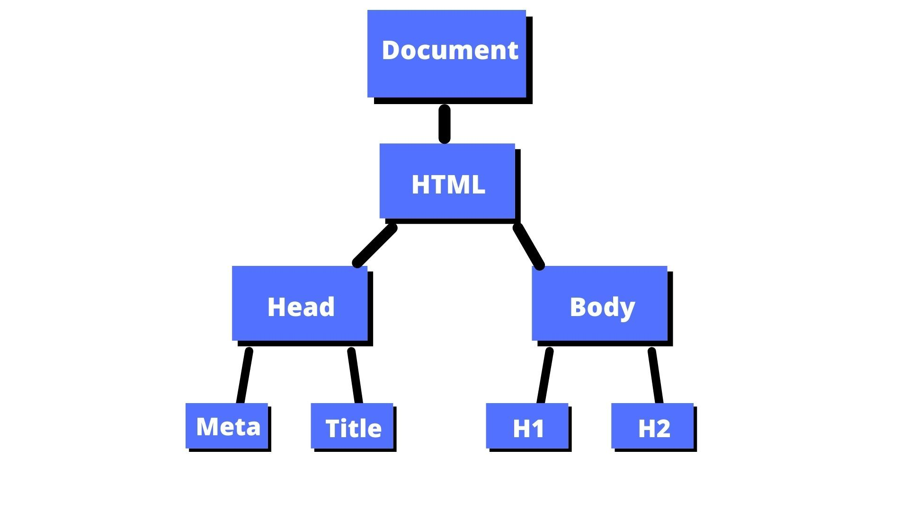
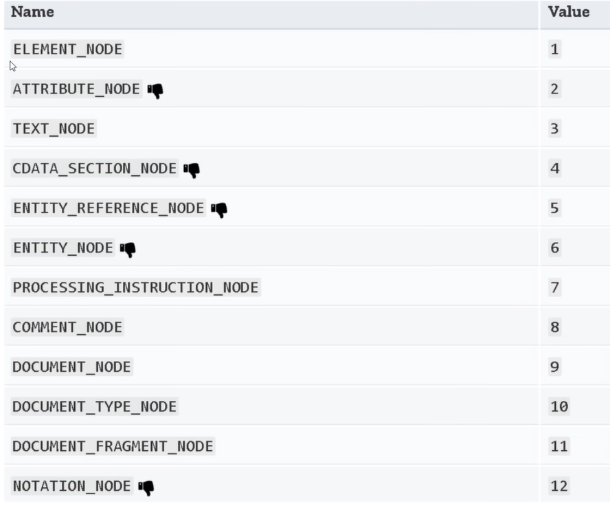
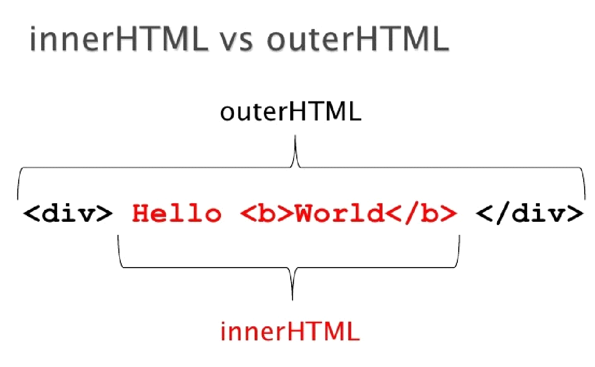
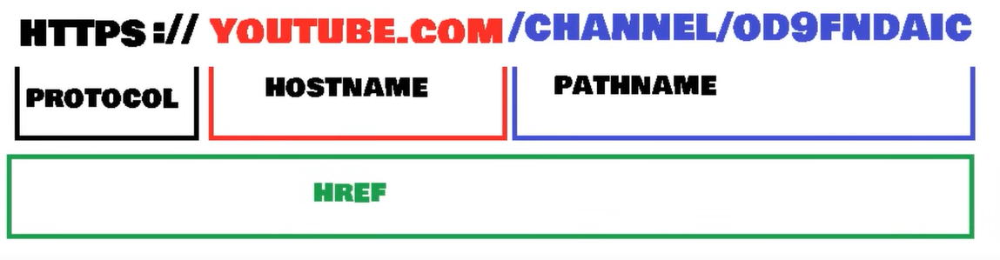
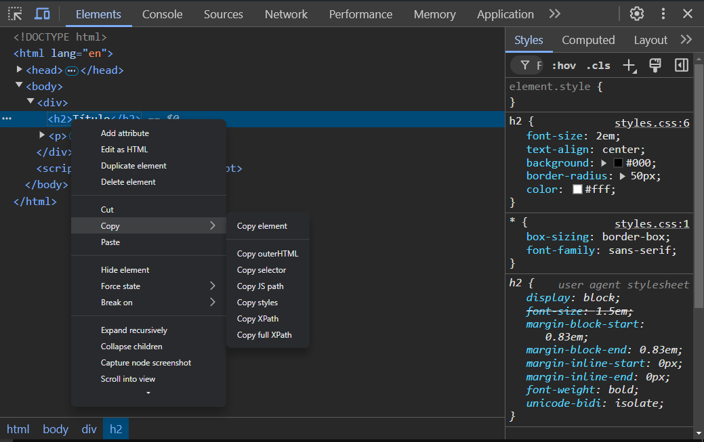
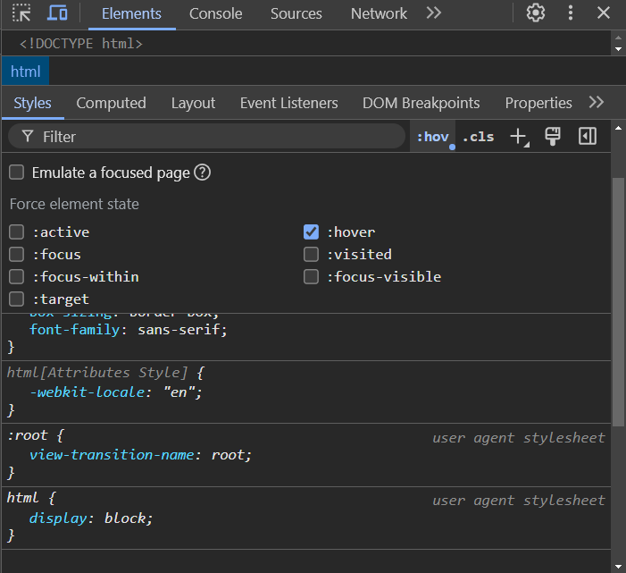
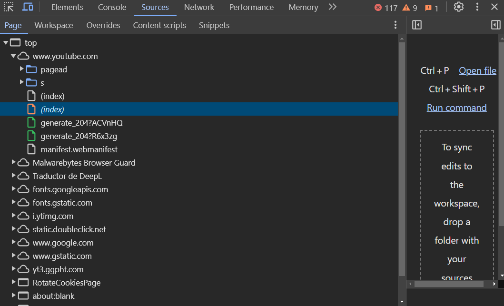
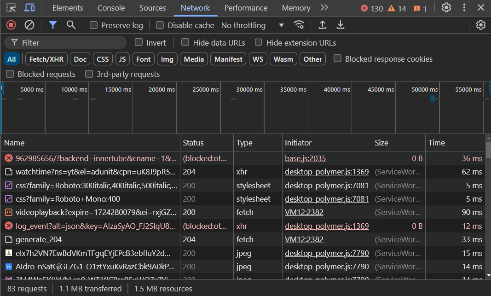
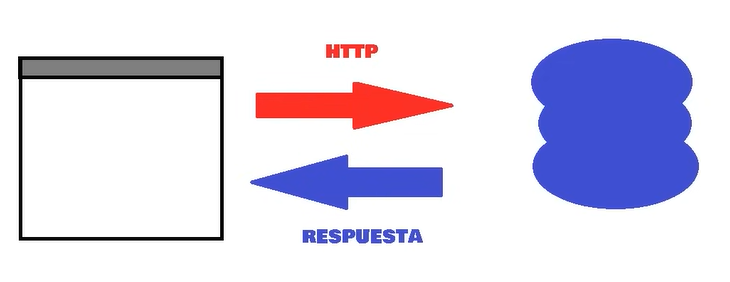

# JavaScript

## Enlazar JS en HTML

- ***Etiqueta script***:
    
    ```jsx
    <script type="text/javascript">
            console.log("Hola")
     </script>
    ```
    

- Con un archivo externo (Recomendado)
    
    ```jsx
    <script src="main.js"></script>
    ```
    

## Prompt y Alert

- **alert( )**: Muestra una ventana con lo que se le indique entre los paréntesis (una cadena de texto).
- **prompt( )**: Muestra una ventana con un texto, y un espacio para escribir. Todo lo que sea escrito en esa ventana, ya sea texto o números, es considerado string.

## Variables

***Tipos de Datos***: 

- **string**: Cadenas de texto.
- **number**: Números.
- **boolean**: True o False.
- **undefined**
- **null**
- **nan**

**Formas de Definir variables**: 

- **let**
- **var**
- **const**

### Diferencia entre Undefined y Null

Undefined es que la variable no está definida, o que no tiene ningún valor, mientras que null, significa que la variable está vacía. 

## Operadores de Asignación

- Asignan un valor al operando de la izquierda basado en el valor del operando de la derecha
    - **x = y**: Asignación
    - **x += y**: Asignación de adición
    - **x -= y**: Asignación de sustracción
    - x ***= y**: Asignación de multiplicación
    - **x /= y**: Asignación de división
    - **x %= y**: Asignación de resto
    - **x \*\*= y**: Asignación de exponenciación


## Operadores Aritméticos

- Toman valores numéricos (ya sean literales o variables) como sus  operandos y retornan un valor numérico único.
    - **+**: Suma
    - **-**: Resta
    - *****: Multiplicación
    - **/**: División
    - %: Módulo o resto
    - **: Exponenciación
    - **++**: Incremento
    - **—**: Decremento

## **Operadores de Comparación**

- a == b: Igualdad
- a ≠ b: Desigualdad
- a === b: Idénticos
- a > b: Mayor que
- a < b: Menor que
- a ≥ b: Mayor o igual que
- a ≤ b: Menor o igual que

## Operadores Lógicos

- Devuelven un resultado a partir de que se cumpla o no una condición. Su resultado es booleano y sus operandos son valores lógicos o asimilables a ellos.
    - exp1 && exp2: **AND**
    - exp1 | | exp2: **OR**
    - !exp: **NOT**

## Arreglos

```jsx
// Array
let arreglo = ["Juan", 21, true];

// Array Asociativo
let datos = {
    nombre: "Juan Bautista",
    apellido: "Malina",
    edad: 21
}

```

## Bucles

- **while(condición):** Bucle que se ejecuta siempre que una condición sea verdadera.
- **do { …}while(condición):** Bucle que se ejecuta al menos una vez sin importar si la condición no es verdadera. 

- **for**
    
    ```jsx
    // Imprimir números del 0 al 4
    for (let i = 0; i < 5; i++) {
        console.log(i);
    }
    ```
    

- **for in**: Devuelve el índice o posición del elemento.
    
    ```jsx
    const persona = { nombre: "Juan", edad: 21, pais: "Estados Unidos" };
    
    for (let clave in persona) {
        console.log(clave + ": " + persona[clave]);
    }
    ```
    

- **for of**: Devuelve cada elemento dentro del arreglo.
    
    ```jsx
    const numeros = [1, 2, 3, 4, 5];
    
    for (let numero of numeros) {
        console.log(numero);
    }
    
    // Salida: 1, 2, 3, 4, 5
    ```
    

**Palabras reservadas para utilizar dentro de los bucles**: 

- **break**: Se utiliza para salir de un bucle antes de que se complete. Una vez que se ejecuta break, el control del programa se pasa a la primera línea de código después del bucle.
- **continue**: Se utiliza para saltar la iteración actual de un bucle y pasar a la siguiente iteración. No detiene el bucle, solo omite el código restante en la iteración actual y sigue con la siguiente.

## Funciones

- **return**: Esta palabra clave sirve para que las funciones devuelvan un valor.

```jsx
// Función Normal
function nombreFuncion(parametros){
    ...
}

// Función Flecha
const funcion_flecha = (parametros) => {...}

```

## POO (Programación Orientada a Objetos)

```jsx
class clase{
	constructor(parametros){
		propiedades ...
	}
}

// Ejemplo
class Animal{
	constructor(especie, edad, color){
		this.especie = especie;
		this.edad = edad;
		this.color = color;
	} 
}

const perro = new Animal("perro", 10, "marrón");

```

- **extends**: Palabra utilizada para heredar clases.
- **super( )**: Método utilizado en clases hijas para heredar el constructor de la clase padre.
- **static**: Palabra utilizada para crear métodos estáticos. Es decir, métodos que no necesitan una instancia de clase para ser utilizados, sino que pueden usarse colocando el nombre de la clase, seguido de un punto y luego el método.

***Getters y Setters***: 

- **Getter**: Permite obtener información de un objeto.
- **Setter**: Permite establecer un valor a un objeto.

```jsx
// Ejemplo: 
class Perro{

	// Método Constructor
	constructor(especie, edad, raza, color){
		super(especie, edad, color);
		this.raza = raza;
	}
	
	// Setter
	set setRaza(nueva_raza){
		this.raza = nueva_raza
	}
	
	// Getter
	get getRaza(){
		return this.raza;
	}

}

perro = new Perro();
perro.modificarRaza = "Golden Retriever";
```

## Métodos de Cadena

- **concat( )**: Junta dos o más cadenas y devuelve una nueva.
- **startsWith( )**: Si una cadena comienza con los caracteres de otra cadena, devuelve true, sino devuelve false.
- **endsWith( )**: Si una cadena termina con los caracteres de otra cadena, devuelve true, sino devuelve false.
- **includes( )**: Si una cadena puede encontrarse dentro de otra cadena, devuelve true, sino devuelve false.
- **indexOf( )**: Devuelve el índice del primer carácter de la cadena, si no existe, devuelve -1.
- **lastIndexOf( )**: Devuelve el índice del primer carácter de la cadena, contando desde el final al principio, si no existe, devuelve -1.
- **padStart(longitud_máxima, “carácter/es a repetir”)**: Rellenar cadena al principio con los caracteres deseados.
- **padEnd(longitud_máxima, “carácter/es a repetir”)**: Rellenar cadena al final con los caracteres deseados.
- **repeat( )**: Devuelve la misma cadena pero repetida la cantidad.
- **split( )**: Divide la cadena como le pidamos y la convierte en array. La cadena se va a dividir cada vez que encuentre lo establecido en los paréntesis, y cada división representa un elemento.
- **subString( posición_inicio, posición_final)**: Retorna un pedazo de la cadena que seleccionamos. Se le puede indicar a partir de qué posición extraer la cadena y también hasta qué posición
- **toLowerCase( )**: Convierte una cadena a minúsculas.
- **toUpperCase( )**: Convierte una cadena a mayúsculas.
- **toString( )**: Devuelve una cadena que representa al objeto
- **trim( )**: Elimina los espacios en blanco al principio y al final de una cadena.
- **trimEnd( )**: Elimina los espacios en blanco al final de una cadena.
- **trimStart( )**: Elimina los espacios en blanco al comienzo de una cadena.
- **valueOf( )**: Retorna el valor primitivo de un objeto string.

## Métodos de Arrays

**Transformadores**: 

- **pop( )**: Elimina el último elemento de un array y lo devuelve.
- **push( )**: Agrega un elemento al final del array.
- **shift( )**: Elimina el primer elemento de un array y lo devuelve.
- **unshift(** ): Agrega uno o más elementos al inicio del array y devuelve la nueva longitud del array.
- **reverse( )**: Invierte el orden de los elementos de un array.
- **sort( )**: Ordena los elementos del arreglo localmente y devuelve el arreglo ordenado.
- **splice(start, cant_elementos_a_eliminar, objeto_añadir)**: Cambia el contenido de un array eliminando elementos existentes y/o agregando nuevos elementos.

**Accesores**: 

- **join( )**: Une todos los elementos de una matriz (u objeto similar) en una cadena y la devuelve.
- **slice( )**: Devuelve una parte del array dentro de un nuevo array empezando por inicio hasta fin (fin no incluido)
- t**oString( ), indexOf( ), lastIndexOf( ), includes( ).**

**De Repetición**: 

- **filter( )**: Crea un nuevo array con todos los elementos que cumplan la condición
- **forEach( )**: Ejecuta la función indicada una vez por cada elemento del array.

## Objeto Math

**Métodos**: 

- **sqrt( )**: Devuelve la raíz cuadrada positiva de un número.
- **cbrt( )**: Devuelve la raíz cúbica de un número.
- **max( )**: Devuelve el mayor de cero o más números.
- **min( )**: Devuelve el más pequeño de cero o más números.
- **random( )**: Devuelve un número aleatorio entre 0 y 1.
- **round( )**: Devuelve el valor de un número redondeado al número entero más cercano.
- **fround( )**: Devuelve la representación flotante de precisión simple más cercana de un número.
- **floor( )**: Devuelve el mayor entero menor que o igual a un número.
- **trunc( )**: Devuelve la parte entera del número x, la eliminación de los dígitos fraccionarios.

**Propiedades**:

- **PI**: 3.14159.
- **SQRT1_2**: Raíz cuadrada de 1/2.
- **SQRT2**: Raíz cuadrada de 2.
- **E**: Constante de Euler, la base de los logaritmos naturales.
- **LN2**: Logaritmo natural de 2.
- **LN10**: Logaritmo natural de 10.
- **LOG2E**: Logaritmo de E con base 2.
- **LOG10E**: Logaritmo de E con base 10.

## **Consola**

**Funciones de Registro**: 

- **console.assert( )**: Aparece un mensaje de error en la consola si la afirmación es falsa. Si la afirmación es verdadera, no aparecerá nada.
- **console.clear( )**: Limpia la consola.
- **console.error( )**: Muestra un mensaje de error en la consola web.
- **console.info( )**: Emite un mensaje informativo a la consola web.
- **console.log( )**: Muestra un mensaje en la consola web (o del intérprete de javascript).
- **console.table( )**: Esta función toma como argumento obligatorio: data, que debe ser un array o un objeto, y un parámetro adicional: columns y nos muestra una tabla en consola.
- **console.warn( )**: Imprime un mensaje de advertencia en la consola web.
- **console.dir( )**: Despliega una lista interactiva de las propiedades del objeto Javascript indicado.

**Funciones de Conteo**: 

- **console.count( )**: Registra el número de veces que se llama a count. Esta función toma como argumento opcional una etiqueta.
- **console.countReset( )**: Resetea el contador console.count( ).

**Funciones de Agrupación**: 

- **console.group( )**: Crea un nuevo grupo en línea en el registro de la consola web.
- **console.groupEnd( )**: Remueve un grupo en línea en el registro de la consola web.
- **console.groupCollapsed( )**: Crea un grupo en línea pero contraido, el usuario debe expandirlo para poder verlo.

**Funciones de Temporización**: 

- **console.time( )**: Inicia un temporizador
- **console.timeLog( )**: Registra el valor actual de un temporizador
- **console.timeEnd( )**: Detiene un temporizador

**Modificar estilo del texto**: 

- **console.log("%c texto", "color:red;background:black")**

---

## DOM (Document Object Model)



**Nodo**: Es cualquier etiqueta del cuerpo, como un párrafo, el mismo body o incluso las etiquetas de una lista.  

- ***Document**: El nodo documment es el nodo raíz, a partir del cual derivan el resto de nodos.
- ***Element**: Nodos definidos por etiquetas html.
- ***Text**: El texto dentro de un nodo element se considera un nuevo nodo hijo de tipo text (texto).
- ***Attribute**: Los atributos de las etiquetas definen nodos (en JavaScript no los veremos como nodos, sino como información asociada al nodo de tipo element).
- ***Comentarios y otros**: Los comentarios y otros elementos como las declaraciones doctype en cabecera de los documentos HTML generan nodos.



### **Métodos de selección de elementos**

- **document.getElementbyId(”id”)**: Selecciona un elemento por ID.
- **document.getElementsbyTagName( )**: Selecciona todos los elementos que coincidan con el nombre de la etiqueta especificada.
- **document.querySelector(”#id .class”)**: Devuelve el primer elemento que coincida con el grupo especificado de selectores. Si es un ID se coloca # y el nombre del id, mientras que si es una clase se coloca un punto y el nombre de la clase.
- **document.querySelectorAll( )**: Devuelve todos los elementos que coincidan con el grupo especificado de selectores.

### **Métodos para Definir, Obtener y Eliminar atributos**

- **elemento.metodo( )**
- **setAttribute(atributo, valor)**: Modifica el valor de un atributo
- **getAttribute(atributo)**: Obtiene el valor de un atributo
- **removeAttribute(atributo)**: Remueve  el valor de un atributo

### **Atributos Globales**

- *Todos los elementos de HTML tienen estos atributos*.
- **contentEditable**: Indica si el elemento puede ser modificable por el usuario (bool).
- **dir**: Indica la direccionalidad del texto
- **hidden**: Oculta el elemento
- **tabindex**: Indica si el elemento puede obtener un focus de input. Se le asignan números a este atributo, de forma que cada número representa el orden en el que se van a focusear los elementos al apretar la tecla tab
- **title**: mini título que aparece al colocar el cursor encima de un elemento

### **Atributos de Inputs**

- *Modificar atributos o mostrar por pantalla*. **elemento_input.atributo**
- **className**: Indica el nombre de la clase
- **value**: Indica el valor del input (contenido)
- **type**: Indica el tipo del input
- **minlength**: Indica la cantidad mínima de caracteres para enviar un formulario
- **placeholder**: Indica el placeholder del input
- **required**: Convierte al campo en requerido, obligatorio
- **accept**: Se utiliza en inputs de tipo file, para indicar que tipo de archivos acepta.
- **form**: Se utiliza para asociar un input submit con un formulario, teniendo en cuenta que dicho input se encuentra fuera de las etiquetas del formulario. Para utilizarlo se coloca un id al formulario y al input submit se coloca form seguido del id dado al formulario.

### **Atributo Style**

- Para utilizarlo, se coloca el nombre de la variable seguido de un punto, luego la palabra style, posteriormente otro punto y el nombre de la propiedad a modificar. Finalmente igual y el valor.  **elemento.style.propiedad**.

**Ejemplo**: 

```jsx
let titulo = document.querySelector(".titulo");
titulo.style.color = "white";
titulo.style.background = "black"
titulo.style.fontFamily = "sans-serif"
```

### **Clases, classList y Metodos de classList**

- ***elemento.metodo( )*.**
- **classList.add( )**: Añade una clase
- **classList.remove( )**: Remueve una clase
- **classList.item( )**: Devuelve la clase del índice especificado
- **classList.contains( )**: Verifica si ese elemento posee o no la clase especificada
- **classList.replace( )**: Reemplaza una clase por otra
- **classList.toggle( )**: Si no tiene la clase especificada, la agrega. Si la tiene, la elimina.

### **Obtención y Modificación de Elementos**

- ***textContent***: Devuelve el texto de cualquier nodo (no incluye etiquetas html). No recurre al estilo css, por lo que muestra todo el texto.
- ***innerHTML***: Devuelve el contenido HTML de un elemento (incluye etiquetas html)
- ***outerHTML***: Devuelve el código completo HTML del elemento (incluye etiquetas html)
    
    
    

- ***~~innerText~~***: Devuelve el texto visible de un node element (no incluye etiquetas html). NO SE USA MÁS
- ***~~outerText~~***: NO SE USA MÁS

### Creación de Elementos

- **createElement( )**: Crea un elemento. Para añadir el elemento se coloca entre comillas y en mayúsculas el elemento.
- **createTextNode( )**: Crea el contenido (texto) del elemento
- **appendChild( )**: Inserta el texto en el elemento
- **createDocumentFragment( )**: Crea un contenedor invisible y temporal donde puedes agregar varios elementos antes de insertarlos todos juntos en el documento, lo que mejora el rendimiento al reducir el número de actualizaciones en la página.

```jsx
// Ejemplo de la creación e inserción de un elemento
let contenedor = document.querySelector(".contenedor");
let item = document.createElement("LI"); // Crear elemento
let contenido = document.createTextNode("Item 1"); // Crear contenido
item.appendChild(contenido); // Unir el contenido al elemento
contenedor.appendChild(item) // Unir el elemento al contenedor

// Ejemplo de la creación de varios elementos
let contenedor = document.querySelector(".contenedor");
let fragmento = document.createDocumentFragment();

for (let i = 0; i < 10; i++) {
  
  // Paso 1: Crear el elemento tipo li
  const item = document.createElement("LI");

  // Paso 2: Crear el contenido para el elemento
  item.innerHTML = `Elemento de la lista N°${i+1}`;

  fragmento.appendChild(item);  // Paso 3: Unir cada item al fragmento
}

contenedor.appendChild(fragmento); // Paso 4: Unir el fragmento al contenedor
```

### **Obtención y Modificación de Childs**

- **firstChild**: Selecciona el primer hijo (incluye espacios entre etiquetas).
- **lastChild**: Selecciona el último hijo (incluye espacios entre etiquetas).
- **firstElementChild**: Selecciona el primer hijo sin incluir los espacios entre etiquetas.
- **lastElementChild**: Selecciona el último hijo sin incluir los espacios entre etiquetas.
- **childNodes**: Devuelve todos los nodos hijos (incluye los espacios entre etiquetas).
- **children**: Solamente devuelve las etiquetas HTML. No incluye los espacios entre etiquetas y tampoco incluye los nodos de texto, es decir, el contenido de las etiquetas.

### **Métodos de Childs (Hijos)**

- **replaceChild(elemento-nuevo, elemento-antiguo)**: Reemplaza un elemento por otro
- **removeChild( elemento)**: Elimina el elemento hijo indicado
- **hasChildNodes( )**: Devuelve true en caso de que el elemento tenga hijos y false en caso de que el elemento no tenga hijos. (se considera como hijo al contenido textual, los node text)

### **Propiedades de Parents (Padres)**

- **parentElement**: Devuelve el elemento padre
- **parentNode**: Devuelve cualquier nodo padre

### **Propiedades de Siblings (Hermanos)**

- **nextSibling**: Devuelve el elemento hermano siguiente (incluye los espacios entre etiquetas)
- **previousSibling**: Devuelve el elemento hermano anterior (incluye los espacios entre etiquetas)
- **nextElementSibling**: Devuelve el elemento hermano siguiente sin incluir los espacios entre etiquetas.
- **previousElementSibling**: Devuelve el elemento hermano anterior sin incluir los espacios entre etiquetas.

**Nodos - Extra**:

- **closest(selector)**: Selecciona el elemento ascendente más cercano que coincida con un selector

---

## **Objeto Window**

- **window.propiedad**
- Hereda las propiedades de EventTarget
- **open( )**: Carga un recurso en el contexto de un nuevo navegador o uno que ya existe.
- **close( )**: Cierra la ventana actual, o la ventana en la que se llamó.
- **closed**: Indica si la ventana referenciada está cerrada o no.
- **stop( )**: Detiene la carga de recursos en el contexto de navegación actual.
- **alert( )**: Muestra un cuadro de alerta con el contenido especificado y un botón Aceptar.
- **print( )**: Abre el cuadro de diálogo Imprimir para imprimir el documento actual.
- **prompt( )**: Abre un cuadro de diálogo con un mensaje que solicita al usuario un dato (String).
- **confirm( )**: Abre un cuadro de diálogo con un mensaje y dos botones: Aceptar y Cancelar.

- **screen**: Devuelve una referencia al objeto de pantalla asociado con la ventana.
- **screenLeft**: Devuelve la distancia horizontal entre el borde izquierdo del navegador y el borde izquierdo de la pantalla.
- **screenTop**: Devuelve la distancia vertical entre el borde superior del navegador y el borde superior de la pantalla.
- **scrollX**: Devuelve el número de píxeles que el documento se desplaza actualmente horizontalmente.
- **scrollY**: Devuelve el número de píxeles que el documento se desplaza actualmente verticalmente.
- **scroll( )**: Desplaza la ventana a un lugar particular en el documento (con options y con posiciones).

- **resizeBy( )**: Cambia el tamaño de la ventana actual en una cantidad específica.
- **resizeTo( )**: Redimensiona dinámicamente la ventana.
- **moveBy( )**: Mueve la ventana en una ubicación relativa.
- **moveTo( )**: Mueve la ventana en una ubicación absoluta.

**Objetos Barprop**:

- locationbar
- menubar
- personalbar
- scrollbars
- statusbar
- toolbar

**Location**:

- **window.location.href**: Devuelve el href (URL) de la página actual.
- **window.location.hostname**: Devuelve el nombre de dominio del servidor web.
- **window.location.pathname**: Devuelve la ruta y el nombre de archivo de la página actual.
- **window.location.protocol**: Devuelve el protocolo web utilizado (http o https)
- **window.location.assign( )**: Carga un nuevo documento



## Chrome Developer Tools

### Pestaña Elements

- Filtrar y buscar por palabras claves
- Modificar, crear y eliminar etiquetas
- Modificar propiedades de CSS
- Opciones para copiar





### Pestaña Sources

- Ver y guardar archivos
- Información ofrecida
- Cambios en tiempo real
- Snipets - Ejecutar código por fragmentos



### Pestaña Networks

- Interfaz
- Sort By y Filtro de búsqueda
- Limpiar Cookies y Caché
- Importar y exportar



### Pestaña Performance/Timeline

- Uso y grabación
- Screenshots de la grabación
- Controls
- Overviews

## Eventos

- **elemento.addEventListener(evento, función)**: Añade un evento a un elemento.
    
    *Por Ejemplo*:
    
    ```jsx
    btn.addEventListener("click", saludar);
    
    function saludar(){
    	alert("Hola!");
    }
    ```
    

- **elemento.removeEventListener(evento, función)**: Remueve el evento de un elemento.
- **elemento.addEventListener(evento, (e) ⇒ { console.log(e} )**:Obtener el objeto desde el cual se ejecutó el evento

### Event Flow: Event Bubbling vs Event Capturing

- El Event Bubbling es el por defecto. Este ocurre cuando se ejecutan los eventos de los más específicos (los hijos), a los menos específicos (los contenedores).
- Para cambiar Event Bubbling por Event Capturing, se debe añadir un tercer parámetro de la siguiente manera:
    
    ```jsx
    elemento.removeEventListener(evento, función, true);
    ```
    

### Eventos del Mouse

- **click**: Ocurre con un click
- **dbclick**: Ocurre con un doble click
- **mouseover**: Ocurre cuando el puntero se mueve sobre un elemento  o sobre uno de sus hijos
- **mouseout**: Ocurre cuando se mueve el puntero fuera de un elemento o de sus elementos secundarios
- **contextmenu**: Ocurre con un click en el botón derecho en un elemento para abrir un menú contextual
- **mouseenter**: Ocurre cuando el puntero se mueve sobre un elemento
- **mouseleave**: Ocurre cuando el puntero se mueve fuera de un elemento
- **mouseup**: Ocurre cuando un usuario suelta un botón del mouse sobre el elemento
- **mousedown**: Ocurre cuando un usuario apreta (pulsa pero no suelta) un botón del mouse sobre un elemento
- **mousemove**: Ocurre cuando el puntero se mueve mientras está sobre un elemento

### Eventos del Teclado

- **keydown**: Ocurre cuando una tecla se deja de presionar
- **keypress**: Ocurre cuando una tecla se presiona
- **onkeyup**: Ocurre después de que los dos eventos anteriores hayan concluido consecutivamente

### Eventos de la Interfaz

- **error** Ocurre cuando sucede un error durante la carga de un archivo multimedia
- **load**: Ocurre cuando un objeto se ha cargado
- **beforeunload**: Ocurre antes de que el documento esté a punto de descargarse
- **unload**: Ocurre una vez que se ha descargado una página
- **resize**: Ocurre cuando se cambia el tamaño de la vistta del documento
- **scroll**: Ocurre cuando se desplaza la barra de desplazamiento de un elemento
- **select**: Ocurre después de que el usuario selecciona algún texto de `<input>` o `<textarea>`


### Timers (Temporizadores)

- **setTimeout( )**: Establece un temporizador. Recibe dos parámetros, en primer lugar recibe una función y allí irá el código que deseemos ejecutar, mientras que en segundo lugar recibe un tiempo en milisegundos, lo que significa que el código establecido se ejecutará una vez que pasen los segundos establecidos.
    
    ```jsx
    setTimeout(() => {
        document.write("<h1>Bienvenido</h1>")
    }, 2000);
    ```
    

- **setInterval( )**: Establece otro tipo de temporizador (como si fuera un bucle). En este caso, también recibe 2 parámetros. En primer lugar se le debe pasar una función con el código que deseemos ejecutar, mientras que en segundo lugar debemos pasarle un tiempo en milisegundos. Entonces, lo que hará esta función es ejecutar la función que le pasemos cada x segundos (donde x son los milisegundos pasados).
    
    ```jsx
    const intervalo = setInterval(() =>{
        document.write("hola");
    }, 2000);
    
    ```
    

- **clearTimeout( )**: Elimina el temporizador de **setTimeout**.
- **clearInterval( )**: Elimina el intervalo de **setInterval**.

## Control de flujo y Manejo de errores

### Excepciones y Tipos de Excepciones

- Excepciones ECMAScript
- DOMException y DOMError

### Try… Catch

- **Aclaración**: El bloque try y catch no contempla errores de sintaxis.
- **try**: Intentar ejecutar un bloque de código.
- **catch**: Se ejecutará en caso de que ocurra un error dentro del try. Recibe como parámetros el error ocurrido en el try.
- **finally**: Se ejecutará siempre, al terminar de ejecutar ya sea el try o el catch.
- **throw**: Sirve para provocar un error.

```jsx
// Ejemplo de try y catch
try {
    // Intentamos ejecutar este bloque de código
    let sum = a + 10; // Esto provocará un error porque 'a' no está definida

} catch (error) {
    // Si hay un error en el bloque try, se ejecuta este bloque
    console.log("Ocurrió un error: " + error.message);

} finally {
    // Este bloque siempre se ejecuta, independientemente de si hubo un error o no
    console.log("El bloque finally siempre se ejecuta.");
}

// Ejemplo de uso: throw
try{
	throw "Ingreso Inválido";
}catch(e){
		console.log("Error: " + e);
}

```

### Sentencia Switch

- Es una especia de if, que permite una mayor legibilidad en el código
- Se utiliza la palabra reservada ***break***, ya que de lo contrario, se ejecutarían todos los casos

```jsx
let day = 3;

switch (day) {
    case 1:
        console.log("Hoy es lunes");
        break;
    case 2:
        console.log("Hoy es martes");
        break;
    case 3:
        console.log("Hoy es miércoles");
        break;
    case 4:
        console.log("Hoy es jueves");
        break;
    case 5:
        console.log("Hoy es viernes");
        break;
    case 6:
        console.log("Hoy es sábado");
        break;
    case 7:
        console.log("Hoy es domingo");
        break;
    default:
        console.log("Día no válido");
}
```

## Trabajar de Manera Obsoleta

### ¿Cuándo algo se vuelve obsoleto?

- “Deprecated”
- Inútil
- No recomendado
- Tiene Bugs o Fallos
- Está por ser reemplazado
- Hay mejores formas de hacerlo

### Los efectos negativos (aplicado a métodos, clases y propiedades)

- Uso excesivo de recursos
- Código con Bugs o Fallos
- Código innecesariamente largo
- SEO

### ¿Cómo verificar si algo está obsoleto?

- Verificar si tienen o usan funciones, métodos, objetos o metodologías obsoletas
- Verificar en los sitios basados en estándares oficiales

## Callbacks

- Son funciones que se pasan como parámetro a otras funciones

```jsx
// Función que toma un callback como argumento
function procesarEntradaUsuario(callback) {
    const nombre = prompt("Por favor, ingresa tu nombre:");
    callback(nombre);
}

// Función callback que se pasa como argumento
function saludarUsuario(nombre) {
    alert("¡Hola, " + nombre + "!");
}

// Llamada a la función principal con el callback
procesarEntradaUsuario(saludarUsuario);

```

## Promesas

- Es un objeto que representa la eventual terminación (o falla) de una operación asíncrona y su valor resultante. En otras palabras, es una forma de manejar acciones que toman tiempo en completarse, como una solicitud a un servidor, una lectura de archivos, o cualquier proceso que no se resuelve de inmediato.

```jsx
const miPromesa = new Promise((resolver, rechazar) => {
    setTimeout(() => {
        resolver("¡Operación completada con éxito!");
    }, 1000); // Esperar 1 segundo
});

// Usar la promesa
miPromesa
    .then(mensaje => {
        console.log(mensaje); // Se ejecuta si la promesa se cumple
    })
    .catch(error => {
        console.error("Error:", error); // Se ejecuta si la promesa es rechazada
    });

```

## Await y Async

- Es una manera para trabajar con funciones asincrónicas de manera más sencilla

```jsx
const objeto = {
	nombre: "Juan",
	edad: 22
}

// Función que simula una tarea asincrónica
function obtenerInformacion(){
    return new Promise((resolve, reject) => {
        setTimeout(() => {
            resolve(objeto)
        }, 3000);
    })
}

// Función asincrónica que utiliza 'await'
async function mostrarResultado(){
		resultado = await obtenerInformacion(); // Espera a que la promesa se resuelva
		console.log(resultado);
}

// Llamada a la función asincrónica
mostrarResultado();

```

---

## Peticiones HTTP

- Es una petición que uno envía a un servidor. El servidor devuelve una información.



### Datos Estructurados (JSON)

- **JSON.parse( )**: Convierte un string con estructura JSON a Formato JSON (deserializar)
- **JSON.stringify( )**: Convierte un dato de JavaScript en una cadena de texto JSON (serializar)

```jsx
// JSON serializado (es un string)
const persona = '{ "nombre" : "Juan", "edad" : "22", "profesion" : "programador" }';

// JSON deserializado (es un objeto)
const persona = {
	"nombre" : "Juan",
	"edad" : "22",
	"profesion" : "programador"
	}

//-------------------------------------------------------------------------------
// USANDO MÉTODOS

// JSON.stringify()
const usuario = {nombre: "Ana", edad: 25, activo: true};
const usuarioJSON = JSON.stringify(usuario); // Convertir el objeto JavaScript a una cadena JSON
console.log(usuarioJSON); // Salida: '{"nombre":"Ana","edad":25,"activo":true}'

// JSON.parse()
const datosJSON = '{"nombre":"Ana","edad":25,"activo":true}';
const datos = JSON.parse(datosJSON); // Convertir la cadena JSON a un objeto JavaScript

console.log(datos.nombre); // Salida: 'Ana'
console.log(datos.edad);   // Salida: 25
console.log(datos.activo); // Salida: true

```

### AJAX (JavaScript Asíncrono o Asynchronous JavaScript and XML)

- ***¿Qué es AJAX?***: Es una técnica de desarrollo web, que permite a una página web comunicarse con el servidor sin tener que recargar la página completa. Esto permite que partes específicas de una página web se actualicen de manera rápida y eficiente, mejorando la experiencia del usuario.

- *Ejemplo*: Imagina que estás en una tienda en línea y quieres ver detalles de un producto. Normalmente, cuando haces clic en un enlace, la página se recarga completamente para mostrarte la nueva información. Con **AJAX**, solo se actualiza la parte de la página donde están los detalles del producto, sin recargar toda la página.

### **XMLHttpRequest**

- A través de este objeto pueden realizarse peticiones

```jsx
// Creación del Objeto
const peticion = new XMLHttpRequest;

// Configurar la petición al servidor
peticion.open("GET", "informacion.txt");

// Envía la solicitud previamente configurada al servidor
peticion.send();
```

- **addEventListener(”readystatechange”, ( ) ⇒ { …})**: Este evento tiene 4 estados. El primer estado significa que la solicitud se creó correctamente, el segundo significa que la solicitud se envió correctamente, el tercero significa que se está procesando la petición. Finalmente, el cuarto estado significa que el resultado ya se puede utilizar.
    
    ```jsx
    const peticion = new XMLHttpRequest;
    
    peticion.addEventListener("readystatechange", () =>{
        console.log(peticion.readyState);
    })
    
    peticion.open("GET", "informacion.txt");
    peticion.send();
    ```
    

- **addEventListener(”load”, ( ) ⇒ { …})**: Manejar la respuesta cuando una solicitud HTTP ha finalizado exitosamente

```jsx
const peticion = new XMLHttpRequest;

peticion.addEventListener("load", () =>{

    let respuesta;

    if(peticion.status == 200) respuesta = peticion.response;
    else respuesta = "Lo siento, no se ha encontrado el recurso";

    console.log(respuesta)
})

peticion.open("GET", "informacion.txt");
peticion.send();

```

### Propiedades de XMLHttpRequest

- **peticion.propiedad**: Para usar estas propiedades hay que primero crear un objeto del tipo XMLHttpRequest y luego acceder a las propiedades.

- **response**: Devuelve la respuesta de una solicitud HTTP
- **readyState**: Indica el estado de la solicitud. Posibles valores: 1, 2, 3 o 4.
- **status**: El código de estado HTTP devuelto por el servidor.
    - `200` – Éxito (OK).
    - `404` – No encontrado (Not Found).
    - `500` – Error interno del servidor (Internal Server Error).
    - **Uso común**: Para verificar si la solicitud fue exitosa (`status === 200`).

### ActiveXObject

- Este objeto se utiliza para el navegador de Internet Explorer, ya que no soporta XMLHttpRequest.
    
    ```jsx
    let peticion;
    if(window.XMLHttpRequest){
        peticion = new XMLHttpRequest();
    }else{
        peticion = new ActiveXObject("Microsoft.XMLHTTP")
    }
    ```
    
- Entonces, el código verifica si el navegador soporta `XMLHttpRequest` (usado en navegadores modernos) y, en caso contrario, utiliza `ActiveXObject` para versiones antiguas de Internet Explore

### Enviar peticiones POST

```jsx
const peticion = new XMLHttpRequest;

peticion.addEventListener("load", () =>{
    let respuesta;
    if(peticion.status == 200 || peticion.status == 201) respuesta = peticion.response;
    else respuesta = "Lo siento, no se ha encontrado el recurso";

    console.log(JSON.parse(respuesta)); 
})

peticion.open("POST", "https://reqres.in/api/users");
peticion.setRequestHeader("Content-type", 'application/json;charset=utf-8')
peticion.send(JSON.stringify({
    "name": "morpheus",
    "job": "leader"
}))

```

### Fetch

- Es una función de JavaScript que permite realizar solicitudes HTTP asíncronas (como GET, POST, PUT, DELETE, etc.) a servidores web. En otras palabras, fetch es una forma de trabajar similar a el objeto XMLHttpRequest.
- Fetch devuelve una promesa, por lo que hay que trabajarlo con then. Al utilizar el primer then, se obtiene un objeto de tipo Response, por lo que hay que utilizar métodos y otros then.
- Otro dato importante es que por defecto, Fetch realiza peticiones GET.

```jsx
// Ejemplo 1: 
peticion = fetch('https://jsonplaceholder.typicode.com/todos/1')

peticion
      .then(respuesta => respuesta.json()) // Obtener la respuesta  y convertir a json
      .then(json => console.log(json)) // Mostrar respuesta

// Ejemplo 2:
peticion = fetch("https://pokeapi.co/api/v2/pokemon/ditto");
peticion
    .then(res => res.text()) // Obtener la respuesta y convertir a texto
    .then(res => console.log(JSON.parse(res))) // Convertirla a json y mostrarla

```

### Métodos de Fetch

- ***respuesta*.json( )**: Convierte la respuesta a JSON.
- ***respuesta*.text( )**: Convierte la respuesta a texto (string).

### Librería Axios

- **¿Qué es?**: **Axios** es una **librería de JavaScript** que permite hacer solicitudes HTTP asíncronas a servidores web desde navegadores o Node.js. En pocas palabras, vendría a ser el reemplazo de Fetch.
- **Instalación**: [https://github.com/axios/axios](https://github.com/axios/axios)

```html
<script src="https://cdn.jsdelivr.net/npm/axios@1.6.7/dist/axios.min.js"></script>
```

---

## Resumen Peticiones HTTP (Maneras de Trabajar)

### XMLHttpRequest (Antigua)

**Propiedades**: 

- **response**: Devuelve la respuesta de una solicitud HTTP
- **readyState**: Indica el estado de la solicitud. Posibles valores: 1, 2, 3 o 4.
- **status**: El código de estado HTTP devuelto por el servidor.

**Ejemplo**: 

```jsx
// GET
const peticion = new XMLHttpRequest;

peticion.addEventListener("load", () =>{
    let respuesta;
    if(peticion.status == 200) respuesta = peticion.response;
    else respuesta = "Lo siento, no se ha encontrado el recurso";
    console.log(respuesta)
})

peticion.open("GET", "informacion.txt");
peticion.send();

// --------------------------------------------

// POST
const peticion = new XMLHttpRequest;

peticion.addEventListener("load", () =>{
    let respuesta;
    if(peticion.status == 200 || peticion.status == 201) respuesta = peticion.response;
    else respuesta = "Lo siento, no se ha encontrado el recurso";
    console.log(JSON.parse(respuesta)); 
})

peticion.open("POST", "https://reqres.in/api/users");
peticion.setRequestHeader("Content-type", 'application/json;charset=utf-8')
peticion.send(JSON.stringify({
    "name": "morpheus",
    "job": "leader"
}))

```

### Fetch API

**Propiedades**: 

- ***respuesta*.json( )**: Convierte la respuesta a JSON.
- ***respuesta*.text( )**: Convierte la respuesta a texto (string).

**Ejemplo**: 

```jsx
peticion = fetch('https://pokeapi.co/api/v2/pokemon/ditto')

peticion
      .then(respuesta => respuesta.json()) // Obtener la respuesta  y convertir a json
      .then(json => console.log(json)) // Mostrar respuesta
```

### Axios

**Ejemplo**: 

```jsx
// GET
peticion = axios("https://pokeapi.co/api/v2/pokemon/ditto")
peticion
    .then(res => console.log(res.data));

// POST
peticion = axios.post("https://reqres.in/api/users", {"nombre" : "juan"})
peticion
    .then(res => console.log(res.data))
```

---