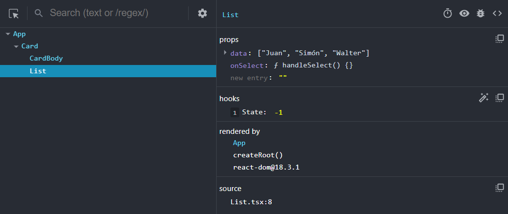
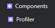
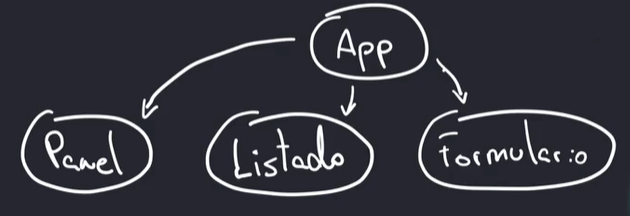
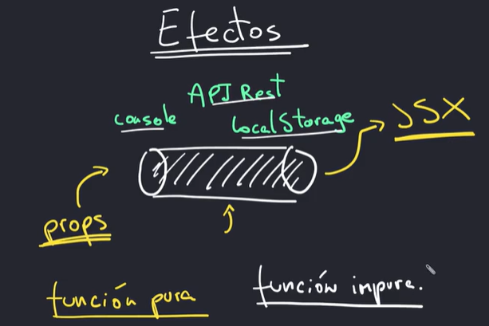
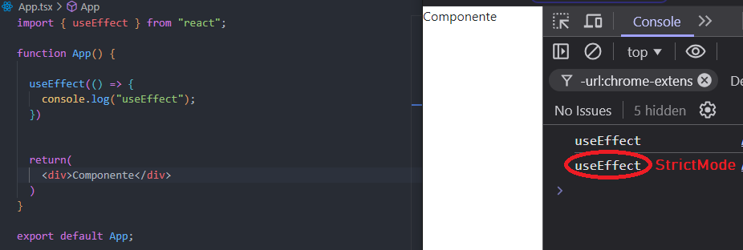
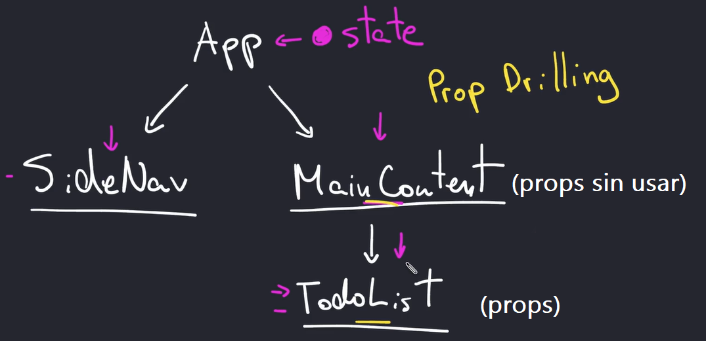
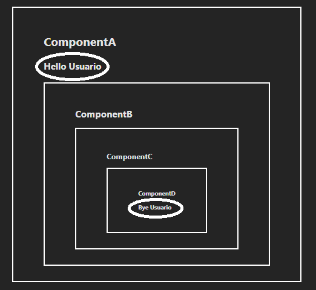

# REACT

## ¿Qué es React?

- Es una biblioteca para poder construir interfaces ya sea webs o nativas. Es decir, React puede ser utilizado para construir aplicaciones webs o aplicaciones móviles para Android e IOS. También pueden construirse aplicaciones para Windows, Mac y Linux.

---

## Configurando ambiente de Trabajo

- ***Node.js***: [https://nodejs.org/en/download/package-manager](https://nodejs.org/en/download/package-manager)
- **VSC**: [https://code.visualstudio.com/](https://code.visualstudio.com/)
    - ***Extensiones Recomendadas***:
        - **Prettier**
        - **ES7+ React/Redux/React-Native snippets (autor: dsznajder**)

---

# Instalación

## CRA vs Vite

### ¿Qué es CRA? (No Recomendado)

- Herramienta muy popular para configurar nuevos proyectos de React sin configuración.
- Proporciona un entorno preconfigurado con una configuración predeterminada
- Incluye Webpack, Babel y ESLint, entre otros. Esto permite a los desarrolladores centrarse en escribir código en lugar de lidiar con configuraciones de compilación complejas.

```bash
// CRA
npx create-react-app nombre-proyecto

// Iniciar el proyecto
npm start
```

### ¿Qué es Vite? (Recomendado)

- Empaquetador de aplicaciones web
- Herramienta de compilación más nueva que ha ganado un impulso significativo en la comunidad de JavaScript.
- Diseñado pensando en la velocidad y ofrece un enfoque de desarrollo diferente
- Vite aprovecha las funciones modernas del navegador, como los módulos ES, para ofrecer una experiencia a de desarrollo extremadamente rápida

### Instalación con Vite

- **Link** (Documentación): [https://vitejs.dev/](https://vitejs.dev/)

```bash
npm create vite
--> Colocar nombre del proyecto
--> Seleccionar: REACT
--> Seleccionar: JavaScript + SWC

------------------------------------------
Comandos a ejecutar luego de crear el proyecto:

cd nombre-proyecto
npm install
npm run dev
------------------------------------------

import React from "react"
import ReactDOM from "react-dom/client"
```

---

## Puntos Importantes

- **JSX (JavaScript XML)**: Es una extensión de la sintaxis de JavaScript que permite escribir código similar a HTML dentro de archivos JavaScript.
- **Fragmentos (`<>...</>`)**: Los componentes de React deben estar envueltos en un solo contenedor. Si no quieres añadir un contenedor adicional al DOM, puedes usar `<>...</>` (fragmentos vacíos) para agrupar elementos sin crear un nodo extra.
- **Nombres de Componentes en Mayúscula**: Los nombres de los componentes deben comenzar con una letra mayúscula. Esto es necesario para que React los trate como componentes y no como elementos HTML nativos. Si no se utiliza una letra mayúscula al principio, el componente no funcionará.

---

# ¿Cómo funciona React?

- React lo que hace, es que toma todo el código escrito ya sea en **JSX** o en **TSX** y lo transforma en código HTML. De esta forma se crean nodos. Luego cuando existan cambios dentro del código, React va a crear una copia del **DOM** dentro de la memoria de la computadora. React a su vez va a buscar cuál es la diferencia, si es que la hay, entre el árbol del DOM y el árbol del **Virtual DOM**. Una vez que encuentre las diferencias, se le encargará la tarea de “re-renderizar” los componentes en el explorador a lo que se conoce como ReactDOM.

---

# Fundamentos

## Crear un Componente

- Un componente es una función que devuelve (**return**) contenido HTML junto con JavaScript.
    
    ```jsx
    function App() {
      const usuario = "Juan"
      
      return(
        <div>
          <h1>Bienvendio {usuario}</h1>
        </div>
      )
    }
    
    export default App;
    
    ```
    

## Añadir Clases

```jsx
function App() {
  return(
    <div className="contenedor"> {/* Se utiliza className en lugar de class*/}
      <h1>Bienvendio</h1>
    </div>
  )
}

export default App;
```

## Comentarios

```jsx
{/* Comentario */}
```

## Propiedades (Props)

- Las props son una forma de pasar datos de un componente a otro, generalmente de un componente "**padre**" a un componente "**hijo**". Sirven para comunicar información entre componentes y hacer que un componente sea reutilizable y configurable según los datos que reciba.
Para utilizar props, hay que colocarlas entre los paréntesis del componente en el que se quieran utilizar y a partir de allí, acceder a las diferentes propiedades.

```jsx
function Card(props){
	
	const { titulo, descripcion } = props; 
	
	return(
		<>
			<h1>{titulo}</h1>
			<p>{descripcion}</p>
		</>
	)
}

function App(){
	return(
		<Card titulo="Tarjeta" descripcion="Contenido de la tarjeta" />
	)
}
```

### Props con valores por defecto

- Son una forma de definir valores predeterminados para los props de un componente. Esto es útil cuando un componente no recibe un prop específico, ya que el valor por defecto se utilizará en su lugar.
    
    ```jsx
    function Saludo({ nombre = "Usuario" }){
      return <h1>Hola {nombre}!</h1>;
    };
    
    function App(){
      return (
        <div>
          <Saludo />               {/* "Hola Usuario!" */}
          <Saludo nombre="Juan" /> {/* "Hola Juan!" */}
        </div>
      );
    };
    
    export default App;
    ```
    

### Propiedad Children

- Se refiere a cualquier contenido que esté dentro de las etiquetas de un componente. Esto incluye texto, otros componentes o elementos HTML que el componente "envuelve". Es útil cuando se quiere que un componente funcione como "contenedor", adaptándose al contenido que se coloque dentro de él.

Para utilizar **children**, el componente debe recibirlo como una prop especial. En la función del componente, `children` se accede como `props.children`. Esto permite que el componente renderice cualquier contenido pasado entre sus etiquetas.
    
    ```jsx
    const Contenedor = ({ children }) => {
      return <div className="contenedor">{children}</div>;
    };
    
    // Uso:
    <Contenedor>
      <h1>Este es un título dentro de Contenedor</h1>
      <p>Este es un párrafo también dentro de Contenedor.</p>
    </Contenedor>
    
    ```
    

- En **TypeScript**, cuando defines la interfaz de las `props` del componente, puedes especificar el tipo de `children` como `ReactNode`. **ReactNode** es un tipo que representa cualquier cosa que React puede renderizar: texto, elementos, fragmentos, etc. Esto hace que el componente acepte varios tipos de contenido sin problemas.
    
    ```jsx
    interface Props{
      children: ReactNode;
    }
    
    function Contenedor(props: Props){
    	const { children } = props;
    	
      return <div>{children}</div>;
    };
    
    function App(){
      return (
        <Contenedor>
          <p>Texto dentro del Contenedor</p> {/* children */}
        </Contenedor>
      );
    };
    
    ```
    

### Funciones como Props

- Es posible pasar **funciones** como props a un componente de la misma manera que pasarías cualquier otro valor, como un número o una cadena. Esto es útil cuando quieres que un componente hijo ejecute una función definida en el componente padre, permitiendo comunicación entre ellos.

```jsx
// Ejemplo en JavaScript

// Archivo 1 (Componente Hijo)
function Boton(props){
    const { children, onClick } = props
	return(
		<button onClick={onClick} type="button"> {children} </button>
	)
}
export default Boton;

// Archivo 2 (Componente Padre)
import Boton from "./components/Boton";

function App() {
  
  const btnClickeado = () => {
    alert("Haz realizado un click");
  };

  return (<Boton onClick={btnClickeado}>Clickear</Boton>)
  }
  export default App

```

```tsx
// Ejemplo en TypeScript

// Archivo 1 (Componente Hijo)
import { ReactNode } from "react";

	// Paso 1: Definir Interfaz
	interface Props{
		children: ReactNode;
		onClick: () => void
	}
	
	// Paso 2: Pasar Props como argumentos
	function Boton({ children, onClick } : Props){
		return(
			<button onClick={onClick} type="button"> {children} </button>
		)
	}
	

// Archivo 2 (Componente Padre)
import Boton from "./components/Boton";

function App(){
	
	// Paso 3: Definir función que se pasará como parámetro
  const btnClickeado = () => {
    alert("Haz realizado un click");
  };

	return(
		<Boton onClick={btnClickeado}>Clickear</Boton>
	)
}
```

### Validación de Props con propTypes

- *Lo utiliza principalmente el desarrollador* para comprobar si se le está pasando una información que es requerida, y también para comprobar coherencia en los tipos pasados. En caso de que la información requerida no sea correcta o no se pase, se arrojará un mensaje de error en la consola.
    
    ```bash
    # Instalación
    npm install prop-types
    ```
    

```jsx
import PropTypes from 'prop-types';

function MiComponente({props}){
	const {nombre, edad, esEstudiante} = props
    return (
        <div>
            <h1>Hola, {nombre}!</h1>
            <p>Edad: {edad}</p>
            <p>¿Es estudiante?: {esEstudiante ? 'Sí' : 'No'}</p>
        </div>
    );
};

MiComponente.propTypes = {
    nombre: PropTypes.string.isRequired, // Requerido, debe ser un string
    edad: PropTypes.number.isRequired, // Requerido, debe ser un número
    esEstudiante: PropTypes.bool // No requerido, debe ser un booleano
};

export default MiComponente;

```

## Listas

- En **React**, una **lista** se refiere a un conjunto de elementos que se renderizan de manera repetida basándose en un array o una colección de datos. Cada elemento de la lista se convierte en un componente o parte del JSX, y se utiliza la función `map()` de JavaScript para iterar sobre los datos y generar los elementos de manera dinámica.
    - **Iteración con `map()`**: Se utiliza el método `map()` para recorrer un array y generar JSX para cada elemento.
    - **Propiedad `key`**: Cada elemento de la lista debe tener una propiedad especial llamada `key` que ayuda a React a identificar y optimizar la renderización de los elementos.
    
    ```jsx
    function Lista({data}) {
      
      return (
        <ul>
          {data.map((nombre, index) => (
            <li key={index}>{nombre}</li>
          ))}
        </ul>
      );
    }
    
    function App() {
    	const nombres = ['Juan', 'Simón', 'Gastón', 'Milton'];
    	
      return <Lista data={nombres}/>;
    }
    ```
    

## Gestión de Eventos

- Los eventos son acciones que ocurren cuando el usuario interactúa con la interfaz, como hacer clic en un botón, escribir en un campo o mover el ratón. Son similares a los eventos en HTML o JavaScript, pero en React se manejan de manera diferente.
- **CamelCase**: Los eventos se escriben en camelCase, por ejemplo, `onClick` en lugar de `onclick`.
- **Convención de nombres**: En React, es común nombrar las funciones de los manejadores de eventos con el prefijo `handle` seguido del nombre del evento. Por ejemplo, `handleClick` para un evento `onClick`, o `handleChange` para un evento `onChange`. Esto facilita la lectura y mantenimiento del código, ya que describe claramente la acción que está manejando la función.
- Cada función que se le pase a las props de evento (como **handleClick**) puede recibir un evento. Por convención puede llamarse `event` o `e`, y es de tipo `MouseEvent` (TypeScript).
    
    ```jsx
    function Boton() {
      const handleClick = () => {
        alert('Botón presionado');
      };
    
      return <button onClick={handleClick}>Presionar</button>;
    }
    
    function App() {
      return <Boton />;
    }
    
    ```
    

## Renderizado Condicional

- **if**: El if puede utilizarse de 2 maneras distintas en React. A continuación ejemplos
    
    ```jsx
    // Utilizando un if común
    function Condicionales({autorizado}){
    		if(autorizado){
    			return <h1>Autorizado</h1>
    		}
    		return <h1>No Autorizado</h1>
    }
    
    // Utilizando un operador ternario
    function Condicionales(props){
    		return(props.autorizado ? <h1>Autorizado</h1> : <h1>No Autorizado</h1>);
    
    }
    ```
    

- El **&& (AND)** se utiliza para realizar un renderizado condicional. Incluye componentes en el renderizado solo si se cumple una condición. **Si la condición de la izquierda se cumple, entonces se mostrará lo que está a la derecha del &&**.
    
    ```jsx
    <div className='suma'>{resultado!=null && <h2>El resultado de la suma es: <span className='resultado'>{resultado}</span></h2>}</div>
    ```
    

## Actualizadores de estado (updater functions*)*

- Una `updater function` es una función que se pasa como argumento para establecer el estado, `setState()`. Son una forma avanzada de actualizar el estado usando una función. En lugar de pasar directamente el nuevo valor al actualizador del estado, se le pasa una función que recibe el valor actual y devuelve el nuevo valor. Cuando se utiliza una **updater function**, todas esas funciones se añaden a una cola (queue)
    
    Este enfoque es útil para actualizar el estado cuando depende de su valor anterior. Esto evita problemas de *estado desfasado*, que pueden ocurrir si intentamos actualizar un estado varias veces seguidas, especialmente en operaciones asíncronas o en situaciones donde React agrupa varias actualizaciones.
    

```jsx
function App() {

	const [count, setCount] = useState(0);
	
	const incrementar = () => {
		
		setCount(c => c + 1) // Nombrar la variable: c o prevCount para count
		// c representa el valor actual de count
	}
	
		return(
		<>
		<p>{count}</p>
		<button onClick={incrementar}>Click</button>
		</>)
	}
```

## React Developer Tools

- Es una extensión que permite inspeccionar y depurar aplicaciones creadas con React.
- **Link**: [https://chromewebstore.google.com/detail/react-developer-tools/fmkadmapgofadopljbjfkapdkoienihi?hl=en](https://chromewebstore.google.com/detail/react-developer-tools/fmkadmapgofadopljbjfkapdkoienihi?hl=en)





---

# Hooks

- Los Hooks permiten añadir ciertas funcionalidades a los componentes de REACT, cuando ocurren ciertos eventos o condiciones.

## useState( )

- Cada componente en React tiene un **estado**, un espacio en la memoria que guarda su valor actual. Esto permite que el componente pueda "***recordar***" datos entre renderizados, como el valor de un contador, el texto de un campo de entrada, entre otros.
- Al utilizar `useState()` se obtiene un array de 2 elementos*.*
    1. **El estado actual del componente `state`**: el primer valor en el array representa el valor almacenado en el estado.
    2. **Una función para actualizar el estado `setState`**: el segundo valor es una función que permite cambiar el valor del estado.

Su funcionamiento interno consiste en que cada vez que se ejecute la función (el segundo parámetro recibido) la cual modifica el valor del primer parámetro,  React lo que va a hacer es renderizar el componente nuevamente. 

```jsx
// Importación
import { useState } from 'react';

function Contador() {
  // Definimos el estado inicial en 0
  const [contador, setContador] = useState(0);

  // Función que incrementa el contador
  const incrementar = () => {
    setContador(contador + 1); 
  };

  return (
    <div>
      <p>Has hecho click {contador} veces</p>
      <button onClick={incrementar}>Incrementar</button>
    </div>
  );
}
```

### State vs Props (Diferencias)

- Ambos, cuando cambia el estado o las props, ocasionará un RE-RENDER. Esto significa que todos los componentes que se encuentran involucrados, cuando cambien ya sea el estado o las props, van a ser re-renderizados.

**State**:

- Datos (variables) internos del componente
- Pueden mutar (su contenido puede modificarse)

**Props**:

- Argumentos del componente
- Son inmutables (su contenido no puede modificarse ya que produciría errores)

---

## useRef( )

- Se utiliza para crear una referencia mutable que persiste entre renderizaciones. Se usa comúnmente para **acceder directamente al DOM** o para mantener cualquier valor mutable que no necesita causar una nueva renderización. Por lo general se usa en campos de formularios y botones, entre otros. Se podría decir que sustituye al `document.querySelector` de JS. 
Para usar `useRef` en un campo `input`, asocia la referencia al input mediante el atributo `ref`.
    - `inputRef.current.value`: Acceder al valor actual del input.
    - `inputRef.current`: Etiqueta HTML
    
    ```tsx
    import { useRef } from 'react'; // Importación
    
    function Componente() {
        const nameRef = useRef<HTMLInputElement>(null); // Crear la referencia
    
        const handleSubmit = (e: FormEvent) => {
    		    e.preventDefault();
            console.log(nameRef.current.value); 
        };
    
        return (
            <div>
                <input ref={nameRef} type="text" id="name"/> {/* Atributo ref*/}
                <button onClick={handleSubmit}>Enviar</button>
            </div>
        );
    }
    
    ```
    

---

## useEffect( )

- Permite realizar efectos secundarios en componentes funcionales, como manejar suscripciones, solicitudes de red, actualizaciones del DOM, entre otros. Se ejecuta después de que el componente se renderiza y puede depender de valores específicos del estado o de las props para ejecutar de nuevo el efecto.

```jsx
useEffect(() => {
  // Código del efecto que quieres ejecutar

  // Función de limpieza opcional (se ejecuta cuando el componente se desmonta o se actualiza)
  return () => {
    // Código para limpiar el efecto
  };
  
}, [dependencias]);  // Las dependencias son los valores que determinan cuándo ejecutar el efecto
```

```jsx
// 1. useEffect(() => {})     Se ejecuta cada vez que un componente se re-renderiza
// 2. useEffect(() => {}, []) Se ejecuta solo una vez, cuando el componente se monta
// 3. useEffect(() => {}, [value]) // Componente se monta + cada vez que su valor cambia
```

---

# Estilos

## Inline Style

- Los estilos en línea (**inline styles**) se aplican a los elementos utilizando un objeto de JavaScript. No se recomienda su uso, salvo para ejemplos o mantenimiento de código.

```jsx
// Opción 1
<button style={{backgroundColor: "black", color: "white"}}>Haz Click</button>

// Opción 2
const styles = {
	backgroundColor: "red"
}

<button style={styles}>Haz Click</button>
```

## CSS

- Esta segunda forma, es mejor que los estilos en línea pero tampoco es recomendada. 
La estructura que debe seguirse para asignar estilos y mantener ordenados los archivos es la siguiente: Dentro de la carpeta `components`, crear una carpeta con el nombre del componente al que se le desea colocar estilos. Dentro de esa carpeta, debe haber 2 archivos: El componente con el nombre cambiado a **`index`**, y un **`archivo.css`** que debe tener el nombre del componente con la extensión CSS. Luego hay que importar el archivo de estilos en el componente.
    
    ```java
    /src
    └── /components
        └── /NombreComponente
            ├── index.js            // Archivo principal del componente (antes era NombreComponente.js)
            └── NombreComponente.css // Archivo CSS exclusivo para este componente
            
    
    // Ejemplo:
    /src
    └── /components
        └── /Boton
            ├── index.js            // Componente Boton.js renombrado a index.js
            └── Boton.css           // Archivo de estilos específico de Boton
    ```
    

## CSS Modules

- Para usar **CSS Modules**, crea una carpeta dentro de `components` con el nombre del componente. Dentro de esta carpeta, agrega dos archivos: `index.js` (el componente) y `NombreComponente.module.css` (archivo de estilos CSS Module exclusivo del componente).
    
    Una vez creada la estructura, importa el archivo CSS Module como una variable. Luego, para usar los estilos en el componente, asigna `className` usando esta variable y el nombre de la clase deseada. Por ejemplo, accede a la clase usando `styles.nombreDeLaClase`.
    
    ```java
    /src
    └── /components
        └── /NombreComponente
            ├── index.js                 // Archivo principal del componente (antes NombreComponente.js)
            └── NombreComponente.module.css // Archivo CSS Module específico para este componente
    
    // Ejemplo:
    /src
    └── /components
        └── /Boton
            ├── index.js                 // Componente Boton.js renombrado a index.js
            └── Boton.module.css         // Archivo de estilos CSS Module para Boton
    ```
    
    ```jsx
    import styles from "Componente.module.css"
    
    function Componente(){
    	
    	// Usar un solo estilo
    	return(
    		<button className={styles.button}></button>
    	)
    	
    	
    	// Usar varias clases
    	
    	// Opción 1
    	const className = `${styles.button} ${styles.padded}`;
    	
    	// Opción 2
    	const className = [styles.button, styles.padded].join(" ");
    
    	return(
    		<button className={className}></button>
    	)
    }
    
    ```
    

## CSS en JS (styled-components)

- Esto lo que hace es crear un elemento (por ejemplo, un botón) con estilos personalizados, que puede utilizarse dentro de los componentes.
- Lo que se hace en este caso es escribir el código CSS en el archivo JSX o TSX.
Para hacer esto primero hay que instalar **styled-components** en el proyecto y, posteriormente importarlo. Finalmente se crea un componente o elemento con estilos y se utiliza.
    
    ```jsx
    // Paso 1: Instalar en el proyecto
    npm install styled-components
    npm i @types/styled-components
    
    // -------------------------------
    
    // Paso 2: Importar
    import styled from 'styled-components';
    
    // Paso 3: Crear componentes con estilos
    const Btn = styled.button`
      background-color: #3498db;
      color: white;
      border: none;
      padding: 10px 20px;
      font-size: 16px;
      border-radius: 5px;
      cursor: pointer;
    `;
    
    // Paso 4: Usar el componente
    function App() {
      return (
          <Btn>Click aquí</Btn>
      );
    }
    
    export default App;
    ```
    

### Herencia en styled-components

- Para utilizar la herencia en los **styled-components**, hay que crear un nuevo archivo JSX o TSX, en el cual se debe crear un nuevo styled-component, pero en lugar de utilizar ***styled.element*** (siendo element div, button, etc) hay que usar `styled(componentePadre)`, es decir de quien se va a heredar. De esta forma, se heredan todas los estilos del componente padre, y es posible reescribir estilos dentro de las comillas
    
    ```jsx
    import styled from 'styled-components';
    import Btn from './Btn';
    
    export const NewBtn = styled(Btn)`
    		background-color: red;
    
    `;
    ```
    

### Props en styled-components

- Para utilizar las props en los styled-components, hay que agregar `${}` en el estilo en el que se quiera pasar o evaluar una prop. A partir de allí puede evaluarse y aplicar un estilo u otro dependiendo de la prop.
    
    ```jsx
    // NewBtn.jsx
    import styled from 'styled-components';
    import Btn from './Btn';
    
    export const NewBtn = styled(Btn)`
    		background-color: ${({principal}) => principal ? "blue" : "red"};
    `;
    
    // App.jsx
    function App(){
    	<NewBtn principal={true}/>
    }
    ```
    

## Media queries

- Con **`styled-components`**, las Media Queries se integran directamente en los componentes, manteniendo los estilos y su lógica en un solo lugar. Esto permite definir, por ejemplo, cómo debe verse un componente en móviles, tablets o pantallas grandes.
    
    En **`styled-components`**, puedes añadir media queries utilizando **`@media`**, especificando la condición de pantalla y los estilos correspondientes. Esto da flexibilidad para ajustar los estilos de un componente según el tamaño de pantalla.
    
    ```jsx
    // Ejemplo Básico
    
    import styled from 'styled-components';
    
    const Boton = styled.button`
      background-color: blue;
      color: white;
    
      @media (max-width: 768px) {
        background-color: green; // Cambio de color en pantallas pequeñas
      }
    `;
    ```
    
    ```jsx
    // Ejemplo un poco más complejo
    
    import styled {css} from 'styled-components';
    
    const medidaAncho = 900; // Ancho de la pantalla
    const mediaQuery = `@media(max-width: ${medidaAncho}px)`
    
     const Boton = styled.button`
    				width: 700px;
            background-color: #3498db;
            padding: 10px 20px;
            font-size: 16px;
            border-radius: 5px;
            margin: 10px 0;
            
            /* Usando media query*/
            ${mediaQuery}{
    	        width: 50%;
            }
    `;
    
    export default Boton;
    ```
    

## Bibliotecas Populares

- **React Bootstrap**: [https://react-bootstrap.netlify.app/](https://react-bootstrap.netlify.app/)
- **Daisy UI (Tailwind)**: [https://daisyui.com/](https://daisyui.com/)
- **React Bulma**: [https://react-bulma.dev/en](https://react-bulma.dev/en)
- **Chakra UI**: [https://v2.chakra-ui.com/](https://v2.chakra-ui.com/)
- **React Icons**: [https://react-icons.github.io/react-icons/](https://react-icons.github.io/react-icons/)

---

# Gestión de estado (useState)

## Resumen

- **Actualización por lote**: El componente se renderiza solo después de que todas las actualizaciones hayan sido procesadas, generalmente al finalizar una función como `handleClick`.
- **Anidación de Hooks**: Colocar los **hooks** en el nivel más alto de la aplicación (**no anidar**).
- El estado siempre se guarda fuera de los componentes. Esto significa que los estados de los componentes no deben encontrarse nunca dentro del mismo archivo.
- **useState** va a detectar cuando se le pase un nuevo array o un nuevo objeto y no cuando se le pase el mismo objeto u array pero modificado
    
    

## Actualización por lote

- Antiguamente React actualizaba el Componente cada vez que se llamara a una de las funciones setter (las funciones que modifican la variable de estado, setEstado por ejemplo). Pero actualmente todas estas actualizaciones se realizan por lote. Esto significa que *primero se va a actualizar el estado de todas las funciones setter  y luego*, tras finalizar la ejecución de esas funciones, que por lo general se encuentran todas dentro de una sola función, como por ejemplo `handleClick`, es en ese momento cuando *va a rerenderizar el componente*.
- El proceso que se sigue es el siguiente
    1. Se envía la instrucción de actualización de estado
    2. Re-renderización del componente
    3. Obtener el nuevo estado
    
    ```jsx
    import { useState} from "react";
    
    function App(){
    	const [count, setCount] = useState(0);
    	const [sent, setSent] = useState(false)
    	
    	const handleClick = () => {
    
    		setCount(count+1);
    		setSent(true);
    		console.log(count, sent); // count = 0 y sent = false
    
    	} // Recien después de ejecutar esta función, el componente se va a rerenderizar
    	
    	return <button onClick={handleClick}>Enviar</button>
    }
    
    export default App
    ```
    

## Anidación de hooks

- Siempre hay que colocar los **hooks** en el nivel más alto de la aplicación, y no anidarlos nunca. Nunca hay que colocarlos en bloques como if, while, for, etc, ya que si lo hacemos, React no va a poder hacer seguimiento del estado de manera correcta.

## StrictMode

- Sirve para 3 casos en particular:
    - **Encontrar Componentes impuros**: Un componente puro es lo mismo que una función pura. Entonces, una función pura es una función que no importa cuántas veces sea ejecutada, esta siempre va a retornar el mismo valor. Mientras que una función impura es una función que puede ser ejecutada más de una vez y esta va a arrojar resultados distintos. Resumiendo, funciones impuras son: llamados a servidores, llamados a bases de datos, imprimir en una consola o solicitar la fecha.
    - **Encontrar “efectos” sin cleanup**
    - **Encontrar funcionalidades que se encuentren deprecadas**: Casos en los que se esté utilizando código de React que ya no tenga soporte.

## Mutabilidad vs Inmutabilidad

- **Mutabilidad** ocurre cuando tenemos objetos o arrays que queremos modificar y lo que hacemos es acceder directamente a estos y los modificamos. En cambio, en la **Inmutabilidad** hay que tratar a los objetos y arrays como si fueran solo de lectura, y en ese caso hay que generar una nueva copia de esos archivos.
    
    Esto va a ocurrir solamente con las variables que sean de referencia: **Objetc**, **Array y Function**.
    
    - *Mutabilidad*: Modificar directamente el archivo original
    - *Inmutabilidad*: Crear una copia del archivo original, y modificar la copia

## Detalles de useState

- **useState** va a detectar cuando se le pase un nuevo array o un nuevo objeto y no cuando se le pase el mismo objeto u array pero modificado. Entonces *si a useState no se le pasa un nuevo array u objeto, este no se va a re-renderizar*.
    
    ```jsx
    // Ejemplo de lo que NO SE DEBE HACER
    
    	const [products, setProducts] = useState([{name: "iPhone"}]);
    	
    	const handleClick = () => {
    		products.push(){ name: "Android" });
    		setProducts(products);
    	}
    
    //----------------------------------------------------------------
    
    // Ejemplo de lo que se debe hacer
    
    	const [products, setProducts] = useState([{name: "iPhone"}]);
    	const handleClick = () => {
    		
    		let newProducts = [...products, {name: "Android"}] // Opcion 1
    		let newProducts = products.concat({ name: "Android" }); // Opcion 2
    	
    		setProducts(newProducts2);
    	}
    	
    ```
    

## Actualizando objetos

```jsx
// Ejemplo de lo que NO SE DEBE HACER
	const [product, setProduct] = useState({name: "iPhone"});
	
	const handleClick = () => {
		product.name = "Android";
		setProduct(product);
	}
	
//----------------------------------------------------------------------

// Ejemplo de lo que se debe hacer
	const [product, setProduct] = useState({name: "iPhone", stock: 25});
	
	const handleClick = () => {
		let newProduct = {...product, name: "Android"};
		setProduct(newProduct);
	}
```

## Propiedades anidadas

```jsx

	const [product, setProduct] = useState({
		name: "iPhone",
		stock: 25,
		adress: {
			number: 42,
			street: "Queen st",
		},	
	});
	
	const handleClick = () => {
		let newProduct = {...product, adress: {...product.adress, number: 57}};
		setProduct(newProduct);
	}
```

## Trabajar con arrays

- **Agregar elementos**: `[...array, nuevoElemento]`
- **Modificar elementos**: Usar `map` con una condición para encontrar el elemento y actualizarlo. Ejemplo: `array.map(e => e.id === 1 ? { ...e, name: "Nombre" } : e)`
- **Eliminar elementos**: Usar `filter` para excluir el elemento que cumple con la condición. Ejemplo: `array.filter(e => e.id !== 1)`.

```jsx

	const [products, setProducts] = useState([{
	    id: 1,
	    name: "iPhone"
	  }]);
	
		
	const handleClick = () => {
		const newProduct = {id: 2, name: "Android"};

		// agregar al comienzo
    const newProducts = [newProduct, ...products];

    // agregar al final 
    const newProducts = [...products, newProduct];

    // modificar un producto
    const newProducts = products.map(p => p.id == 1 ? 
										    {...p, name: "Windows"} : p );
										    
    // eliminar producto
    const newProducts = products.filter(p => p.id != 1)

    setProducts(newProducts);
	}
}
```

## ¿Donde debe vivir el estado?

- En React, el estado debe vivir en el componente más cercano que lo necesite o que tenga que compartirlo con otros componentes. Las opciones más comunes sobre dónde colocar el estado son:
1. **Componente padre**: Si el estado necesita ser compartido entre varios componentes (por ejemplo, entre componentes hermanos), debe vivir en el componente padre más cercano. Luego, ese componente puede pasar el estado y las funciones para modificarlo como props a los componentes hijos.
    
    
    

1. **Componente local**: Si el estado solo es necesario en un componente específico y no necesita ser compartido, entonces debe residir en ese componente. 

---

# Formularios

- *Nota*: En React, es necesario reemplazar el atributo **`for`** en etiquetas `<label>` por **`htmlFor`** para evitar errores de sintaxis en JSX.

## Enviar un formulario

- Para manejar el envío de un formulario, asigna a la etiqueta `<form>` el atributo **`onSubmit`**, pasándole una función que procese el envío.

```jsx
const handleSubmit = () => console.log("Enviando...");
<form onSubmit={handleSubmit}></form>
```

## Prevenir comportamiento por defecto del formulario

- Utilizar el evento `FormEvent` (**TypeScript**) en los parámetros de la función y hacer uso de la función `preventDefault( )`.

```jsx
const handleSubmit = (event: FormEvent) =>{
	event.preventDefault();
}
<form onSubmit={handleSubmit}></form>
```

## Controlled vs Uncontrolled

- Un componente o ***formulario NO controlado*** es como un formulario completamente normal. Esto quiere decir que el usuario puede escribir en los campos de texto, pero *React no sabe absolutamente nada de qué es lo que se encuentra dentro del campo de texto*. Recién cuando el usuario presione el *botón de enviar,* se van a poder empezar a realizar validaciones.
- En los componentes o ***formularios controlados***, lo que se hace es tomar cada uno de los campos de texto y enviarlos al estado de React. Entonces React es consciente de lo que está ocurriendo en cada momento (no hace falta presionar en el botón de enviar).

## Uncontrolled

- En los **formularios no controlados**, se utiliza el hook de **`useRef`**. Este se almacena en una constante, y el valor que hay que pasarle por parámetros inicialmente debe ser `null`.
- **Acceder al valor de un input**: **`inputRef.current?.value`**
    
    ```tsx
    // Ejemplo de formulario no controlado
    
    import { FormEvent, useRef } from "react"; // Importación del hook useRef
    
    function Form() {
        const nameRef = useRef<HTMLInputElement>(null); // Referencia para el nombre
        const lastnameRef = useRef<HTMLInputElement>(null); // Referencia para el apellido
    
      // Función de envío del formulario
      const handleSubmit = (event: FormEvent) => {
        event.preventDefault(); // Prevenir actualización de la página
        
        const user = { 
    		    // Acceder a los valores del input
            name: nameRef.current?.value,  
            lastname: lastnameRef.current?.value
        }
        
        console.log(user)
      };
    
      return (
        <form onSubmit={handleSubmit}>
          <div className="mb-3">
            <label htmlFor="name" className="form-label">
              Nombre
            </label>
    {/*-->*/}  <input ref={nameRef} type="text" className="form-control" id="name" />
          </div>
          <div className="mb-3">
            <label htmlFor="lastname" className="form-label">
              Apellido
            </label>
    {/*-->*/}  <input ref={lastnameRef} type="text" className="form-control" id="lastname" />
          </div>
          <button type="submit" className="btn btn-primary">
            Enviar
          </button>
        </form>
      );
    }
    
    export default Form;
    ```
    

## Controlled

- A diferencia de los componentes no controlados, en los componentes controlados el estado y los valores de los campos viven dentro de React. Esto permite que React gestione y actualice el estado de los elementos de formulario *en tiempo real*.
- Normalmente, se usa el hook `useState` para crear un estado que se inicializa con un valor vacío o predefinido según sea necesario para cada campo. Esto garantiza que el formulario comience con valores vacíos o predeterminados, y que esos valores se actualicen según la interacción del usuario.
    
    ```tsx
    const [nombre, setNombre] = useState('');
    const [email, setEmail] = useState('');   
    ```
    
- **Actualización del Estado:** Cada campo (input) tiene la propiedad onChange a la cual hay que pasarle una función que va a permitir que al modificar el input, el valor de la variable relacionada con el input también cambie.
    
    ```tsx
    <input 
        type="text" 
        value={nombre} 
        onChange={(e) => setNombre(e.target.value)} 
        placeholder="Escribe tu nombre"
    />
    ```
    
    ```jsx
    // Ejemplo de formulario controlado
    import { FormEvent, useState } from "react";
    
    function Form() {
      const [user, setUser] = useState({
        name: "",
        lastname: "",
      });
    
      const handleSubmit = (event: FormEvent) => {
        event.preventDefault();
        console.log(user)
      };
    
      return (
        <form onSubmit={handleSubmit}>
          <div className="mb-3">
            <label htmlFor="name" className="form-label">
              Nombre
            </label>
            <input 
            value={user.name} 
            onChange={e => setUser({...user, name: e.target.value})} 
            type="text" 
            className="form-control" 
            id="name" />
          </div>
          <div className="mb-3">
            <label htmlFor="lastname" className="form-label">
              Apellido
            </label>
            <input 
            value={user.lastname} 
            onChange={e => setUser({...user, lastname: e.target.value})} 
            type="text" 
            className="form-control" 
            id="lastname" />
          </div>
          <button type="submit" className="btn btn-primary">
            Enviar
          </button>
        </form>
      );
    }
    
    export default Form;
    
    ```
    

---

## React Hook Form Resumido

### **Configuración básica del formulario**

- Usar `useForm` para obtener `register` y `handleSubmit`.

```jsx
const { register, handleSubmit } = useForm();
```

### **Estructura del formulario**

- `handleSubmit` se usa en el evento `onSubmit` para manejar el envío de datos.

```jsx
<form onSubmit={handleSubmit(data => console.log(data))}>
  {/* Campos del formulario */}
</form>
```

### **Registro de campos con `register`**

- `register` conecta los campos del formulario, para controlar sus valores y validarlos automáticamente.

```jsx
<input {...register("name")} type="text" />
```

- **`...register("name")`**: Conecta el input a React Hook Form para que controle su estado y valor.

---

## React Hook Form

### Instalación e Importación

```bash
# Instalación mediante la Consola
npm i react-hook-form
```

```jsx
// Importación en el Componente
import { useForm } from "react-hook-form";
```

### Creación del formulario

- Llama a `useForm` para obtener las herramientas principales. En su forma básica, se utiliza `register` y `handleSubmit`:
    
    ```jsx
    const { register, handleSubmit } = useForm();
    ```
    
    - **`register`**: Se encarga de registrar los campos del formulario para que React Hook Form los controle.
    - **`handleSubmit`**: Es una función que se asocia al evento `onSubmit` del formulario para manejar el envío de datos.

### Estructura del formulario

- Asociar `handleSubmit` al evento `onSubmit` de la etiqueta `<form>`. A `handleSubmit` se le debe pasar una función que defina qué hacer cuando se envíe el formulario, la cual recibe los *datos del formulario* como argumento.

```jsx
// Ejemplo 1
<form onSubmit={handleSubmit(data => console.log(data))}>
  {/* Campos del formulario */}
</form>

// Ejemplo 2
const onSubmit = (data: Form) => console.log(data);

<form onSubmit={handleSubmit(onSubmit)}>
  {/* Campos del formulario */}
</form>
```

### Register

- `register` es una función de **useForm** que registra un campo de formulario (input) para que React Hook Form:
- Controlar sus valores
- Validar los datos
- Recuperar los datos cuando se envía el formulario

```tsx
<input {...register("name")} type="text" />
```

- **`...register("name")`**: Usa el operador spread (`...`) para pasar propiedades necesarias como `onChange`, `onBlur` y `value` al `<input>`, permitiendo que **React Hook Form** controle el campo.
- **`"name"`**: Es el identificado (nombre del campo) que se utiliza para almacenar el valor ingresado.

En resumen, conectas el input a React Hook Form, permitiéndole manejar cambios, validación y más automáticamente.

### Ejemplo Completo

```tsx
import { useForm } from "react-hook-form";

// Definir el tipo para los datos del formulario (TypeScript)
type Form = {
  name: string,
  lastname: string
}

function Form() {
  // Destructuramos los métodos necesarios de useForm
  const { register, handleSubmit, formState: { errors } } = useForm<Form>();

  // Función que maneja el envío del formulario
  const onSubmit = (data: Form) => console.log(data);

  return (
    <form onSubmit={handleSubmit(onSubmit)}>
      {/* Campo de Nombre con validación de longitud mínima */}
      <div className="mb-3">
        <label htmlFor="name" className="form-label">Nombre</label>
        <input 
          {...register("name", {
            minLength: {
              value: 4,
              message: "El largo mínimo es 4"
            }
          })}  
          type="text" 
          className="form-control" 
          id="name" 
        />
        {/* Mostrar errores si los hay */}
        {errors?.name && <p>{errors?.name?.message}</p>}
      </div>

      {/* Campo de Apellido sin validación */}
      <div className="mb-3">
        <label htmlFor="lastname" className="form-label">Apellido</label>
        <input {...register("lastname")} type="text" className="form-control" id="lastname" />
      </div>

      <button type="submit" className="btn btn-primary">
        Enviar
      </button>
    </form>
  );
}

export default Form;
```

---

## Validación por schema (bibliotecas)

- La validación por ***schema*** permite definir reglas específicas para validar los datos del formulario de manera estructurada y reutilizable. Utilizando bibliotecas como **Joi**, **Yup**, o **Zod**, puedes definir un esquema (*schema*) que describe la forma y los requisitos de tus datos, como los tipos de datos, los límites de longitud y otros criterios. Este esquema se aplica automáticamente cuando se envía el formulario, garantizando que los datos cumplen con las reglas establecidas antes de ser procesados.
    - **Joi**: [https://github.com/hapijs/joi](https://github.com/hapijs/joi)
    - **Yup**: [https://github.com/jquense/yup](https://github.com/jquense/yup)
    - **Zod**: [https://github.com/colinhacks/zod](https://github.com/colinhacks/zod)

## Primeros pasos con zod

### Instalación

```bash
npm i zod
```

### Organización de archivos

1. Dentro de la carpeta `src`, crea una subcarpeta llamada `schemas`.
2. En esta carpeta, crea un archivo para definir tus esquemas, por ejemplo, **`user.ts`**.

### Definir el esquema de validación

- En **`user.ts`**, importa **Zod** y define el esquema para los datos del formulario. En este ejemplo, se valida que los campos `name` y `lastname` sean cadenas de texto con un mínimo de 4 caracteres.

```tsx
import { z } from "zod";

export const userSchema = z.object({
    name: z.string({ required_error: "Nombre es requerido" })
           .min(4, { message: "Longitud mínima 4." }),
    lastname: z.string({ required_error: "Apellido requerido" })
               .min(4, { message: "Longitud mínima 4." }),
});
```

### Validación manual con onSubmit

- En el componente, utiliza `userSchema` para validar los datos en `onSubmit`. Si los datos no cumplen con el esquema, Zod generará errores con los mensajes definidos. Esta forma de validación es posible, pero **no es la más recomendada** ya que el uso de un resolver es más eficiente para formularios.
    
    ```tsx
    const onSubmit = (data: Form) => {
        try{
          const validatedData = userSchema.parse(data);
          console.log(validatedData); // Datos validados
        } catch (error) {
          console.log(error); // Errores de validación
        }
      }
    ```
    

## Resolvers

- Un **resolver** es un conector que ayuda a usar bibliotecas de validación (como **Zod**, **Yup** o **Joi**) con **React Hook Form**.
- Básicamente, toma las reglas de validación que escribiste y las convierte en errores fáciles de manejar dentro de tu formulario. Así puedes mostrar mensajes de error automáticamente si algo no cumple las reglas, sin escribir todo desde cero.  
Por ejemplo, si un campo no cumple con una regla, el resolver permite que ese error aparezca en el formulario para que puedas mostrar un mensaje como: *"Este campo es obligatorio"*.
- **Link**: [https://github.com/react-hook-form/resolvers](https://github.com/react-hook-form/resolvers)

### Instalación

```bash
npm i @hookform/resolvers
```

### Importación

```tsx
import { zodResolver } from "@hookform/resolvers/zod";
```

### Ejemplo Completo

```tsx
// users.ts

import { z } from "zod";

export const userSchema = z.object({
  name: z
    .string()
    .min(1, { message: "Campo Requerido" })
    .min(4, { message: "Longitud mínima 4." }),
  lastname: z
    .string({ required_error: "Apellido requerido" })
    .min(4, { message: "Longitud mínima 4." }),
});

export type userForm = z.infer<typeof userSchema>;
```

```tsx
import { zodResolver } from "@hookform/resolvers/zod";
import { useForm } from "react-hook-form";
import {userSchema, userForm} from "../schemas/users"

type Form = {
    name: string,
    lastname: string
  }

function Form() {
  
    const { register, handleSubmit, formState: {errors} } = useForm<userForm>({
        resolver: zodResolver(userSchema),
    });

    const onSubmit = (data: userForm) => {
        console.log(data)
    };

  return (
    <form onSubmit={handleSubmit(onSubmit)}>
      <div className="mb-3">
        <label htmlFor="name" className="form-label">
          Nombre
        </label>
        <input {...register("name")} type="text" id="name" className="form-control" />
        
        {/* Mostrar errores si los hay */}
        {errors?.name && <p>{errors?.name?.message}</p>}

      </div>

      <div className="mb-3">
        <label htmlFor="lastname" className="form-label">
          Apellido
        </label>
        <input {...register("lastname")}  type="text" id="lastname" className="form-control" />
        
        {/* Mostrar errores si los hay */}
        {errors?.lastname && <p>{errors?.lastname?.message}</p>}

      </div>
      <button className="btn btn-primary">Enviar</button>
    </form>
  );
}

export default Form;
```

---

# Efectos (useEffect)

## ¿Qué es useEffect?

- Es un ***hook*** de React que se usa para ejecutar código cuando el componente se monta o cuando cambian las dependencias especificadas, como si fuera una acción que se dispara en respuesta a un evento.

## Introducción

- Cada vez que se crea una función o un componente, este está formado de la siguiente manera: Por una lado se le pasan props, y tras un proceso que realiza React, devuelve código JSX. Cuando a una función se le pasan las mismas propiedades y se devuelve el mismo código JSX, se le llama una función pura.
    
    Cuando las funciones afectan a algo que se encuentre fuera de ella, como por ejemplo una API Rest, console, localStorage (cosas que se encuentran fuera de la función definida) a eso se le llama Efecto. Y cuando una función genera un Efecto, a eso le llamamos función impura.
    



## Cómo funciona useEffect

1. **Se ejecuta después de renderizar**: La función recibe unas propiedades, después de eso la función devuelve (retorna) código JSX. Posteriormente el código JSX se plasma en el DOM, y luego de que eso ocurra, se ejecuta `useEffect`. En resumen, **useEffect** se ejecuta cada vez que se renderiza el componente.
2. **Sistema de limpieza**: *Retornar una función → Desmontando.* 
Cuando se trabaja con **useEffect** es posible retornar una función (opcional) que se utiliza para detener, cancelar o desuscribirse de algo. Dicha función se ejecuta luego de que el componente se haya desmontado.
3. **Sistema de dependencias**: Se ejecuta con el primer renderizado, cuando se actualiza, y cuando se desmonta.
4. **No es posible usar async/await directamente**

## Cuándo y cómo se ejecuta

- `useEffect` es un **hook** que se usa para manejar efectos secundarios en componentes de React. Recibe una función como argumento, que se ejecuta después de que el componente ha sido renderizado.
    
    ```tsx
    import { useEffect } from "react";
    
    function App() {
    
      useEffect(() => {
        console.log("useEffect");
      });
      
      return(
        <div>Componente</div>
      )
    }
    
    export default App;
    
    ```
    
    ```jsx
    // 1. useEffect(() => {})     Se ejecuta cada vez que un componente se re-renderiza
    // 2. useEffect(() => {}, []) Se ejecuta solo una vez, cuando el componente se monta
    // 3. useEffect(() => {}, [value]) // Componente se monta + cada vez que su valor cambia
    ```
    

## ¿Por qué se ejecuta dos veces el efecto?



- Esto ocurre debido a un comportamiento intencional en el `Strict Mode`. Esto sucede solo en el entorno de desarrollo, y el propósito es ayudar a detectar y evitar efectos secundarios inesperados o errores en el código.

## Sistema de limpieza

- Cuando usas una **función de limpieza** en `useEffect`, el orden de ejecución es el siguiente:
1. **Primero**, se ejecuta el código dentro de `useEffect`, haciendo lo que hayas especificado (como `console.log("useEffect ejecutado")`).
2. **Luego**, en el siguiente renderizado (si el componente se actualiza o si se desmonta), se ejecuta la función de limpieza que definiste con `return`, para limpiar o finalizar cualquier cosa que el primer efecto haya iniciado (como `console.log("Limpieza ejecutada")`).
3. **Por último**, `useEffect` se vuelve a ejecutar, ignorando la función de limpieza, y se repite el primer paso: se ejecuta el código principal del efecto nuevamente.

Este ciclo ocurre cada vez que el efecto se vuelve a ejecutar, permitiendo que el componente mantenga un orden claro: ejecutar el efecto, limpiar el efecto anterior, y luego volver a ejecutar el efecto actualizado. Esto ayuda a que tu código sea más fácil de seguir y evita acumulaciones de efectos antiguos.

```tsx
function App() {

  useEffect(() => {
    console.log("useEffect");
    return () => console.log("Limpieza Ejecutada")
  })

  return(
    <div>Componente</div>
  )
}

export default App;
```

## Dependencias

### Ejecutar solo una vez useEffect

- Para ejecutar `useEffect` solo una vez, hay que pasarle un array vacío (`[]`) como segundo argumento. Esto asegura que el efecto se ejecute solo al montar el componente.
    
    ```tsx
    function App() {
      const [users, setUsers] = useState<string[]>()
      useEffect(() => {
        console.log("Llamando al servidor...");
        const data = ["Usuario 1", "Usuario 2"];
        setUsers(data)
      }, [])
    
      return(
        <div>Componente</div>
      )
    }
    
    export default App;
    
    ```
    

### Ejecutar useEffect  cada vez que las dependencias cambien

- Para que **useEffect** se ejecute cada vez que las dependencias cambien, hay que pasarle variables al array, como segundo argumento.
    
    ```tsx
    import { useEffect, useState } from "react";
    
    function App() {
      const [count, setCount] = useState(0);
      
      useEffect(() => {
        console.log(`El contador vale: ${count}`);
      }, [count]); // Se ejecuta cada vez que 'count' cambia
    
      return (
        <div>
          <p>Contador: {count}</p>
          <button onClick={() => setCount(count + 1)}>Incrementar</button>
        </div>
      );
    }
    
    export default App;
    
    ```
    

## Promesas

- Ejemplo de peticiones a un servidor desde React.

```tsx
import { useEffect, useState } from "react";

type User = {
  id: string
  name: string;
}

function App() {
	const [users, setUsers] = useState<User[]>([]);

  useEffect(() => {
    const url = "https://jsonplaceholder.typicode.com/users";
    fetch(url)
      .then((response) => response.json() as Promise<User[]>)
      .then((data) => setUsers(data));
  }, []);

  return (
    <ul>
     {users.map((user) => <li key={user.id}>{user.name}</li>)}
    </ul>
  );
}

export default App;
```

## Estado de carga

- El **estado de carga** es una variable que se utiliza para indicar si una operación asíncrona, como una solicitud de datos (***fetch***), está en proceso. Este estado permite mostrar a los usuarios una notificación visual de que la información se está cargando, mejorando la experiencia de usuario al brindarles feedback sobre la espera.

### **Ejemplo**

- El mensaje "**Cargando...**" se muestra en el primer renderizado, cuando `loading` es `true` al iniciar la solicitud. Luego, se oculta en el segundo renderizado, cuando la solicitud termina y `loading` vuelve a `false`, mostrando los datos obtenidos.
    
    ```tsx
    import { useEffect, useState } from "react";
    
    type User = {
      id: string;
      name: string;
    };
    
    function App() {
      // 1. Estado para almacenar la lista de usuarios
      const [users, setUsers] = useState<User[]>([]);
    
      // 2. Estado para controlar si la aplicación está en estado de carga
      const [loading, setLoading] = useState(false);
    
      // 3. useEffect para manejar la carga de datos
      useEffect(() => {
        const url = "https://jsonplaceholder.typicode.com/users";
    
        // Cambiamos el estado de carga a `true` al comenzar la solicitud de datos
        setLoading(true);
    
        // Realizamos la solicitud para obtener los usuarios
        fetch(url)
          .then((response) => response.json() as Promise<User[]>) // Convertimos la respuesta en JSON y definimos el tipo de dato
          .then((data) => setUsers(data)) // Actualizamos el estado `users` con los datos obtenidos
          .finally(() => setLoading(false)); // Terminamos la solicitud y cambiamos `loading` a `false`
      }, []);
    
      // 4. Renderizado condicional basado en `loading`
      if (loading) {
        return <p>Cargando...</p>;
      }
    
      return (
        <ul>
          {users.map((user) => (
            <li key={user.id}>{user.name}</li>
          ))}
        </ul>
      );
    }
    
    export default App;
    ```
    

## Mensajes de error

- El manejo de mensajes de error en `useEffect` permite capturar problemas durante operaciones asíncronas, como solicitudes de datos, y dar retroalimentación útil a los usuarios en caso de que algo salga mal.

```tsx
import { useEffect, useState } from "react";

type User = {
  id: string
  name: string;
}

function App() {

  const [users, setUsers] = useState<User[]>([]);
  const [loading, setLoading] = useState(false); 
  const [error, setError] = useState<string>();

  useEffect(() => {
    console.log("Ejecutando useEffect");
    const url = "https://jsonplaceholder.typicode.com/xusers";
    setLoading(true);
    fetch(url)
      .then((response) => {
        if (!response.ok) throw new Error(`${response.status}`);
        return response.json() as Promise<User[]>
      })
      .then((data) => setUsers(data))
      .catch((error: Error) => setError(error.message))
      .finally(() => setLoading(false));
  }, []);

  if(loading){
    return <p>Cargando</p>
  }

  if(error && !loading){
    return <p>Ha ocurrido un error: {error}</p>
  }
  return (
    <ul>
     {users.map((user) => <li key={user.id}>{user.name}</li>)}
    </ul>
  );
}

export default App;
```

## Reutilizando lógica (customs hooks)

- Los **`custom hooks`** son funciones personalizadas que permiten reutilizar lógica de componentes en diferentes partes de tu aplicación React. Al extraer lógica común en un *custom hook*, puedes mantener tu código más limpio, organizado y fácil de mantener.

Un *custom hook* se comporta igual que los hooks de React (`useState`, `useEffect`, etc.), pero lo defines tú mismo para cubrir necesidades específicas.

### **1. Crear la estructura de archivos**

1. **Crear una carpeta `hooks`.**
2. **Dentro de la carpeta**, crear un archivo JavaScript o TypeScript (`.js` o `.ts`), con el nombre del *custom hook*. *Por convención, los hooks personalizados deben comenzar con `use`.* 
**Ejemplo**: `hooks/useUsers.tsx`.

### **2. Escribir el código del Custom Hook**

- Define el *custom hook* en el archivo creado.
- Utiliza lógica reutilizable, como manejo de estado, `useEffect`, etc.
- Retorna las variables o funciones necesarias para que puedan ser usadas en otros componentes.
    
    **Ejemplo: `useUsers.tsx`**
    
    ```tsx
    // hooks/useUsers.tsx
    import { useEffect, useState } from "react";
    
    type User = {
      id: string;
      name: string;
    };
    
    export default function useUsers() {
      const [users, setUsers] = useState<User[]>([]);
      const [loading, setLoading] = useState(false);
      const [error, setError] = useState<string>();
    
      useEffect(() => {
        console.log("Ejecutando useEffect");
        const url = "https://jsonplaceholder.typicode.com/users";
        setLoading(true);
        fetch(url)
          .then((response) => {
            if (!response.ok) throw new Error(`${response.status}`);
            return response.json() as Promise<User[]>;
          })
          .then((data) => setUsers(data))
          .catch((error: Error) => setError(error.message))
          .finally(() => setLoading(false));
      }, []);
    
    	  return { users, loading, error };
      }
    ```
    

### 3. **Usar el Custom Hook en un Componente**

- Importa el *custom hook* en el componente donde lo necesites.
- Desempaqueta las variables o funciones que retorna el hook.

```tsx

// App.tsx
import useUsers from "./hooks/useUsers";

function App() {
  const { users, loading, error } = useUsers();
  
  if(loading){
    return <p>Cargando</p>
  }

  if(error && !loading){
    return <p>Ha ocurrido un error: {error}</p>
  }
  return (
    <ul>
     {users.map((user) => <li key={user.id}>{user.name}</li>)}
    </ul>
  );
}

export default App;
```

## Async y Await

- Para usar `async/await` en `useEffect`, hay algunos detalles a tener en cuenta ya que `useEffect` no acepta directamente funciones `async`.
    
    **Declara la función asincrónica dentro de `useEffect`**: En lugar de hacer `useEffect(async () => {...}, [])`, define la función `async` dentro de `useEffect` y luego llámala inmediatamente. Esto es porque `useEffect` espera una función sincrónica.
    
    ```tsx
    useEffect(() => {
      async function fetchData() {
        // lógica asincrónica aquí
      }
      fetchData();
    }, []);
    
    ```
    
    ```tsx
    import { useEffect, useState } from "react";
    
    type User = {
      id: string;
      name: string;
    };
    
    export default function useUsers() {
      const [users, setUsers] = useState<User[]>([]);
      const [loading, setLoading] = useState(false);
      const [error, setError] = useState<string>();
    
      useEffect(() => {
        async function hook() {
          const url = "https://jsonplaceholder.typicode.com/users";
          setLoading(true);
    
          try{
              const response = await fetch(url)
              if (!response.ok) throw new Error(`${response.status}`);
              const data: User[] = await response.json()
              setUsers(data);
              
          }catch(error){
            setError((error as Error).message)
            
          } finally{
            setLoading(false)
          }
        }
          hook()
    
        }, []);
    
      return { users, loading, error }
      }
    ```
    

## Abortar Peticiones

- Cuando se realiza una solicitud asíncrona, como una petición `fetch`, puede ser necesario abortarla si el componente se desmonta antes de que la respuesta sea recibida o si se cambia la URL de la solicitud. Para esto, podemos usar el **`AbortController`**, que nos permite cancelar la solicitud en curso.
    
    ```tsx
    import { useEffect, useState } from "react";
    
    type User = {
      id: string;
      name: string;
    };
    
    export default function useUsers() {
      const [users, setUsers] = useState<User[]>([]);
      const [loading, setLoading] = useState(false);
      const [error, setError] = useState<string>();
    
      useEffect(() => {
        const controller = new AbortController();
        const { signal } = controller;
    
        async function hook() {
          const url = "https://jsonplaceholder.typicode.com/users";
          setLoading(true);
    
          try {
            const response = await fetch(url, { signal });
            if (!response.ok) throw new Error(`${response.status}`);
            const data: User[] = await response.json();
            setUsers(data);
            setError(undefined)
          } catch (error) {
            setError((error as Error).message);
          } finally {
            setLoading(false);
          }
        }
        hook();
    
        return () => controller.abort()
      }, []);
    
      return { users, loading, error };
    }
    
    ```
    

## Agregando elementos

```tsx
// useHttpData.ts (custom hook)
import { useEffect, useState } from "react";

export default function useHttpData<T>(url: string) {
  const [data, setData] = useState<T[]>([]);
  const [loading, setLoading] = useState(false);
  const [error, setError] = useState<string>();

  useEffect(() => {
    const controller = new AbortController();
    const { signal } = controller;

    async function hook() {
      setLoading(true);

      try {
        const response = await fetch(url, { signal });
        if (!response.ok) throw new Error(`${response.status}`);
        const data: T[] = await response.json();
        setData(data);
        setError(undefined);
      } catch (error) {
        setError((error as Error).message);
      } finally {
        setLoading(false);
      }
    }
    hook();

    return () => controller.abort();
  }, []);

  const addData = async (element: T) => {
    const initialData = [...data];
    setData([{ id: 0, ...element }, ...data]);
    
    try{
      const response = await fetch(url, {
        method: "POST",
        body: JSON.stringify(element),
        headers:  {
          "Content-Type": "application/json",
        }
      })

      if(!response.ok){
        setData(initialData);
        throw new Error(`${response.status}`)
      }

      const savedData = await response.json();
      setData([savedData, ...initialData])

    }catch (error){
      setError((error as Error).message)
    }
  };

  return { data, loading, error, addData };
}
```

```tsx
// App.tsx

import useHttpData from "./hooks/useHttpData";

type User = {
  id?: string;
  name: string;
};

function App() {
  const url = "https://jsonplaceholder.typicode.com/users"
  const { loading, error, data: users, addData: addUser } = useHttpData<User>(url);
  
  if(loading){
    return <p>Cargando</p>
  }

  if(error && !loading){
    return <p>Ha ocurrido un error: {error}</p>
  }
  return (
    <ul>
      <button onClick={() => addUser({name: "Usuario"})}>Enviar</button>
     {users.map((user) => <li key={user.id}>{user.name}</li>)}
    </ul>
  );
}

export default App;
```

## Eliminando elementos

```tsx
// useHttpData.ts (custom hook)
import { useEffect, useState } from "react";

type ID = {
  id?: string | number;
}

export default function useHttpData<T extends ID>(url: string) {
  const [data, setData] = useState<T[]>([]);
  const [loading, setLoading] = useState(false);
  const [error, setError] = useState<string>();

  useEffect(() => {
    const controller = new AbortController();
    const { signal } = controller;

    async function hook() {
      setLoading(true);

      try {
        const response = await fetch(url, { signal });
        if (!response.ok) throw new Error(`${response.status}`);
        const data: T[] = await response.json();
        setData(data);
        setError(undefined);
      } catch (error) {
        setError((error as Error).message);
      } finally {
        setLoading(false);
      }
    }
    hook();

    return () => controller.abort();
  }, []);

  const addData = async (element: T) => {
    const initialData = [...data];
    setData([{ id: 0, ...element }, ...data]);
    
    try{
      const response = await fetch(url, {
        method: "POST",
        body: JSON.stringify(element),
        headers:  {
          "Content-Type": "application/json",
        }
      })

      if(!response.ok){
        setData(initialData);
        throw new Error(`${response.status}`)
      }

      const savedData = await response.json();
      setData([savedData, ...initialData])

    }catch (error){
      setError((error as Error).message)
    }
  };

  const deleteData = async (id: string | number) => {
    const initialData = [...data];
    setData(data.filter(element => element.id !== id))

    try {
      const response = await fetch(`${url}/${id}`, {method: "DELETE"})
      if(!response.ok){
        setData(initialData);
        throw new Error(`${response.status}`)
      }
    } catch (error) {
      setError((error as Error).message)
    }
  }

  return { data, loading, error, addData, deleteData };
}

```

```tsx
// App.tsx
import useHttpData from "./hooks/useHttpData";

type User = {
  id?: string;
  name: string;
};

function App() {
  const url = "https://jsonplaceholder.typicode.com/users"
  const { loading, error, data: users, addData: addUser, deleteData: deleteUser } = useHttpData<User>(url);
  
  if(loading){
    return <p>Cargando</p>
  }

  if(error && !loading){
    return <p>Ha ocurrido un error: {error}</p>
  }
  return (
    <ul>
      <button onClick={() => deleteUser(1)}>Enviar</button>
     {users.map((user) => <li key={user.id}>{user.name}</li>)}
    </ul>
  );
}

export default App;
```

## Actualizando elementos

```tsx
// useHttpData.ts (custom hook)
import { useEffect, useState } from "react";

type ID = {
  id?: string | number;
};

export default function useHttpData<T extends ID>(url: string) {
  const [data, setData] = useState<T[]>([]);
  const [loading, setLoading] = useState(false);
  const [error, setError] = useState<string>();

  useEffect(() => {
    const controller = new AbortController();
    const { signal } = controller;

    async function hook() {
      setLoading(true);

      try {
        const response = await fetch(url, { signal });
        if (!response.ok) throw new Error(`${response.status}`);
        const data: T[] = await response.json();
        setData(data);
        setError(undefined);
      } catch (error) {
        setError((error as Error).message);
      } finally {
        setLoading(false);
      }
    }
    hook();

    return () => controller.abort();
  }, []);

  const addData = async (element: T) => {
    const initialData = [...data];
    setData([{ id: 0, ...element }, ...data]);

    try {
      const response = await fetch(url, {
        method: "POST",
        body: JSON.stringify(element),
        headers: {
          "Content-Type": "application/json",
        },
      });

      if (!response.ok) {
        setData(initialData);
        throw new Error(`${response.status}`);
      }

      const savedData = await response.json();
      setData([savedData, ...initialData]);
    } catch (error) {
      setError((error as Error).message);
    }
  };

  const deleteData = async (id: string | number) => {
    const initialData = [...data];
    setData(data.filter((element) => element.id !== id));

    try {
      const response = await fetch(`${url}/${id}`, { method: "DELETE" });
      if (!response.ok) {
        setData(initialData);
        throw new Error(`${response.status}`);
      }
    } catch (error) {
      setError((error as Error).message);
    }
  };

  const updateData = async (updatedElement: T) => {
    const initialData = [...data];
    setData(
      data.map((element) =>
        element.id == updatedElement.id ? updatedElement : element
      )
    );

    try {
      const response = await fetch(`${url}/${updatedElement.id}`, { method: "PUT" });
      if (!response.ok) {
        setData(initialData);
        throw new Error(`${response.status}`);
      }
    } catch (error) {
      setError((error as Error).message);
    }
  };

  return { data, loading, error, addData, deleteData, updateData };
}

```

```tsx
// App.tsx
import useHttpData from "./hooks/useHttpData";

type User = {
  id?: string;
  name: string;
};

function App() {
  const url = "https://jsonplaceholder.typicode.com/users";
  const {
    loading,
    error,
    data: users,
    addData: addUser,
    deleteData: deleteUser,
    updateData: updateUser,
  } = useHttpData<User>(url);

  if (loading) {
    return <p>Cargando</p>;
  }

  if (error && !loading) {
    return <p>Ha ocurrido un error: {error}</p>;
  }
  return (
    <ul>
      <button onClick={() => updateUser({ id: "1", name: "Juan" })}>
        Enviar
      </button>
      {users.map((user) => (
        <li key={user.id}>{user.name}</li>
      ))}
    </ul>
  );
}

export default App;

```

---

# Gestión del estado global

## ¿Qué es Context?

- El **Context** en React es una forma de compartir valores globales entre componentes, evitando la necesidad de pasar props manualmente a través de múltiples niveles del árbol de componentes.
- Permite gestionar de forma sencilla estados como:
    - Usuario actual.
    - Tema (oscuro/claro).
    - Preferencias de idioma.
    - Autenticación.

## ¿Cuándo usar Context?

- Usar Context es útil cuando quieres evitar el **prop drilling**.
    
    **`Prop Drilling`**: Ocurre cuando pasas props de un componente padre a varios componentes descendientes que no necesitan directamente esos valores, generando una estructura compleja y difícil de mantener.
    
- Para estados simples o locales, usa **`useState`** o **`useReducer`**.
    
    Si necesitas compartir estado entre componentes distantes, considera usar **Context**.
    





### Provider Component

```jsx
1. import {createContext} from 'react'
2. export const MyContext = createContext();
3.  <MyContext.Provider value={value}>
				<Child />
		<MyContext.Provider />
```

### Consumer Components

```jsx
1. import React, {useContext} from 'react'
	 import { MyContext } from './ComponentA'

2. const value = useContext(MyContext)
```

## Creando un Context:

### Estructura de archivos

```bash
src/
│
├── contexts/
│   └── UserContext.js  (o .ts para TypeScript)
├── App.js (o .tsx)
└── ComponentB.js (o .tsx)
```

---

## Ejemplo con JavaScript

### 1. Crear el Contexto (`contexts/UserContext.js`)

```jsx
// contexts/UserContext.js
import { createContext } from "react";

// Crear el contexto
const UserContext = createContext();

// Exportar el contexto
export default UserContext;

```

### 2. Proveer el Contexto (`App.js`)

```jsx
// App.jsx
import React, { useState } from "react";
import UserContext from "./contexts/UserContext";
import ComponentB from "./ComponentB";

const App = () => {
  const [user, setUser] = useState("Usuario");

  return (
    <UserContext.Provider value={user}>
      <div>
        <h1>Componente A</h1>
        <h3>Hola, {user}</h3>
        <ComponentB />
      </div>
    </UserContext.Provider>
  );
};

export default App;

```

### 3. Consumir el Contexto (`ComponentB.js`)

```jsx
import React, { useContext } from "react";
import UserContext from "./contexts/UserContext";

const ComponentB = () => {
  const user = useContext(UserContext);

  return (
    <div>
      <h2>Componente B</h2>
      <p>El usuario desde Context es: {user}</p>
    </div>
  );
};

export default ComponentB;
```

---

## Ejemplo con TypeScript

### 1. Crear el Contexto (`contexts/UserContext.ts`)

```tsx
import { createContext } from "react";

// Definir el tipo para el contexto
type UserContextType = string;

// Crear el contexto con el tipo definido
const UserContext = createContext<UserContextType>("");

export default UserContext;
```

### 2. Proveer el Contexto (`App.tsx`)

```tsx
import React, { useState } from "react";
import UserContext from "./contexts/UserContext";
import ComponentB from "./ComponentB";

function App(){
  const [user, setUser] = useState<string>("Usuario");

  return (
    <UserContext.Provider value={user}>
      <div>
        <h1>Componente A</h1>
        <h3>Hola, {user}</h3>
        <ComponentB />
      </div>
    </UserContext.Provider>
  );
};

export default App;

```

### 3. Consumir el Contexto (`ComponentB.tsx`)

```tsx
import React, { useContext } from "react";
import UserContext from "./contexts/UserContext";

function ComponentB() {
  const user = useContext(UserContext);

  return (
    <div>
      <h2>Componente B</h2>
      <p>El usuario desde Context es: {user}</p>
    </div>
  );
}

export default ComponentB;
```

---

## Custom Providers

- Un **Custom Provider** es un componente personalizado que encapsula la lógica de creación y gestión del contexto en un solo lugar.
    
    En lugar de usar directamente el contexto con `createContext` y `Provider` en cada parte de la aplicación, creas un componente que actúa como proveedor de contexto y encapsula toda la lógica necesaria.
    

### **Estructura Básica**

- Crear la carpeta **`providers`.** Dentro de esta carpeta, crear un archivo llamado `UserProvider.tsx` o similar.
- Definir el contexto y el proveedor**.** El archivo `UserProvider.tsx` contendrá el contexto (`createContext`) y el componente proveedor (`Provider`).

```jsx
// providers/UserProvider.tsx

import React, { createContext, useState } from "react";

// Crear el contexto
export const UserContext = createContext();

// Crear el Custom Provider
export function UserProvider({ children }) {
  const [user, setUser] = useState("Invitado"); // Estado compartido

  return (
    <UserContext.Provider value={{ user, setUser }}>
      {children} {/* Renderizar los componentes hijos */}
    </UserContext.Provider>
  );
}
```

```jsx
// App.tsx

import React from "react";
import ComponentA from "./ComponentA";
import { UserProvider } from "./providers/UserProvider";

function App() {
  return (
    <UserProvider> {/* Envolver la aplicación con el proveedor */}
      <div>
        <h1>App</h1>
        <ComponentA />
      </div>
    </UserProvider>
  );
}

export default App;
```

```jsx
// ComponentA.tsx

import React, { useContext } from "react";
import { UserContext } from "./providers/UserProvider";

function ComponentA() {
  const { user, setUser } = useContext(UserContext); // Consumir el contexto

  return (
    <div>
      <h2>Componente A</h2>
      <p>Usuario actual: {user}</p>
      <button onClick={() => setUser("Nuevo Usuario")}>
        Cambiar Usuario
      </button>
    </div>
  );
}

export default ComponentA;
```